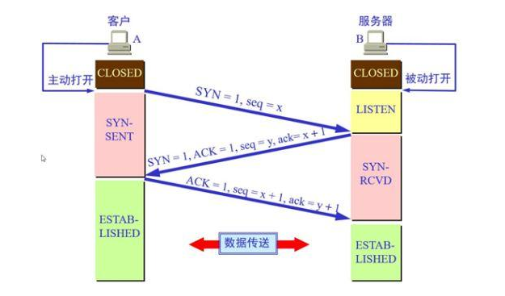

部分资料来自于互联网，如有侵权请联系删除。

Part of the information comes from the Internet, please contact to delete if there is any infringement.

SHEIN 7.27 面试

**1.自我介绍**

**2.java集合类**

  集合类主要负责保存、盛装其他数据，因此又将集合类称为容器类，本质上是一种数据结构！Java集合类通常分为Set、List、Map和Queue4大体系。其中，Set代表无序的、不允许有重复元素的集合，List代表有序的、允许有重复元素的集合，Map代表具有映射关系的集合，Queue代表队列集合。Java集合类主要由2个接口派生过来：Collection接口和Map接口！

**3.hashmap底层实现**

Java8 对 HashMap 进行了一些修改， 最大的不同就是利用了红黑树，所以其由 数组+链表+红黑
树 组成。
根据 Java7 HashMap 的介绍，我们知道，查找的时候，根据 hash 值我们能够快速定位到数组的
具体下标，但是之后的话， 需要顺着链表一个个比较下去才能找到我们需要的，时间复杂度取决
于链表的长度，为 O(n)。为了降低这部分的开销，在 Java8 中， 当链表中的元素超过了 8 个以后，
会将链表转换为红黑树，在这些位置进行查找的时候可以降低时间复杂度为 O(logN)。

**4.红黑树时间复杂度**

O(logN)

**5.java内存模型**

**6.有哪些GC，什么情况会调用GC**,**标记清除过程**

Serial GC，ParNew GC，CMS (Concurrent Mark Sleep) GC，Parrallel GC，G1 GC

什么情况会调用GC

- 对象没有引用
- 作用域发生未捕获异常
- 程序在作用域正常执行完毕
- 程序执行了System.exit()
- 程序发生意外终止（被杀进程等）　

标记清除

最基础的垃圾回收算法，分为两个阶段，标注和清除。标记阶段标记出所有需要回收的对象，清除阶段回收被标记的对象所占用的空间。如图

从图中我们就可以发现，该算法最大的问题是内存碎片化严重，后续可能发生大对象不能找到可利用空间的问题。

**7.java为什么是线程不安全的**

有可能出现多个线程先后更改数据造成所得到的数据是脏数据

**8.java怎么实现线程安全**

**9.synchronized底层实现**

会在同步块的前后分别形成monitorenter和monitorexit这个两个字节码指
令。在执行monitorenter指令时，首先要尝试获取对象锁。如果这个对象没被锁定，或者当前线程已经
拥有了那个对象锁，把锁的计算器加1，相应的，在执行monitorexit指令时会将锁计算器就减1，当计
算器为0时，锁就被释放了。如果获取对象锁失败，那当前线程就要阻塞，直到对象锁被另一个线程释
放为止 。

**10.synchronized和lock的区别**

这两种方式最大区别就是对于Synchronized来说，它是java语言的关键字，是原生语法层面的互斥，需
要jvm实现。而ReentrantLock它是JDK 1.5之后提供的API层面的互斥锁，需要lock()和unlock()方法配
合try/finally语句块来完成。
Synchronized进过编译，会在同步块的前后分别形成monitorenter和monitorexit这个两个字节码指
令。在执行monitorenter指令时，首先要尝试获取对象锁。如果这个对象没被锁定，或者当前线程已经
拥有了那个对象锁，把锁的计算器加1，相应的，在执行monitorexit指令时会将锁计算器就减1，当计
算器为0时，锁就被释放了。如果获取对象锁失败，那当前线程就要阻塞，直到对象锁被另一个线程释
放为止 。
由于ReentrantLock是java.util.concurrent包下提供的一套互斥锁，相比Synchronized，ReentrantLock类提供了一些高级功能，主要有以
下3项：
1.等待可中断，持有锁的线程长期不释放的时候，正在等待的线程可以选择放弃等待，这相当于
Synchronized来说可以避免出现死锁的情况。
2.公平锁，多个线程等待同一个锁时，必须按照申请锁的时间顺序获得锁，Synchronized锁非公平锁，
ReentrantLock默认的构造函数是创建的非公平锁，可以通过参数true设为公平锁，但公平锁表现的性
能不是很好。
3.锁绑定多个条件，一个ReentrantLock对象可以同时绑定对个对象 。

**11.TCP握手挥手**

**12.自己项目**

**13.服务发现怎么实现。**

https://www.dazhuanlan.com/2019/12/16/5df67095ac938/

**14.第三方授权登录**

OAuth 代表开放授权协议。这允许通过在 HTTP 服务上启用客户端应用程序（例如第三方提供商 Facebook，GitHub 等）来访问资源所有者的资源。因此，您可以在不使用其凭据的情况下与另一个站点共享存储在一个站点上的资源

**15.自己的优点**