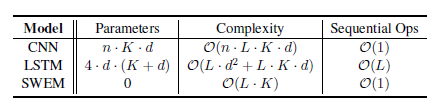
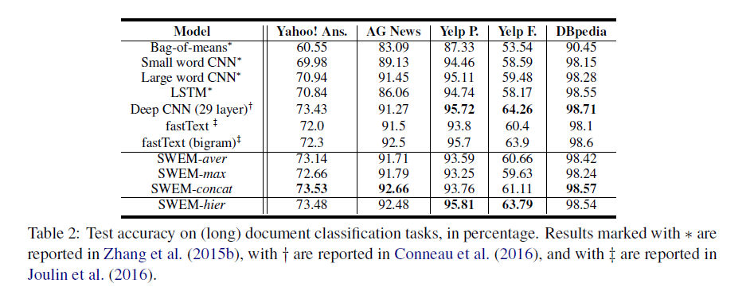
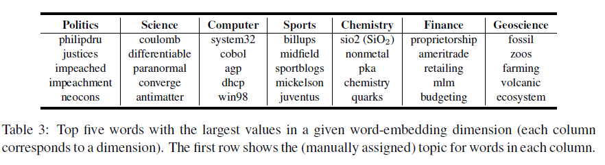
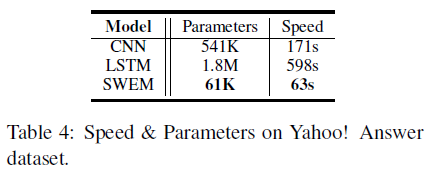
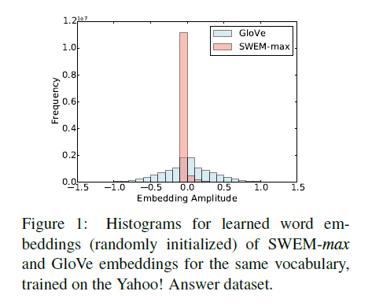
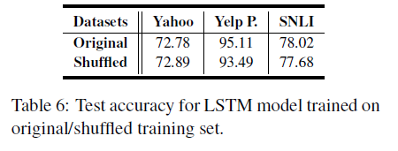
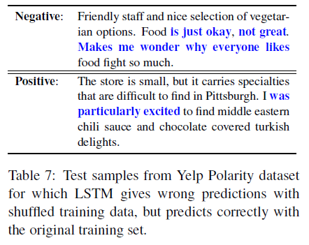
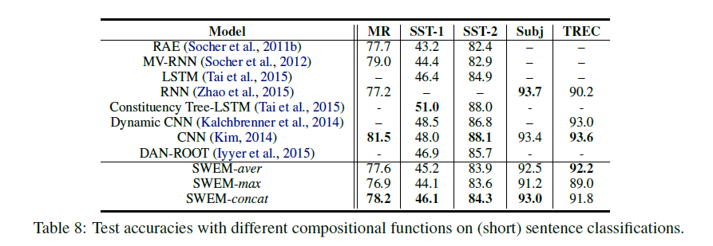
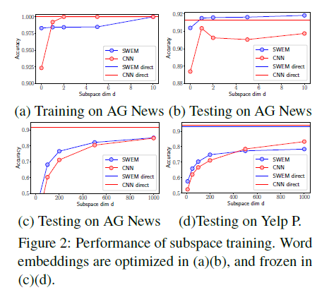

Baseline Needs More Love: On SimpleWord-Embedding-Based Models
and Associated Pooling Mechanisms

#  Baseline需要更多的支持:基于简单字嵌入的模型和相关的池机制 

## 摘要

已经提出了许多深度学习架构来对文本序列中的组成进行建模，这需要大量的参数和昂贵的计算。 但是，尚未对复杂的合成功能的附加值进行严格的评估。 在本文中，我们相对于基于词嵌入的RNN / CNN模型，对基于简单词嵌入的模型（SWEM）进行了逐点比较研究，该模型由无参数的池化操作组成。令人惊讶的是，SWEM在大多数情况下都表现出可比甚至更好的性能。 基于这种理解，我们针对学习的单词嵌入提出了两种其他的池化策略：（i）最大池操作以提高可解释性； （ii）层次化池操作，该操作在文本序列内保留空间（n元语法）信息。 我们目前在涉及三个任务的17个数据集上进行实验：（i）（长）文档分类； （ii）文本序列匹配； （iii）短文本任务，包括分类和标记。 可以从https://github.com/dinghanshen/SWEM获得源代码和数据集。

## 1 介绍

从大量非结构化文本数据中学到的单词嵌入是自然语言处理（NLP）广泛采用的构建块。 通过将每个单词表示为固定长度的向量，这些嵌入可以将语义相似的单词分组，同时隐式编码丰富的语言规律性和模式(Bengio et al., 2003;Mikolov et al., 2013; Pennington et al., 2014)。 利用单词嵌入构造，已经提出了许多深度架构来对可变长度文本序列中的组成进行建模。 这些方法的范围从简单的加法运算(Mitchell and Lapata, 2010;Iyyer et al., 2015),到更复杂的合成功能，例如递归神经网络（RNN）(Tai et al., 2015; Sutskever et al.,2014),，卷积神经网络（CNN）(Kalchbrenner et al., 2014; Kim, 2014; Zhang et al., 2017a)和递归神经网络(Socher et al., 2011a).

具有更富表现力的合成功能的模型，如RNNs或CNNs，已显示出令人印象深刻的结果;  然而，由于需要估计数十万(如果不是数百万)个参数，它们通常在计算上非常昂贵 (Parikh et al., 2016). 相反，具有简单复合函数的模型通常通过简单地对通过word2vec (Mikolov et al., 2013)或者GloVe(Pennington et al., 2014)等方法获得的每个序列元素的单词嵌入进行相加或求平均值来计算句子或文档的嵌入 。通常，这种基于简单单词嵌入的模型（SWEM）不会明确考虑文本序列内的空间，单词顺序信息。 但是，相对于基于RNN或CNN的模型，它们具有所需的参数数量少，训练速度快得多的理想特性。 因此，存在关于如何对文本序列的组成进行建模的计算与表达权衡的折衷。

在本文中，我们进行了广泛的实验研究，以了解何时以及为什么简单的合并策略（仅对单词嵌入进行操作）已经携带了足够的信息来自然语言理解。为了解决可能需要不同语义特征的各种NLP的不同之处，我们以逐点方式将基于SWEM的模型与现有的递归和卷积网络进行了比较。特别的，我们考虑了17个数据集，包括三个不同的NLP任务：文本分类（Yahoo news，Yelp reviews，etc.）自然语言序列匹配（SNLI，WikIQA,etc.）和（短）句子分类（标签）（Stanford sentiment treebank，TREC，etc.） 令人惊讶的是，SWEMs在考虑的大多数情况下都表现出相当甚至更好的性能。 

为了验证我们的研究发现，我们进行了附加的调查来理解什么程度的词顺序被利用/需要来预测不同的任务。 我们注意到在文本表示任务中，许多词 (例如，停止词语，或与感情或话题无关的词语) 对最终的预测没有任何意义 （例如，情绪标注），基于以上理解， 我们建议在给定序列的字嵌入矩阵上直接使用最大池操作，以选择其最显著的特征。  这个策略被证明是提取相对于标准平均运算的互补特征，同时产生一个更可解释的模型。  在情感分析任务的案例研究的启发下，我们进一步提出了层次汇聚策略，以抽象和保留空间信息的最终表示。该策略在对词序特征敏感的任务上表现出与LSTM和CNN相似的经验结果，同时保持了不包含成分参数的良好特性，从而实现了快速训练。 

我们的工作为文本表示学习提供了一个简单但强大的基线，它在基准测试中被广泛忽略，并突出了通用计算与基准测试的对比。-表达性权衡与选择适当的复合函数为不同的NLP问题。此外，我们利用子空间训练约束可训练变量，定量地证明了基于词嵌入的文本分类任务无论使用何种模型，其难度都是相似的(Li et al., 2018)，因此，根据奥卡姆剃刀原则，简单模型表现更好。

## 2 相关工作

NLP的一个基本目标是发展表达能力，然而，计算效率高的合成函数可以捕捉自然语言序列的语言结构。最近，有几项研究表明，在某些NLP应用程序中，与使用递归或卷积(Parikh et al., 2016; Vaswani et al., 2017).的更复杂的模型相比，更简单的基于单词嵌入的体系结构具有相当甚至更好的性能。 虽然在这些模型中避免了复杂的复合函数，但是在词嵌入层的基础上增加了注意层等附加模块。 结果，单词嵌入在这些模型中所扮演的特定角色没有得到强调(或明确)，这分散了我们对单词嵌入对于所观察到的优越性能的重要性的理解。  此外，最近的几项研究已经从经验上表明，独特的合成功能的优势在很大程度上取决于具体的任务 (Mitchell and Lapata, 2010; Iyyer et al., 2015; Zhang et al., 2015a; Wieting et al., 2015; Arora et al., 2016). 因此，研究额外表达性在各种NLP问题上的实用价值是很有意义的。 SWEMs与深度平均网络（Iyyer et al., 2015）或者fastText（joulin et al., 2016）很相似。

但是，存在一些关键差异，使我们的工作与众不同。 首先，我们探索一系列的池化操作，而不仅仅是平均池化。 具体而言，引入了层次化合并操作以合并空间信息，这证明了在情感分析方面相对于平均合并有更好的结果。 其次，我们的工作不仅探讨简单的池化操作何时足够，还调查了根本原因，即，不同的NLP问题需要哪些语义特征。 第三，DAN和fastText一次只关注一个或两个问题，因此，迄今为止，缺乏有关各种组合功能对不同NLP任务的有效性的全面研究，例如，对短句/长文档进行分类，匹配自然语言句子的功能 。 相应地，我们的工作旨在针对广泛的NLP问题，对简单与复杂的合成函数进行全面比较，并揭示了一些合理选择模型以解决不同任务的一般规则。

## 3 模型和训练

考虑到一个文本序列被表示为X（句子或者文章）， 由一系列单词组成: $\{w_1,w_2,...,w_L\}$,L是字符的个数即句子或者文章的长度。$\{v_1,v_2,..,v_L\}$表示每个词的词嵌入向量。这里$u_l \in \mathbb{R}^k$. 复合函数，$X \rightarrow z$, 旨在将词嵌入到一个固定长度的句子/文档表示$z$.  然后这些表示被用来预测序列 $X$. 下面，我们将介绍本文中考虑的不同类型的函数。 

### 3.1 循环序列编码器

一个被广泛采用的复合函数是这样定义的:  该模型在$t$处依次取词向量$v_t$ , 随着隐藏单位$h_{t-1}$从上一个位置$t-1$,经过$h_t=f(v_t,h_{t-1})$来跟新循环隐藏单元，这里$f(\cdot)$是转换函数。

为了解决学习长期依赖关系的问题，$f(\cdot)$经常被定义成长短期记忆网络 (LSTM)(Hochreiter and Schmidhuber, 1997),它使用门来控制从序列中提取的信息流。我们省略了LSTM的细节，并建议有兴趣的读者阅读Graves et al. (2013)等人的著作进一步解释 。  直观地说，LSTM根据其词序信息对文本序列进行编码，但是生成必须学习的其他组成参数。 

### 3.2 卷积序列编码器

卷积神经网络架构(Kim, 2014; Collobert et al., 2011; Gan et al., 2017; Zhang et al., 2017b; Shen et al., 2018)是另一种广泛使用的策略是作为组合函数对文本序列进行编码。卷积运算考虑序列中n个连续单词的窗口，在这些窗口中应用一组过滤器(待学习)来生成相应的特征图。(例如最大池化) 在特征图上提取最显著的语义特征，从而得到最终的表示。 对于大多数实验，我们考虑一个单层CNN文本模型 然而，深度CNN文本模型也被开发出来(Conneau et al.,2016), 在我们的一些实验中被考虑。 

### 3.3 简单词嵌入模型(SWEM)

为了研究词嵌入的原始建模能力，我们考虑了一类没有附加成分参数来编码自然语言序列的模型，称为SWEMs。  其中，最简单的策略是计算给定序列的字向量上的元素平均 (Wieting et al., 2015; Adi et al., 2016):
$$
z=\frac{1}{L}\sum_{i=i}^{L}v_i \tag{1}
$$

 (1)中的模型可以看作是一个平均池操作，它取所有词嵌入的k维的平均值，结果得到与嵌入本身维数相同的表示$z$，这里被称为SWEM-aver。 直观上， $z$通过加法运算考虑每个序列元素的信息。 

**最大池化** 一般来说，只有少数几个关键词有助于最终的预测，基于这一观察结果，我们提出了另一个建议
SWEM变体，通过在每个词向量的维上取最大值，从每个词嵌入维中提取最显著的特征。这种策略类似于卷积神经网络中的最大超时池操作(Collobert et al., 2011):
$$
z=\mbox{Max-pooling}(v_1,v_2,..,v_L). \tag{2}
$$
 我们将该模型变体表示为SWEM-max。 这里$z$的第$j$个值来自集合$\{v_{1j},...,{v_{Lj}}\}$的最大值，这里$v_{1j}$是$v_1$的第$j$个值。通过这个池化操作，那些与这个任务不重要或不相关的词会在编码的过程中被忽略（ 由于嵌入向量的分量具有较小的幅值 ）。 与SWEM-aver不同，SWEM-aver的每一个单词都有相同的表现。 

 考虑到SWEM-aver和SWEM-max是互补的，从解释文本序列中不同类型的信息的意义上来说， 表1:CNN、LSTM和SWEM架构的比较。列分别对应组合参数的数量、计算复杂度和顺序操作。

我们还提出了第三种SWEM变体，在这种变体中，两个抽象的特性被连接在一起，形成句子嵌入，在这里表示为SWEM-concat。对于所有的SWEM变体，不需要学习额外的组成参数。因此，这些模型只利用内在的字嵌入信息进行预测。 

**分层池化** SWEM-aver和SWEM-max没有考虑单词顺序或空间信息，这可能对某些NLP应用程序很有用。 因此，我们进一步提出了层次池层。 $v_{i:i+n-1}$指由n个连续单词组成的局部窗口,$v_i,v_{i+1},...,v_{i+n-1}$。首先，在每个局部窗口上执行平均池化，$v_{i:i+n-1}$。从所有窗口中提取的特征将通过每个窗口的表示之上的全局最大池化操作进一步下采样。 由于其分层池池化，因此我们将这种方法称为SWEM-hier。 

这种策略保留了文本序列的局部空间信息，因为它跟踪句子/文档是如何由单个单词窗口构成的，即,n-grams。这种方法与bag-of-grams方法相关 (Zhang et al., 2015b). 然而，SWEM-hier学习语料库中出现的n-gram的固定长度表示，而不是仅仅通过计数特性捕获它们的出现，这可能有利于预测目的。 

###  3.4 参数与计算比较 

我们比较了CNN，LSTM，SWEM关于它们的参数和计算速度。 K表示词嵌入的维数，如上所示。对于CNN，我们使用n来表示卷积核的宽度(为了便于分析，假设所有滤波器的宽度都是常数，但实际上通常使用变量n)。我们定义d为最终序列表示的维数。具体来说，d分别表示LSTM或CNN中隐藏单元的维数或卷积核的数量。 

我们首先检查每个模型的组成参数的数量。如表1所示，  CNN和LSTM都有大量的参数来对文本序列的语义组合性建模，而SWEM没有这些参数。类似于 Vaswani et al. (2017), 然后我们考虑计算复杂度和每个模型所需的最小顺序操作数。在计算复杂度方面，SWEM比CNN和LSTM更有效率。 例如，考虑情况，当$K=d$，SWEM比CNN或者LSTM都要分别快nd或d的倍，更进一步，SWEM中的计算是高度并行的，不像LSTM中需要$\mathcal{O}(L)$个连续的迭代计算。

##  4 实验 

 我们在各种监督任务上评估不同的组合函数，包括文档分类、文本序列匹配（给一个序列对，$X_1,X_2$,预测它们的关系$y$),或短句子分类问题。我们在17个关注自然语言理解的数据集上进行实验，补充材料中汇总了相应的数据统计信息。我们使用GloVe词嵌入向量维度等于300(Pennington et al., 2014)，对所有模型进行初始化。未登录词（OOV）被初始化成$[-0.01,0.01]$的均匀分布。GloVe嵌入以两种方式来学习精炼的单词嵌入：（i）在训练过程中直接更新每个单词嵌入； （ii）训练具有ReLU激活功能的300维多层感知器（MLP）层，其中GloVe嵌入作为MLP的输入，而输出则定义了改进的词嵌入。 后一种方法对应于学习一个MLP模型，该模型使GloVe嵌入适应所需的数据集和任务。 这两种方法的优点因数据集的不同而不同。我们根据它们在验证集上的相应性能来选择更好的策略。最终的分类器实现为一个MLP层，从该层中选择维数$[100,300,500,1000]$ ，然后是sigmoid或softmax函数，具体取决于具体的任务。Adam(Kingma and Ba, 2014) 用于优化所有模型， 学习率从$[1\times10^{-3},3\times10^{-4},2\times10^{-4},1\times10^{-5}]$中选取 (使用交叉验证为给定数据集和任务选择适当的参数)。 

丢弃正则化(Srivastava et al., 2014)用于词嵌入层和最终MLP层，丢弃率从$[0.2,0.5,0.7]$中选取。batch的大小从$[2,8,32,128,512]$中选取

###  4.1 文档分类 

我们从对文档进行分类的任务开始(每个文档平均约100个单词)。 我们遵循Zhang et al.(2015b) 数据的分割为了可比性。这些数据集通常可分为三种类型：主题分类（由Yahoo! Answer和AG news表示），情感分析（由Yelp Polarity和Yelp Full表示）和本体分类（由DBpedia表示）。 结果显示在表2中。令人惊讶的是，在主题预测任务上，相对于LSTM和CNN组成体系结构，我们的SWEM模型通过利用词嵌入的平均和最大合并功能，表现出更强的性能。 具体来说，当预测主题时，我们的SWEM联合模型甚至优于29层深的CNN模型（Conneau等，2016）。 关于本体分类问题（DBpedia数据集），我们观察到相同的趋势，SWEM与CNN或LSTM模型相比，显示出可比较甚至更好的结果。 由于SWEM中没有成分参数，因此我们的模型具有比LSTM或CNN少一个数量级的参数（不包括嵌入），并且在计算效率上要高得多。如表4所示，SWEM-concat在Yahoo!上获得了更好的结果。 比CNN / LSTM的答案要多，只有61K参数（LSTM参数数量的十分之一，或CNN参数数量的三分之一），而相对于CNN或LSTM，则只需花费一小部分训练时间。

 有趣的是，在情绪分析任务中，CNN和LSTM组合函数的表现都优于SWEM，这表明在分析情绪倾向时可能需要词顺序（word-order）信息。  这一发现与Pang et al. (2002)的假设是一致的，他们假设一个单词在文本序列中的位置信息可能有助于预测情绪。 这在直觉上是合理的，因为例如短语“不是很好”和“真的不是很好”传达了不同程度的负面情绪，而只是在其词序上有所不同。与SWEM相反，CNN和LSTM模型都可以通过卷积滤波器或递归转换函数来捕获此类信息。 但是，如上所述，这种词序模式可能对预测文档主题的用处不大。 这可以归因于这样一个事实，即至少在所考虑的文本序列较长时，单词嵌入本身已经提供了足够的文档主题信息。

####  4.1.1解释模型预测 

尽管建议的SWEM-max变体通常比SWEM-aver稍差一些，但它会从SWEM-aver中提取互补特征，因此在大多数情况下，SWEM-concat在所有SWEM变体中均表现出最佳性能。更重要的是，我们发现从SWEM-max学习到的词嵌入趋于稀疏。我们在Yahoo数据集（随机初始化）上训练了SWEM-max模型。通过学习的嵌入，我们为整个词汇表绘制了每个单词嵌入维的值。如图1所示，大多数值都高度集中在零附近，这表明学习到的单词嵌入非常稀疏。相反，对于相同的词汇，GloVe单词嵌入比从SWEM-max学习到的嵌入要密集得多。这表明该模型可能仅依赖整个词汇表中的几个关键词来进行预测（因为大多数单词对SWEM-max中的最大合并操作没有帮助）。通过嵌入，模型可以学习给定任务的重要单词（具有非零嵌入成分的单词）。

就这一点而言，在这方面，最大池化过程的性质产生了一个更易于解释的模型。对于文档，仅使用在每个嵌入维度中具有最大价值的单词作为最终表示形式。因此，我们怀疑语义相似的单词在某些共享维度上可能具有较大的价值。因此，在Yahoo数据集上训练SWEM-max模型后，我们为每个单词嵌入维度选择了在整个词汇量中具有最大值的五个单词（这些单词优先通过max操作在相应维度中选择） 。如表3所示，在每个嵌入维度中选择的单词的确具有高度的相关性，并且对应于一个常见的主题（主题是从单词中推论得出的）。例如，表3第一栏中的词语都是政治用语，可以将其分配给“政治与政府”主题。请注意，我们的模型甚至可以学习标签信息未明确指示的本地可解释结构。例如，第五列中的所有单词都与化学有关。但是，我们在数据集中没有化学标签，无论它们是否应属于“科学”主题。

### 4.2 文本序列匹配

为了更深入地了解单词嵌入的建模能力，我们进一步研究了句子匹配的问题，包括自然语言推断，答案句子选择和释义识别。 相应的性能指标显示在表5中。令人惊讶的是，与考虑使用CNN或LSTM编码器的数据集相比，考虑到的大多数数据集（WikiQA除外），SWEM都显示出最好的结果。 值得注意的是，在SNLI数据集上，我们观察到SWEM-max在所有SWEM变体中表现最好，这与Nie and Bansal (2017); Conneau et al.(2017)发现的一致，BiLSTM隐藏单元的最大池化性能优于SNLI数据集上的平均池化操作。 结果，只有120K参数，我们的SWEM-max达到了83.8％的测试准确度，在基于最新句子编码的模型中（在性能和参数数量上）都非常有竞争力

SWEM方法在这些任务上的强大结果可能源于以下事实：匹配自然语言句子时，在大多数情况下仅对两个序列之间的单词级对齐建模就足够了(Parikh et al.,2016). 从这个角度来看，单词顺序信息对于预测句子之间的关系变得没有多大用处。 此外，考虑到SWEM的简单模型体系结构，与基于LSTM或CNN的模型相比，它们可能更容易进行优化，因此产生了更好的经验结果。

####  4.2.1词序信息的重要性 

SWEM的一个可能的缺点是，它会忽略文本序列中的单词顺序信息，而基于CNN或LSTM的模型可能会捕获这些信息。 但是，我们通过经验发现，除了情感分析之外，SWEM在各种任务上都表现出与CNN或LSTM相似甚至更好的性能。 在这方面，一个自然的问题是：这些任务的字序功能有多重要？ 为此，我们会随机调整训练集中每个句子的单词，同时保持测试集中样本的原始单词顺序。这样做的动机是从训练集中删除单词顺序特征，并检查不同任务的性能对单词顺序信息的敏感程度。 为此，我们使用LSTM作为模型，因为它可以从原始训练集中捕获单词顺序信息。

表6中显示了三个不同任务的结果。令人惊讶的是，对于Yahoo和SNLI数据集，在改组训练集上训练的LSTM模型显示出与在原始数据集上训练的LSTM模型相当的准确性，这表明单词顺序信息不会显着贡献 关于这两个问题，即主题分类和文本蕴涵。 但是，在Yelp极性数据集上，结果显着下降，进一步表明单词顺序对于情感分析确实很重要（如上文从不同的角度所示）。

 值得注意的是，LSTM在打乱训练集的Yelp数据集上的性能与我们使用SWEM的结果非常接近，这表明LSTM和SWEM之间的主要区别可能是由于前者能够捕获词序特征。这两个观察结果与我们在前一节的实验结果一致。 

**个案研究** 为了了解哪种类型的句子对词序信息敏感，我们在表7中进一步显示了由于训练数据改组而被错误预测的样本。以第一个句子为例，评论中的几个词通常是肯定的 ，即friendly, nice, okay, great 和 likes. 但是，预测这句话的情感最重要的功能可能是短语“is just okay”，“not great”或“makes me wonder why everyone likes”，这在不考虑单词顺序特征的情况下是无法把握的。 值得注意的是，在这种情况下，预测的提示实际上是输入文档中的n-gram短语。

###  4.3 SWEM-hier用于情绪分析 

如第4.2.1节所示，字序信息在情感分析任务中起着至关重要的作用。 但是，根据上述案例研究，情感预测最重要的特征可能是输入文档中的一些关键n-gram短语/单词。 我们假设合并有关本地单词顺序的信息（即n-gram特征）可能会大大减轻上述三个SWEM变体的局限性。 受此观察结果的启发，我们建议使用另一种简单的合并操作，称为分层操作（SWEM-hier），如3.3节所述。 我们在两个文档级情感分析任务上评估了该方法，结果如表2的最后一行所示。

SWEM-hier大大优于其他三个SWEM变体，并且相应的精度与CNN或LSTM的结果相当（表2）。 这表明，提出的分层池化操作设法从输入序列中提取空间（单词顺序）信息，这对于情感分析任务中的性能是有利的。

###  4.4短句处理 

现在，我们考虑句子分类任务（平均大约20个单词）。 我们在三个情感分类数据集上进行了实验，即MR，SST-1，SST-2，主观分类（Subj）和问题分类（TREC）。 相应的结果显示在表8中。与CNN / LSTM的成分函数相比，SWEM在情感分析数据集上的准确性较低，与我们在文档归类情况下的观察结果一致。 但是，SWEM在其他两个任务上表现出可比的性能，同样，参数要少得多，训练速度也要快。 此外，我们研究了两个序列标记任务：标准CoNLL2000分块和CoNLL2003 NER数据集。

结果显示在补充材料中，其中LSTM和CNN的性能再次优于SWEM。 通常，SWEM从短句子中提取表示的效率不如从长文档中提取。 这可能是由于以下事实：对于较短的文本序列，由于仅由词嵌入提供的语义信息相对有限，因此词序功能往往更重要。

此外，我们注意到由于过度拟合的问题，这些相对较小的数据集的结果对模型正则化技术高度敏感。 在这方面，一个有趣的未来方向可能是为SWEM框架开发特定的正则化策略，从而使它们在小句子分类数据集上更好地工作。

##  5 讨论 

###  5.1 子空间训练的比较 

我们使用子空间训练（Li et al。，2018）来衡量文本分类问题中的模型复杂度。 它限制了低维度子空间中可训练参数的优化，固有维度dint定义了产生良好解决方案的最小值d。 研究了两个模型：SWEM-max变体和CNN模型，包括卷积层和FC层。 我们考虑两种设置：

（1）随机嵌入单词嵌入，并与模型参数一起优化。 我们在图2（a）（b）中显示了对AG News数据集进行直接和子空间训练的性能。 通过直接方法训练的两个模型在训练和测试上具有几乎相同的性能。 即使完全不训练模型参数（d = 0），子空间训练也可以通过非常小的d直接训练获得相似的精度。 这是因为嵌入的单词具有完全的自由度，可以进行调整以实现良好的解决方案，而与采用的模型无关。 与SWN相比，SWEM似乎比单词CNN更容易损失损失，可以找到最佳的解决方案。 根据奥卡姆（Occam）的剃刀，如果其他所有条件都相同，则首选简单模型。

（2）冻结预训练的GloVe进行单词嵌入，仅优化模型参数。 AG News和Yelp P.的测试数据集的结果分别显示在图2（c）（d）中。 对于大范围的低子空间尺寸，SWEM的精度明显高于CNN，这表明SWEM的参数效率更高，可以得到不错的解决方案。 在图2（c）中，如果我们设置性能阈值

###  5.2 线性分类器 

为了进一步研究从SWEM中学习到的表示的质量，我们在表示的顶部使用了线性分类器进行预测，而不是像上一节中那样使用非线性MLP层。 事实证明，使用线性分类器只会导致Yahoo!的性能下降非常小。 Ans。 （从73：53％到73：18％）和Yelp P.数据集（从93：76％到93：66％）。 该观察结果突出表明，SWEM尽管简单，但仍能够提取健壮且内容丰富的句子表示形式。

###  5.3扩展到其他语言 

我们还尝试了在搜狗新闻语料库（具有与（Zhang等人，2015b）相同的实验设置）上的SWEM-concat和SWEMhier模型，该模型是以拼音（汉语的语音罗马化）表示的中文数据集。 SWEMconcat的精度为91：3％，而SWEM-hier（局部窗口大小为5）在测试集上的精度为96：2％。 值得注意的是，SWEM-hier的性能可与CNN（95：6％）和LSTM（95：2％）的最佳精度相媲美（Zhang等人，2015b）。 这表明通过考虑空间信息，分层池比平均/最大池更适合中文文本分类。 这也意味着中文比英语对本地单词顺序特征更敏感。

##  6 结论 

我们在SWEM（具有无参数合并操作）和基于CNN或LSTM的模型之间进行了比较研究，以表示17个NLP数据集上的文本序列。 我们通过其他探索进一步验证了我们的实验结果，并揭示了一些合理选择不同问题的组成函数的一般规则。 关于何时（以及为什么）简单的池化操作足以完成文本序列表示的研究结果总结如下：

- 简单的池操作在表示较长的文档(包含数百个单词)方面出奇地有效，而在构造短句子的表示时，递归/卷积复合函数是最有效的。 
- 情绪分析任务比主题分类任务对词序特征更敏感。然而，这里提出的一个简单的层次池化层在情绪分析任务上取得了与LSTM/CNN相当的结果。 
- 为了匹配自然语言的句子，例如文本蕴涵、答案句子选择等，简单的池操作已经显示出与CNNLSTM和更优的结果。
- 在带有最大池操作的SWEM中，单词嵌入的每个单独维度都包含可解释的语义模式，并将具有公共主题或主题的单词分组在一起。 

