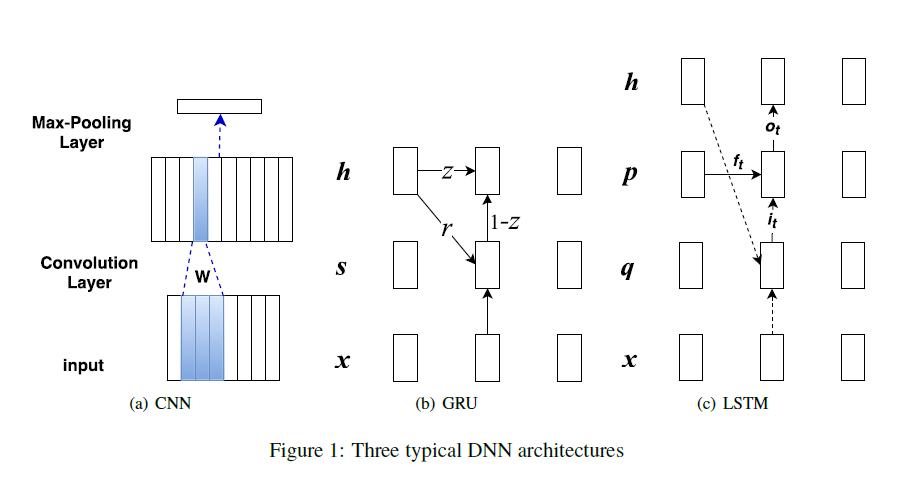

Comparative Study of CNN and RNN for Natural Language Processing

# CNN和RNN在自然语言处理中的比较研究

## 摘要

深度神经网络（DNNs）使自然语言处理(NLP)领域发生了革命性的变化。卷积神经网络（CNN）和循环神经网络（RNN），这两个重要的DNN架构，广泛的被应用在各种自然语言处理任务中。CNN应该擅长于提取位置不变的特征，而RNN擅长于按顺序建模单元。由于CNNs和RNNs之间的竞争，许多NLP任务上的最新技术常常会切换。这项工作是第一次对CNN和RNN进行系统的比较，具有广泛的代表性NLP任务，旨在为DNN选择提供基本指导。

## 1 介绍

自然语言处理（NLP）得益于深度神经网络的复兴，由于它们出色的表现和少量的特征工程。有两种主要的DNN架构：卷积神经网络（CNN）（LeCun et al., 1998）和循环神经网络（RNN）（Elman，1990）. 为了减轻基本RNN的某些限制，人们开发了门控机制，产生了两种流行的RNN类型：长短期记忆力网络（LSTM）（Hochreiter and Schmiduhuber,1997）和门控循环单元（GRU）（Cho et al。，2014）.

一般的说，CNNs是分层而RNNs是序列架构。我们如何选择它们来处理语言？ 基于“层次(CNN) vs.顺序(RNN)”表征，由于情感通常由一些关键短语决定，因此为诸如情感分类之类的分类任务选择CNN是很诱人的。选择RNNs来经行序列建模任务像语言建模，因为它需要对上下文依赖关系进行灵活的建模。 但是当前的NLP文献没有得到一个如此清晰的结论。例如，RNNs在文本级别情感分类任务中表现的很好（Tang et al., 2015）;Dauphin et al. (2016)最近研究表明，尽管长期以来人们一直认为LSTM更适合，但门控CNN在语言建模任务上的性能优于LSTM。 总之，对于任何特定的NLP问题，在DNN选择上尚无共识。

这项工作在一系列NLP任务上系统地比较了CNN，GRU和LSTM：情感/关系分类，文本内容，答案选择，Freebase中的问题关系匹配，Freebase路径查询答案和词性标注。

我们的实验支持两个关键发现。 （i）CNN和RNN为文本分类任务提供补充信息。 哪种架构性能更好取决于从语义上理解整个序列的重要性。 （ii）学习率相对平稳地改变了性能，而隐藏层的大小和批量的大小的更改导致较大的波动。

## 2 相关工作

据我们所知，在大量的NLP任务上尚未进行CNN和RNN的系统比较。

Vu et al. (2016)调查了CNN和基本RNN（即，没有门机制）来进行关系分类。他们研究显示CNN比RNN表现的更好，证据表明CNN和RNN提供补足信息：当RNN计算句子中词的组合权重，CNN为这种关系提取出信息最丰富的ngrams，只考虑它们的结果激活。 

Wen et al. (2016) 和 Adel and Schutze(2017)都支持CNN在长句分类中要好于GRU/LSTM。此外Yin et al.(2016)在选择答案时，与基于注意力的LSTM相比，基于注意力的CNN具有更好的性能。Dauphin et al. (2016)进一步争论说，经过微调的门CNN也可以对长上下文依赖项进行建模，从而在所有RNN竞争对手中获得最新的语言建模技术。

相反，Arkhipenko et al.(2016)比较了word2vec（Mikolov et al.,2013）,CNN,GRU和LSTM在俄罗斯推特的情绪分析中，发现GRU优于LSTM和CNN。

在实际评估中，Chung et al。（2014）和 Jozefowicz et al。（2015）发现GRU和LSTM不分优劣。在许多任务中， 它们的性能相当，调整诸如层大小之类的超参数通常比选择理想的架构更为重要。

## 3 模型

这一节会给一个简单的介绍关于CNN，GRU和LSTM。

### 3.1 卷积神经网络

**输入层**  序列$x$包含$n$个词，每个词被表示成一个d维稠密向量；因此输入被特征映射到$d \times n$。图1（a）展示了 输入层作为具有多个列的下矩形。

**卷积层** 用来从w-grams中表示学习。对于一个输入序列具有n个词：$x_1,x_2,...,x_n$,向量$\mathbf{c}_i \in \mathbb{R}^{wd}$是串联嵌入$w$个词$x_{i-w+1},...,x_i$这里$w$是卷积核的宽度$0<i<s+w$。对于$x_i,i<1 \ \mbox{or}\ i>n$,用0填充。然后我们生成对w-gram$x_{i-w+1},...,x_i$的表示$\mathbf{P}_i \in \mathbb{R}^d$,使用卷积权重$\mathbf{W} \in mathbb{R}^{d\times wd}$
$$
\mathbf{P}_i = \tanh(\mathbf{W}\cdot \mathbf{c}_i+\mathbf{b}) \tag{1}
$$
这里偏置$\mathbf{b}\in\mathbb{R}^d$

**最大池化** 所有w-gram的表示$\mathbf{P}_i(i = 1\cdots s+w-1)$用maxpooling生成输入序列x的表示:$\mathbf{x}_j=\max(\mathbf{p}_{1,j},\mathbf{p}_{2,j},...)(j=1,...,d)$

### 3.2 门循环单元（GRU）

 如图1(b)所示，对文本x建模如下: 
$$
\mathbf{z} = \sigma(\mathbf{x}_t\mathbf{U}^z+\mathbf{h}_{t-1}\mathbf{W}^z) \tag{2}
$$

$$
\mathbf{r}=\sigma(\mathbf{x}_t\mathbf{U}^r + \mathbf{h}_{t-1}\mathbf{W}^r)  \tag{3}
$$

$$
s_t=\tanh(\mathbf{x}_t\mathbf{U}^s+(h_{t-1}\circ \mathbf{r})\mathbf{W}^s) \tag{4}
$$

$$
\mathbf{h}_t=(1-\mathbf{z})\circ\mathbf{s}_t+\mathbf{z}\circ\mathbf{h}_{t-1} \tag{5}
$$

$\mathbf{x}_t \in \mathbb{R}^d$ 表示令牌在x中的位置t， $\mathbf{h}_t \in \mathbb{R}^h$,t处的隐藏层状态，对应是编码历史$x_1,..,x_t$。$\mathbf{z}$和$\mathbf{r}$是两个门状态，所有$\mathbf{U} \in \mathbb{R}^{d \times h},\mathbf{W} \in \mathbb{R}^{h \times h}$是参数。

### 3.3 长短期记忆（LSTM）

LSTM在图1（c）中显示。它建模词序列x如下：
$$
\begin{aligned} \mathrm{i}_{t} &=\sigma\left(\mathrm{x}_{t} \mathrm{U}^{i}+\mathrm{h}_{t-1} \mathrm{W}^{i}+\mathrm{b}_{i}\right) \\ \mathrm{f}_{t} &=\sigma\left(\mathrm{x}_{t} \mathrm{U}^{f}+\mathrm{h}_{t-1} \mathrm{W}^{f}+\mathrm{b}_{f}\right) \\ \mathrm{o}_{t} &=\sigma\left(\mathrm{x}_{t} \mathrm{U}^{o}+\mathrm{h}_{t-1} \mathrm{W}^{o}+\mathrm{b}_{o}\right) \\ \mathrm{q}_{t} &=\tanh \left(\mathrm{x}_{t} \mathrm{U}^{q}+\mathrm{h}_{t-1} \mathrm{W}^{q}+\mathrm{b}_{q}\right) \\ \mathrm{p}_{t} &=\mathrm{f}_{t} * \mathrm{p}_{t-1}+\mathrm{i}_{t} * \mathrm{q}_{t} \\ \mathrm{h}_{t} &=\mathrm{o}_{t} * \tanh \left(\mathrm{p}_{t}\right) \end{aligned}
$$
LSTM有三个门：输入门$i_t$,遗忘门$f_t$和输出门$o_t$.所有门都由sigmoid函数作用于之前的隐藏层状态和输入$x_t$的全体。为了在当前步骤t生成隐藏层状态$h_{t-1}$它首先生成一个临时结果$q_t$ 通过输入集合$x_t$和之前的隐藏状态$h_{t-1}$的一个tanh非线性函数,然后组合临时结果$q_t$和历史数据$p_{t-1}$通过输入门$i_t$和遗忘门$f_t$, 分别获取更新的历史记录$p_t$,最后使用输出门$o_t$ 在这个更新的历史$p_t$中来得到最终隐藏层状态$h_t$

##  4 实验

### 4.1 任务

**情感分类（SentiC）**在斯坦福大学情绪树图资料库（SST）(Socher et al., 2013). 这个数据集预测情绪 (正面或负面的)影评。  我们利用给予的数据集划分出6920个测试用例，872个验证用例，1821个测试用例。正如(Kalchbrenner et al., 2014; Le and Mikolov,2014),我们把标记过的短语作为训练句子的子部分，作为独立的训练实例。措施:准确性。

 **分类(RC)的关系**  关于2010年SemEval任务8(Hendrickx et al., 2009）。 它由人工标记的句子组成，其中包括19个关系（18个直接关系和其他），8000个在训练中的句子和2717个在测试中的句子。 由于没有开发人员集，因此我们使用1500个培训示例作为开发人员，类似于Vu et al. (2016). 度量：F1。

**文本蕴涵(TE)** 斯坦福自然语言推理（SNLI）(Bowman et al.,2015)。 SNLI包含前提假设对，并标记有关系（蕴含，矛盾，中立）。 删除未标记的对之后，我们最终得到549,367对训练用例，9,842对验证用例和9,824对测试用例。 度量：准确性。

 **回答选择(AC)**  在WikiQA(Yanget al., 2015)上，这是一个开放域的问答数据集。 我们使用的子任务假定一个问题至少有一个正确答案。 相应的数据集包括20360个训练用例中的问题候选对，1130个测试用例的测试和2352个验证用例，其中我们采用仅考虑测试中具有正确答案的问题的标准设置。 任务是从一些问题的候选人中选择正确的答案。 度量：MAP和MRR。

**问题关系匹配（QRM）** 我们利用WebQSP（Yih et al。，2016）数据集来创建大规模的关系检测任务，这得益于问题的带标签语义解析的可用性。对于每一个问题，我们（我）选择从剖析话题实体; （ii）选择连接到主题实体的所有关系/关系链（$长度 \leq 2$）； （iii）将标签解析中的关系/关系链设置为肯定，而所有其他关系/设置为否定。 按照Yih等。 （2016）和Xu等。 （2016），我们将此任务表述为序列匹配问题。 排名损失用于训练。 度量：准确性。

 **路径查询应答(PQA)**   关于Guu et al. (2015).发布的路径查询数据集。它包含KB路径$e_h,r_1,...,r_t,e_t$,这里头实体$e_h$,和关系序列$r_0,r_1,...,r_t$ 是用来预测尾部实体$e_t$. 分别有6,266,058/27,163/109,557条训练/验证/测试路径。措施:hit@10。 