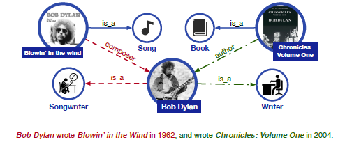
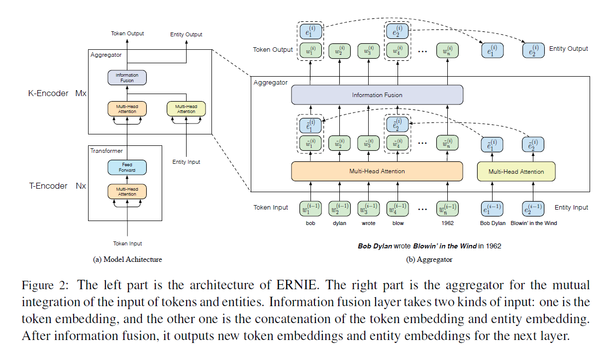
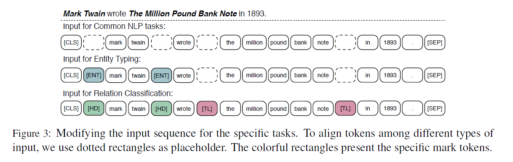

./assets/ERNIE: Enhanced Language Representation with Informative Entities

#  ERNIE:用信息实体增强语言表示

## 摘要

神经语言表示模型（例如在大规模语料库上进行了预训练的BERT）可以很好地捕获纯文本中的丰富语义模式，并且可以对其进行微调以不断提高各种NLP任务的性能。但是，现有的预训练语言模型很少考虑合并知识图谱（KGs），后者可以提供丰富的结构化知识事实，以更好地理解语言。我们认为，KG中的信息实体可以增强外部知识的语言表示能力。在本文中，我们利用大型文本语料库和KG来训练增强的语言表示模型（ERNIE），该模型可以同时充分利用词汇，句法和知识信息。实验结果表明，ERNIE在各种知识驱动的任务上均取得了显着改进，同时可与其他常见NLP任务上的最新模型BERT相比。可以从https://github.com/thunlp/ERNIE获得本文的源代码和实验详细信息。

## 1 介绍

预训练语言表示模型，包括基于特征(Mikolov et al., 2013; Pennington et al., 2014; Peters et al., 2017, 2018)和微调(Dai and Le, 2015; Howard and Ruder,2018; Radford et al., 2018; Devlin et al., 2019)处理该方法可以从文本中获取丰富的语言信息，从而使许多NLP应用程序受益。BERT(Devlin et al., 2019),作为最新提出的模型之一，通过简单的微调，包括命名实体识别，获得各种NLP应用的最新进展(Sang and De Meulder, 2003),

问题图1：将额外的知识信息纳入语言理解的示例。实线表示现有的知识事实。 红色虚线用红色表示从句子中提取的事实。 绿色的虚线以绿色表示从句子中提取的事实。

 回应(Rajpurkar et al., 2016; Zellers et al.,2018),自然语言推理(Bowman et al.,2015), 和文本分类(Wang et al., 2018).

尽管经过预训练的语言表示模型已经取得了令人鼓舞的结果，并且在许多NLP任务中充当常规组件，但它们却忽略了将知识信息纳入语言理解的过程。 如图1所示，在不知道《风与纪事》中的“吹牛”：第一卷分别是歌曲和书籍的情况下，很难识别鲍勃·迪伦在实体打字任务上的两个职业，即流行歌曲的作者和作词人。 此外，在关系分类任务中几乎不可能提取出细粒度的关系，例如作曲家和作者。 对于现有的预训练语言表示模型，这两个句子在语法上是模棱两可的，例如“ UNK用UNK编写UNK”。 因此，考虑丰富的知识信息可以导致更好的语言理解，并因此有益于各种知识驱动的应用，例如 实体类型和关系分类。

为了将外部知识整合到语言表示模型中，存在两个主要挑战。（1）结构化知识编码：对于给定的文本，如何有效地在语言表示模型的KG中提取和编码其相关的信息事实是一个重要的问题；（2）异构信息融合：语言表示的预训练过程与知识表示过程完全不同，导致两个单独的向量空间。 如何设计特殊的预训练目标以融合词汇，句法和知识信息是另一个挑战。

为了克服上述挑战，我们提出了带有信息实体的增强语言表示（ERNIE），它可以在大型文本语料库和KG上预先训练语言表示模型：

（1）为了提取和编码知识信息，我们首先识别文本中的命名实体提及，然后将这些提及与KG中的相应实体对齐。 我们不是直接在KG中使用基于图的事实，而是使用诸如TransE的知识嵌入算法对KG的图结构进行编码（Bordes等人，2013），然后将信息性实体嵌入作为ERNIE的输入。 基于文本和KG之间的对齐方式，ERNIE将知识模块中的实体表示集成到语义模块的基础层中。

（2）与BERT相似，我们采用屏蔽语言模型和下一个句子预测作为预训练目标。 此外，为了更好地融合文本和知识特征，我们设计了一个新的预训练目标，方法是随机遮盖输入文本中的某些命名实体对齐方式，并要求模型从KG中选择合适的实体以完成对齐方式。 与仅使用本地上下文来预测字符的现有预训练语言表示模型不同，我们的目标要求模型汇总上下文和知识事实以预测字符和实体，并形成一个知识渊博的语言表示模型。

我们对两个知识驱动的NLP任务即实体类型和关系分类进行了实验。 实验结果表明，在充分利用词汇，句法和知识信息的情况下，ERNIE在这些知识驱动任务上明显优于最新模型BERT。 我们还在其他常见的NLP任务上对ERNIE进行了评估，并且ERNIE仍可取得可比的结果。

## 2 相关工作

许多工作致力于训练前的语言表示模型，用于从文本中捕获语言信息，然后将这些信息用于特定的NLP任务。这些训练前的方法可分为两类，即，基于特征的方法和微调方法。

早期工作(Collobert and Weston, 2008;Mikolov et al., 2013; Pennington et al., 2014)专注于采用基于特征的方法将单词转换为分布式表示形式。 由于这些经过预训练的单词表示形式可以捕获文本语料库中的句法和语义信息，因此它们经常用作各种NLP模型的输入嵌入和初始化参数，并且相对于随机初始化参数提供了显着的改进(Turian et al., 2010).由于这些词级模型经常出现词多义现象，Peters et al. (2018) 进一步采用序列级模型(ELMo)来捕获跨不同语言上下文的复杂单词特征，并使用ELMo生成上下文感知的单词嵌入。

与上述基于特征的语言方法不同，基于特征的语言方法只使用预先训练好的语言表示作为输入特征，Dai and Le(2015)在未标记的文本上训练自动编码器，然后使用预先训练的模型架构和参数作为其他特定NLP模型的起点。收Dai and le（2015）启发，提出了更多的用于微调的预训练语言表示模型。Howard and ruder(2018)提出AWD-LSTM（Merity et al., 2018）通用语言模型（ULMFiT）。Radford et al. (2018) 提出一个生成式预训练Transformer(Vaswani et al., 2017)(GPT)来学习语言表示。Devlin等人(2019)提出一个深度双向模型具有多层Transformers（BERT），在各种任务中取得了SOTA效果。尽管基于特征和微调的语言表示模型都取得了很大的成功，但它们忽略了知识信息的整合。最近的研究表明，注入额外的知识信息可以显著增强原始模型，如阅读理解(Mihaylov and Frank,2018; Zhong et al., 2018),机器翻译(Zaremoodi et al., 2018),自然语言推理(Chen et al., 2018),知识获取(Han et al., 2018a),和对话系统(Madotto et al., 2018).因此，我们认为额外的知识信息可以有效地受益于现有的培训前模型。事实上，一些工作已经尝试联合表征学习的词和实体，以有效地利用外部知识，并取得了有希望的结果(Wang et al., 2014; Toutanova et al., 2015;Han et al., 2016; Yamada et al., 2016; Cao et al.,2017, 2018). Sun et al. (2019)提出了掩蔽语言模型的知识掩蔽策略，以增强知识对语言的表示能力。在本文中，我们进一步利用语料库和KGs来训练一个基于BERT的增强语言表示模型。

## 3 方法

在本节中，我们介绍了ERNIE的整体框架及其详细实现，包括3.2节中的模型架构，3.4节中为编码信息实体和融合异构信息而设计的新型预训练任务，以及3.5节中微调过程的细节。

### 3.1 符号

我们将字符序列记作$\{w_1,...,w_n\}$,这里n是字符的长度。同时，我们将与给定标记对齐的实体序列表示为{$e_1,...,e_m$},其中m是实体序列的长度，在大多数的案例中m不等于n。在KGs中不是每一个字符都能对应一个实体。此外，我们将包含所有标记的整个词汇表表示为$\mathcal{V}$，实体列表，其中包含KGs中的所有实体$\LARGE\varepsilon$.如果字符$w\in\mathcal{V}$有一个对应实体$e\in \LARGE\varepsilon$。它们的对齐定义为$f(w)=e$。在这篇文章中，我们将实体与它的命名实体短语中的第一个字符对齐，如图2所示。

### 3.2 模型架构

正如图2中展示的，ERNIE整个模型架构包含两个堆叠模块：（1）低层的文本编码器（T-Encoder）负责从输入标记中捕获基本的词汇和语法信息，和（2）上层有知识的编码器（K-Encoder）负责将额外面向字符的知识信息集成到底层的文本信息中，将字符和实体的异构信息表示到统一的特征空间中。除此之外我们将T-Encoder的层数表示为N，K-Encoder的层数表示为M。

具体的说，给定一个字符序列{$w_1,...,w_n$}和它相对应的实体{$e_1,..,e_m$},文本编码器首先对每个标记的标记嵌入、段嵌入、位置嵌入进行求和，计算其输入嵌入，然后计算其词法和句法特征$\{w_1,...,w_n\}$如下，
$$
\{\mathbf{w}_1,...,\mathbf{w}_n\}=\mbox{T-Encoder}(\{w_1,...,w_n\}) \tag{1}
$$
这里$\mbox{T-Encoder}(\cdot)$是多层双向Transformer编码器。$\mbox{T-Encoder}(\cdot)$是与在BERT和BERT中普遍使用的实现相同，我们排除了对这个模块的全面描述，并建议读者参考Devlinet al. (2019) and Vaswani et al. (2017)。

计算{$w_1,...,w_n$}后，ERNIE采用了一个有知识的编码器K-Encoder将知识信息注入语言表示。具体的说，我们用它们的实体{$\mathbf{e}_1,...,\mathbf{e}_m$}表示{$e_1,...,e_m$},这些是通过有效的知识嵌入模型训练的(Bordes et al., 2013).然后$\{\mathbf{w}_1,...,\mathbf{w}_n\}$和{$\mathbf{e}_1,...,\mathbf{e}_m$}输入到K-Encoder为了融合异构信息和计算最终的输出嵌入，
$$
\{w_1^o,...,w_n^o\},\{e_1,...,e_m\}=\mbox{K-Encoder}(\{w_1,...,w_n\},\{e_1,...,e_m\}). \tag{2}
$$

$\{w_1^o,...,w_n^o\},\{e_1,...,e_m\}$将作为特定任务的特征使用。更多K-Encoder的技术细节将在3.3节中介绍。

### 3.3 富有知识的编码器

如图2所示，富有知识的编码器K-Encoder由堆叠的聚合器组成，这些聚合器设计用于对字符和实体进行编码，并融合它们的异构特性。在第i个聚合器，输入字符嵌入$\{\mathbf{w}_1^{i-1},...,\mathbf{w}_n^{i-1}\}$和实体嵌入$\{\mathbf{e}_1^{(i-1)},...,\mathbf{e}_m^{(i-1)}\}$从前面的聚合器分别被送入两个多头自关注(MH-ATTs)(Vaswani et al., 2017)，

$$
\begin{aligned}\left\{\tilde{w}_{1}^{(i)}, \ldots, \tilde{\boldsymbol{w}}_{n}^{(i)}\right\} &=\mathrm{MH}-\mathrm{ATT}\left(\left\{\boldsymbol{w}_{1}^{(i-1)}, \ldots, \boldsymbol{w}_{n}^{(i-1)}\right\}\right) \\\left\{\tilde{e}_{1}^{(i)}, \ldots, \tilde{\boldsymbol{e}}_{m}^{(i)}\right\} &=\mathrm{MH}-\mathrm{ATT}\left(\left\{e_{1}^{(i-1)}, \ldots, e_{m}^{(i-1)}\right\}\right) \end{aligned} \tag{3}
$$

然后，第i个聚合器采用信息融合层实现字符与实体序列的相互集成，并计算每个字符与实体的嵌入输出。对于一个字符$w_j$和它一致的实体$e_k=f(w_j)$,信息融合过程如下:
$$
\begin{aligned} \boldsymbol{h}_{j} &=\sigma\left(\tilde{\boldsymbol{W}}_{t}^{(i)} \tilde{\boldsymbol{w}}_{j}^{(i)}+\tilde{\boldsymbol{W}}_{e}^{(i)} \tilde{\boldsymbol{e}}_{k}^{(i)}+\tilde{\boldsymbol{b}}^{(i)}\right) \\ \boldsymbol{w}_{j}^{(i)} &=\sigma\left(\boldsymbol{W}_{t}^{(i)} \boldsymbol{h}_{j}+\boldsymbol{b}_{t}^{(i)}\right) \\ \boldsymbol{e}_{k}^{(i)} &=\sigma\left(\boldsymbol{W}_{e}^{(i)} \boldsymbol{h}_{j}+\boldsymbol{b}_{e}^{(i)}\right) \end{aligned} \tag{4}
$$

$h_j$是集成字符和实体信息的内在隐藏状态，$\sigma(\cdot)$是非线性激活函数，使用的是GELU函数(Hendrycks and Gimpel,
2016).对于没有对应实体的字符，信息融合层不进行集成计算输出嵌入如下:
$$
\begin{aligned} \boldsymbol{h}_{j} &=\sigma\left(\tilde{\boldsymbol{W}}_{t}^{(i)} \tilde{\boldsymbol{w}}_{j}^{(i)}+\tilde{\boldsymbol{b}}^{(i)}\right) \\ \boldsymbol{w}_{j}^{(i)} &=\sigma\left(\boldsymbol{W}_{t}^{(i)} \boldsymbol{h}_{j}+\boldsymbol{b}_{t}^{(i)}\right) \end{aligned} \tag{5}
$$
为了简单起见，第i个聚合器操作记为:
$$
\begin{aligned}\left\{\boldsymbol{w}_{1}^{(i)}, \ldots, \boldsymbol{w}_{n}^{(i)}\right\},\left\{\boldsymbol{e}_{1}^{(i)}, \ldots, \boldsymbol{e}_{m}^{(i)}\right\}=\text { Aggregator }(\left.\left\{\boldsymbol{w}_{1}^{(i-1)}, \ldots, \boldsymbol{w}_{n}^{(i-1)}\right\},\left\{e_{1}^{(i-1)}, \ldots, e_{m}^{(i-1)}\right\}\right) \end{aligned} \tag{6}
$$
字符和实体的输出嵌入层都由顶层聚合器计算，被用于具有知识的编码器K-Encoder的最终输出嵌入层。

### 3.4 注入知识的预训练

为了通过信息实体将知识注入语言表征中， 我们对于ERNIE提出一种新的预训练任务，它随机地隐藏一些字符实体对齐，然后要求系统根据对齐的字符预测所有相应的实体。因为我们的任务类似于训练一个去噪的自动编码器(Vincent et al., 2008),我们将此过程称为去噪实体自动编码器(dEA)。考虑到$\mathcal{E}$对于softmax层来说确实太大了，因此，我们只需要系统根据给定的实体序列来预测实体，而不是KGs中的所有实体。给定一个字符序列$\{w_1,...,w_{n_1}\}$和与之相对应的实体序列$\{e_1,...,e_m\}$,我们定义字符$w_i$的对齐实体分布如:
$$
p\left(e_{j} | w_{i}\right)=\frac{\exp \left(\operatorname{linear}\left(\boldsymbol{w}_{i}^{o}\right) \cdot \boldsymbol{e}_{j}\right)}{\sum_{k=1}^{m} \exp \left( \text { linear }\left(\boldsymbol{w}_{i}^{o}\right) \cdot \boldsymbol{e}_{k}\right)} \tag{7}
$$
这里$\mbox{linear}(\cdot)$是线性层，等式7将会被用于计算交叉熵损失函数对于dEA

考虑到字符和实体对应关系有一些错误，我们对dEA执行以下操作：（1）在5%的情况下，对于给定的字符-实体对齐，我们用另一个随机实体替换该实体，目的是训练我们的模型纠正字符与错误实体对齐的错误;(2)在15%的时间里，我们对字符实体比对进行了掩模，目的是训练我们的模型去纠正实体比对系统没有提取所有现有比对的错误;(3)其余时间，我们保持字符于实体对齐不变，目的是鼓励我们的模型将实体信息集成到字符表示中，以更好地理解语言。

与BERT相似，ERNIE同样采用遮掩语言模型（MLM）和预测下一个句子（NSP）作为ERNIE的预训练任务来捕获文本中标记的词汇和语法信息。更多的预训练任务细节可以从Devlin et al.(2019).找到。总的预训练损失是dEA、MLM和NSP损失的总和。

### 3.5 针对具体任务进行微调

正如图3所示，对于各种常见的NLP任务，ERNIE可以采用类似于BERT的微调程序。我们可以将第一个字符对应的特殊[CLS]字符的最终输出嵌入作为特定任务的输入序列的表示。对于一些知识驱动的任务(如关系分类和实体类型)，我们设计了特殊的细化过程:

于关系分类，该任务要求系统根据上下文对给定实体对的关系标签进行分类。最直接的方法来微调ERNIE对于关系分类是将池化层应用于给定实体提及的最终输出嵌入，并将给定实体对的提及嵌入连接起来进行分类。在这篇文章中，我们设计了另一个方法，它通过添加两个标记标记来突出显示实体，从而修改输入标记序列。这些额外的标记标记在传统的关系分类模型中起着类似于位置嵌入的作用(Zeng et al., 2015).然后，我们还采取了[CLS]用于分类的字符嵌入。注意，我们分别为头实体和尾实体设计了不同的字符[HD]和[TL]。

实体类型的特定调优过程是关系分类的简化版本。由于以前的类型模型充分利用了上下文嵌入和实体提及嵌入(Shimaoka et al., 2016; Yaghoobzadeh and Sch¨utze, 2017; Xin et al., 2018),我们认为，修改后的输入序列加上提及标记标记[ENT]可以引导ERNIE将上下文信息和实体提及信息有机地结合起来。

## 4 实验

在这一节中，我们将会呈献ERNIE预训练的过程和微调在五个NLP任务（包含知识驱动任务，和常见的NLP任务）上的结果。

### 4.1 预训练数据集

预训练的程序主要根据现有的预训练语言模型的文献。因为培训费用太高ERNIE从零开始，我们采用的参数是由Google发布的BERT，用于初始化用于编码令牌的转换器块。由于预训练是一个包含NSP，MLM和dEA的多任务程序，因此我们将英语维基百科作为我们的预训练语料库，并将测试与WiKi数据对齐。将语料库转换为训练前的格式化数据后，标注的输入有近4个;5亿个子单词和1.4亿个实体，丢弃少于3个实体的句子。在培训前，我们采用了Wikidata4 by培训的知识嵌入作为实体的输入嵌入。具体来说，我们对Wikidata中包含的部分进行了采样;5040986个实体和24267796个三元组。在训练过程中固定实体嵌入，随机初始化实体编码模块的参数。

### 4.2参数设置及培训明细

在这项工作中，我们将字符嵌入和实体嵌入的隐藏维度分别表示为$H_w$，$H_e$，自注意力头的数量分别是$A_w,A_e$。细节上，我们有如下模型尺寸:$N=6,M=6,H_w=768,H_e=100,A_w=12,A_e=4$。参数总共有114M。

$BERT_{BASE}$参数的总数是110M，这意味着ERNIE知识丰富的模块比语言模块小得多，对运行时性能的影响也很小。我们只在注释语料库上对ERNIE进行了一段时间的预习。为了加快训练过程，我们将最大序列长度从512减少到256，因为自注意的计算是长度的二次函数。为了保持字符的数量在batch中与BERT一样，我们增大一倍batch的大小到512，除了设置学习率为$5e^{-5}$,我们很大程度上遵循BERT训练前的超参数。对于微调，除了批量大小、学习率和训练期的数量外，大多数超参数与训练前相同。我们发现以下可能的值范围在带有黄金注释的训练数据集上工作得很好，即，批量大小:32，学习率(Adam):$5e^{-5},3e^{-5},2e^{-5}$，epochs数从3到10。

我们也在远距离监督数据集上评估ERNIE，即FIGER(Ling et al., 2015).作为一个有强大表示能力的深度堆叠Transformer模块，我们发现小批量会导致模型对训练数据的过度拟合。因此,我们使用一个大尺寸的batch和少次数epochs来避免过拟合，保持学习速率范围不变，即，批大小:2048,epochs数量:2,3。

由于大多数数据集没有实体注释，所以我们使用TAGME(Ferragina and Scaiella, 2010)提取句子中提到的实体，并将它们链接到KGs中相应的实体。

### 4.3 实体类型

给定一个实体及其上下文，实体类型要求系统用其各自的语义类型来标记该实体。为了评估这一任务的性能，我们对ERNIE在两个完善的数据集FIGER (Ling等，和开放实体(Choi et al.， 2018)。FIGER的训练集标注远程监控，测试集由人工标注。开放实体是一个完全手工注释的数据集。这两个数据集的统计数据如表1所示。我们将我们的模型与以下实体类型的基线模型进行比较: