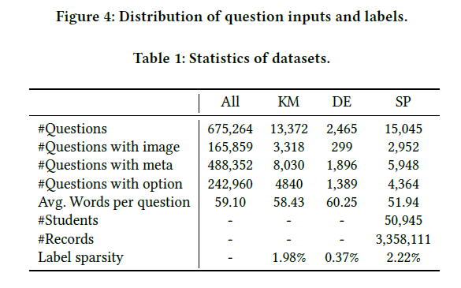

QuesNet: A Unified Representation for
Heterogeneous Test Questions

# QuesNet：异构数据类型测试问题的统一表示

## 摘要

理解学习材料（例如：测试问题）是在线教育系统中的重要问题。它能在教育领域促进很多应用。不过许多受监督的方法都存在人为标记数据稀缺的问题，而大量未标记的资源却被严重利用。为了缓解这个问题，一个有效的解决方案是使用预先训练的表示来理解问题。然而，由于教育领域的一些特殊性，现有的NLP领域的预培训方法在学习试题表示方面是不可行的。首先，问题通常由包括内容文本、图像和边信息在内的异构数据组成。第二，既有基本的语言信息，也有领域逻辑和知识。为此，本文提出了一种新的综合学习问题表示的预训练方法——QuesNet。具体来说，我们首先设计了一个统一的框架，将问题信息及其异构输入聚合到一个综合向量中。在此基础上，提出了一种两层递阶的预训练算法，以更好地理解非监督条件下的试题。在此基础上，提出了一种新的用于抽取低层语言特征的镂空语言模型目标，并提出了一种面向领域的高层逻辑知识学习目标。此外，我们展示了QuesNet在许多基于问题的任务上有调整的能力。我们在大规模的真实问题数据上进行了大量的实验，实验结果清楚地证明了QuesNet在理解问题方面的有效性和优越的适用性。

## CCS 概念

计算机方法论->信息抽取；神经网络；应用计算->教育

## 1 介绍

近年来，许多在线学习系统，如可汗学院和LeetCode，由于其方便和自主，在从K12到大学，甚至成人的各个年龄段的学习者中越来越受欢迎[1, 20].这些系统拥有大量的问题材料，能够为学习者提供许多个性化的学习体验[22].在这些平台中，有必要提前组织好如此丰富的问题[18]。例如，我们需要根据难度属性对它们进行分类，或者用它们的知识概念创建课程设计。在实践中，这样的管理是至关重要的，因为它们可以帮助学生节省精力，找到所需的问题，有针对性的培训和有效的学习[6].因此，找到一种有效的系统理解试题的方法是十分必要的。事实上，由于它是促进许多基于问题的应用的基本问题，例如难度估计[13]，知识图谱[10, 33]，分数预测[28]，系统开发者和研究人员对此都给予了极大的关注。在文献中，利用自然语言处理(NLP)技术来理解问题内容已经做出了许多努力[10,13]。一般来说，现有的解决方案通常设计端到端框架，其中问题被表示为句法模式或语义编码，并通过监督学习在特定的下游任务中直接优化[13,30]。然而，这些特定于任务的方法大多需要大量手工标记的数据(例如，标记难度)，这限制了它们在许多学习系统中的性能，这些系统存在有限的标记注释[13]的稀疏性问题。相对而言，我们的目的是探索一种无监督的方法，充分利用大规模的无标记问题语料库进行问题表示。几种预训练方法在回答问题等任务上都显示出了NLP的优越性[5,24]，它们只是利用同质文本的句子上下文。由于其所具有的领域独特性，在理解和表达问题材料方面是不可行的。首先，测试问题包含一致的异构数据。典型的数学问题，图1由多个不同形式的部分组成，包括文本(红色)、图像(绿色)和侧面信息(黄色)。所有这些信息对于理解问题都是至关重要的，这就要求我们找到一种合适的方法来将它们聚合起来，以便进行全面的表示。其次，对于一个特定的问题，不仅要提取其基本的语言语境，还需要仔细考虑高级逻辑信息，这是一个不平凡的问题。如图1所示，

考题除了语言语境和内容关系外，还包含高层次的逻辑，考虑到四个选项的信息。正确的答案与错误的答案相比，更与问题的意义相关，体现了独特的数学逻辑和知识。例如,在例2中找到正确答案B，我们需要在文中更加聚焦表达式（“AB=AC,...”）和图中的∠CBE也有关系。第三，在练习中被学习到的问题表示应该易于获取，并且易于应用于后续任务，比如难度估计。在实际的教育任务中，问题表示常常作为复杂模型的一部分使用，这就要求该方法具有简单而强大的结构，并且易于混合到特定于任务的模型中。针对上述挑战，本文提出了一种统一的领域特定方法，即QuesNet，用于综合学习试题表示。一般来说，QuesNet能够将某一问题的异构数据聚合成一个整体的形式，并借助低层语言信息和高层领域逻辑知识的优势，获得更深层次的理解。它还可以自然地应用于许多下游方法，从而有效地提高了动态性能。具体来说，我们首先设计了一个基于Bi-LSTM和self-attention的统一模型。在此基础上，提出了一种两层递阶预训练算法，以更好地理解试题。在较低的层次上，我们提出了一种新颖的语言模型(HLM)，目的是帮助QuesNet从基本输入(即，文字，图像等)。相对而言，在更高层次的预培训中，我们提出了一个领域特定的目标，以学习对每个问题的高级理解，从而保持其领域逻辑和知识。有了目标，QuesNet可以在无监督的情况下学习问题的综合表示。此外，我们还演示了如何将QuesNet应用于各种典型的基于问题的任务，包括难度估计、知识映射和分数预测。我们使用三个领域特定的助教对大规模的真实世界问题数据进行了广泛的实验

## 2 相关工作

### 2.1 问题理解

问题理解在教育中是一个已经被研究很久的基本问题[26].现有的方法可以被分成两类：基于规则的表示和基于向量的表示。对于基于规则的表示，学者们致力于设计许多细粒度的规则或语法，并通过将问题文本解析为语义树或预定义的特征来学习理解问题[7,9]。然而，这些主动性工作在很大程度上依赖于设计有效规则模式的专业知识，这显然是劳动密集型的。相比而言，在基于向量的方法中，通过多种自然语言处理(NLP)技术，每个问题都可以作为潜在空间中的语义向量自动学习[29、31]。最近，作为前人研究的延申和组合，深度学习技术由于具有学习复杂语义的优势，已成为一种先进的学习模型[13.35]。例如Tan et al. [30]使用长短期记忆网络（LSTM）模型捕捉疑问句的长期依赖性。Huang et al.[13]使用卷积神经网络来理解问题的内容，针对难度估计任务。虽然已经取得了很大的成功，但所有这些监督方法都存在标记数据稀缺的问题。也就是说，只有在特定的任务中使用标签来监控问题理解和任务建模时，对问题的理解是非常有限的，而没有使用大量未标记的问题数据库。此外，由于没有考虑不同的问题输入形式，导致异构问题理解的信息丢失。

### 2.2 文本预处理

近几年已经目睹了无监督学习的发展，这是在NLP领域充分利用未标记语料库的好方法[5].这些方法可以分为两类:基于特征的方法，其中文本由某种特征提取器表示为固定向量[23,24]，以及基于预训练的方法，其中模型参数在语料库上进行预训练，然后针对具体任务进行微调[5,12]。其中最成功的模型是BERT[5]。它利用Transformer[31]和一些语言相关的训练前目标，以令人印象深刻的性能解决了许多NLP任务。虽然这些训练前的解决方案已经在一系列的NLP任务中得到了充分的检验，但由于以下三个原因，它们很难直接应用于理解试题。首先，测试问题是异构的，其中许多信息以其他格式存在，如图像和侧边特征，将被这些只关注文本的训练前方法忽略。其次，测试问题包含许多领域逻辑和知识，需要理解和表示，而不仅仅是语言特征，这使得模型很难捕获。第三，由于模型修改或超参数调整的需要，这些方法难以应用，这在许多教育设置中是不方便的。

### 2.3基于问题的应用

在教育领域中有许多基于问题的应用，在传统的课堂设置和在线学习系统[1]中发挥着重要的作用。

代表性任务包括难度估计[3,13],知识图谱[4]和得分预测[25]。特别的，难度估计需要我们从题目的内容来评估题目的难易程度，而不是让一群学生来做测试。知识映射的目的是将问题自动映射到相应的知识点。分数预测是一项通过学生的锻炼历史来预测他们在某一特定问题上的表现的任务。所有这些应用都有利于系统管理和服务，如个性化推荐[16]。

与以前的研究相比，我们的工作为异构测试问题提供了统一的表示，并为使用问题的应用程序提供了坚实的基础。我们考虑到测试问题的异构性和理解领域信息的困难，设计了一种功能更强大、可访问的预训练算法。通过异构的问题表示模型和两级的预培训，QuesNet可以从试题中获取更多的信息。

## 3 问题建模和预训练

在本节中，我们将详细介绍QuesNet建模和预培训。首先给出了问题表示问题的形式化定义。然后，描述了异构问题表示的QuesNet体系结构。然后描述了QuesNet的预训练过程，即两级预训练算法。最后，在第3.4节中，我们将讨论如何将QuesNet应用于下游任务并进行微调。

### 3.1 问题定义

在本节中，我们正式介绍了问题表示问题，并阐明了数学符号。

在我们的设置中，每个测试问题q都以异类形式输入，其中包含一种或所有类型的内容，包括文本、图像和边信息(元数据，如知识)。通常，我们能过定义这个作为一个序列$x={x_t,t \in \{1,...,T\}}$,$T$是输入问题序列的长度，与侧信息一起作为一个热编码矢量$m \in \mathbf{R}^{K}$，其中K是边信息的种类数。每一个输入项$x_t$是词汇表中的一个单词(包括公式片段)，或者一个大小为$W \times H$的图片

为了更好的可用性，每个问题q的最终表示，即输出，应该包含作为向量序列的单个内容表示和作为单个向量的整个问题表示。我们将在第3.4节中看到为什么所有这些表示都是必要的。通过上述设置，我们更正式地将问题表示问题定义为:

定义3.1 （问题表征的问题）。给一个异构问题q，作为一个序列$x=\left\{x_{0}, x_{1}, \ldots, x_{T}\right\}$，与侧边信息$x_{0}=m$，序列的长度为T，每个输入内容作为$x_i$(一个词，或者$W\times H$的图像)，我们的目标是将q表示为内容表示向量的序列$v^{(i)}=\left\{v_{0}^{(i)}, \dots, v_{T}^{(i)}\right\}$单句表示向量$v^{(s)}$，每一个都是$N$维的。表示应该捕获尽可能多的信息。

在以下各部分，我们会处理三个主要的挑战:
(1) QuesNet如何生成问题表示;(2)如何对陈述进行预训练;(3)表示如何应用于下游任务。

### 3.2 QuesNet模型架构

QuesNet模型将异构问题q映射到统一的最终表示$\left(v^{(i)}, v^{(s)}\right)$。体系结构如图2 (a)所示，可以分为三个层次:嵌入层、内容层和句子层。具体来说，给定一个问题q，在嵌入层执行其异构输入嵌入。然后在内容层,Bi-LSTM被用于建模不同的输入内容和生成每一个内容表示$\boldsymbol{v}^{(i)}$。最终，在句子层，我们使用注意力机制用一种有效的方法组合向量。

3.2.1 嵌入层。我们首先介绍了嵌入层的构建块。这一层的目的是将异构的输入内容投射到统一的空间中，从而使我们的模型能够针对不同的输入形式。为了做到这一点，在第一层，我们设置了Embedding模块，将各种输入映射到固定长度的向量。Embedding模块的单词是一个映射$emb_w$参数作为$θ_{we}$ ,直接将词汇表中的每个单词映射到一个向量的大小$N_e$。图像embedding模型$emb_i$,具有参数表示$θ_{we}$，如图2（b）的上半部分所示，由三个卷积层和激活层组成。特征也被最大限度地汇集到一个大小为$N_e$的向量中。元数据embedding模型$emb_m$用参数$θ_{me}$表示,如图2所示(b),使用两层完全连接的神经网络将输入元数据嵌入到尺寸为$N_e$的向量中。

对于问题中的每一项，通过这些基础的embedding。我们生成了一个embedded向量$e_t$在第一层中，所以我们能够得到嵌入句子$e=\left\{e_{0}, e_{1}, \ldots, e_{T}\right\}$从输入$x=\left\{x_{0}, x_{1}, \dots, x_{T}\right\}$中。通常：
$$
e_{t}=\left\{\begin{array}{ll}{\operatorname{emb}_{w}\left(x_{t} ; \theta_{w e}\right),} & {\text { if } x_{t} \text { is word }} \\ {\operatorname{emb}_{i}\left(x_{t} ; \theta_{i e}\right),} & {\text { if } x_{t} \text { is image }} \\ {\operatorname{emb}_{m}\left(x_{t} ; \theta_{m e}\right),} & {\text { if } x_{t} \text { is meta data. }}\end{array}\right.
$$
3.2.2 内容层。在这层中，我们的目标是为每个输入项建模关系和上下文。现有的方法，如LSTM[11]只关心一边的上下文。而在Transformer[31]中，上下文和关系建模依赖于位置嵌入，这就失去了一些局部性。此，将上述的嵌入向量序列e作为输入，我们合并一个多层的双向的LSTM结构[14]，更能获取上下文信息。在这里，我们选择Bi-LSTM是因为它可以最大限度地利用正反向问句的上下文内容信息[14,17]。具体来说，给定问题嵌入序列$e=\left\{e_{0}, e_{1}, \ldots, e_{T}\right\}$，我们将LSTM第一层的输入设置为$\overrightarrow{h}^{(0)}=\overleftarrow h^{(0)}=\left\{e_{0}, e_{1}, \ldots, e_{T}\right\}$,在每个位置t，前馈隐藏状态$\left(\overrightarrow{h}_{t}^{(l)}, \overrightarrow{c}_{t}^{(l)}\right)$用于前向传播，或者$\left(\overleftarrow h_{t+1}^{(l)}, \overleftarrow c_{t+1}^{(l)}\right)$对于反方向，递归式为:

这里循环公式遵循Hochreiter et al.[11]

需要更多的层来建模更深层次的关系和上下文。通过L - Bi-LSTM层，可以捕获隐藏状态下的深层语言信息。由于每个方向的隐藏状态只包含一个侧面的上下文，因此在每一步将两个方向的隐藏状态合并成一个向量是有益的。因此，每步t得到的内容表示形式为:
$$
v_{t}^{(i)}=\text { concatenate }\left(\overrightarrow{h}_{t}^{(L)}, \overleftarrow h_{t}^{(L)}\right).
$$
3.2.3 句子层。 在我们对较低层次的语言特征建模之后，我们仍然必须以一种关注长期和全球复杂关系的方式聚合这些信息，这样就可以捕获领域逻辑和知识。为了这个目的，第三个句子层由自注意力模型构成聚合项表示向量序列$\boldsymbol{v}^{(i)}$变成一个句子$v^{(s)}$。与注重上下文的LSTM相比，注意机制更能对长期逻辑和全局信息[31]进行建模。Vaswani等人的[31]之后，我们用多头注意模块执行全局自我注意。给定一组维度N(作为矩阵)Q，键(作为矩阵)K，值的查询(as矩阵)V，多头注意计算输出矩阵为:
$$
\begin{array}{l}{\text { MultiHead }(Q, K, V)=\text { concatenate }\left(\mathrm{head}_{1}, \ldots, \mathrm{head}_{H}\right) W^{O}} \\ {\text { head }_{j} \quad=\text { Attention }\left(Q W_{j}^{Q}, K W_{j}^{K}, V W_{J}^{V}\right)} \\ {\text { Attention }(Q, K, V)=\operatorname{softmax}\left(Q K^{T} / \sqrt{N}\right) V}\end{array}
$$
$H$是多头注意力的头数，$W^{O}, W_{j}^{Q}, W_{j}^{K}, W_{j}^{V}$是一些投影矩阵。直观的，多头注意力模型同时执行几个不同的注意模型，这有助于它为较低层次聚合高级逻辑和知识。

在我们的设置中，我们使用self-attention来聚合内容向量$v^{(i)}$和位置嵌入$pe^{(i)}$，通过设置多头注意力中$Q,K,V$作为$\boldsymbol{v}_{+}^{(i)}=$ concatenate $\left(\boldsymbol{v}^{(i)}, p e^{(i)}\right)$然后将所有时间内的参与值步进一个带有最大池的单个向量中。更正式地:
$$
\left.\left.v^{(s)}=\max \left\{\text { MultiHead (LayerNorm }\left(v_{+}^{(i)}, v_{+}^{(i)}, v_{+}^{(i)}\right)+v_{+}^{(i)}\right)\right)\right\}
$$
其中层规范是指Ba等人提出的层归一化技术，位置嵌入遵循Vaswani等人提出的[31]

到目前为止，我们已经生成了一个统一的问题表示。总之，通过嵌入层，我们将异构内容嵌入到统一的表单中。然后利用内容层中的多层Bi-LSTM，捕捉深层的语言关系和语境。最后在句子层，我们将信息聚合成一个具有高层次逻辑和知识的向量。

### 3.3 预训练

但是，我们仍然需要一种方法来学习大型未标记问题语料库中的所有语言特征和域逻辑，我们将在本小节中对其进行描述。 具体来说，我们充分描述了如何预先训练QuesNet以从问题语料库中捕获语言特征和领域逻辑和知识。 为此，如图3所示，我们设计了一种新颖的分层预训练算法。 我们首先分别预先训练每个嵌入模块。 然后在主要的预训练过程中，我们提出了两个层次的分层目标。 在低水平的预训练中，我们提出了一种新的有孔语言模型作为学习低级语言特征的目标。 在高级学习中，添加了面向领域的目标，用于学习高级域逻辑和知识。 两个级别的目标在一个预培训过程中一起学习。

3.3.1 Embedding预训练。 我们首先对每个嵌入模块进行单独的预训练，为它们设置更好的初始权值。对于词的嵌入，我们在整个语料库中加入Word2Vec[19]，得到一个初始词到向量的映射。对于图片和侧边信息的embedding，我们首先为每个嵌入构造解码器，解码由嵌入模块给出的向量。然后我们使用自动编码器losses[21]来训练这些嵌入模块。如果我们拿图像embedding模型$emb_i$具有参数$\theta_{ie}$作为例子。我们首先构造图像编码器$
\mathrm{e} \widetilde{\mathrm{m}} \mathrm{b}_{i}$同样具有可训练参数$\theta_{i d}$。然后对语料库I中的所有图像，我们可以构造自动编码器loss为:
$$
\mathcal{L}_{T}=\sum_{x \in I} l\left(\operatorname{emb}_{i}\left(\operatorname{emb}_{i}(x)\right), x\right)
$$
$l(y, x)$是度量y和x之间距离的损失函数，例如均方误差(MSE)的损失。则图像嵌入模块的初始权值为:
$$
\hat{\theta}_{i e}=\arg \max _{\theta_{i e}} \mathcal{L}_{I}
$$
我们可以用类似的方法训练边信息嵌入的初值。将所有的边信息作为$\mathcal{L}_{\mathcal{M}}$，边信息编码器$\mathrm{e} \widetilde{\mathrm{m}} \mathrm{b}\left(\cdot ; \theta_{m d}\right)$作为多层全连通神经网络实现，其初始权值为:
$$
\hat{\theta}_{m e}=\arg \max _{\theta_{m e}} \mathcal{L}_{\mathcal{M}}
$$
3.3.2 洞语言模型。 低级别的预训练目标旨在从大型语料库中学习语言特征。 语言模型（LM）是最常用的无监督语言特征学习目标，受其单向性的限制。本文提出了一种新的联合语言模型（HLM），它结合了双方的语境。 直观地说，HLM的目标是用它的左右两个上下文填充每个单词。 它与ELMo [24]中的双向LM实现不同，其中来自双方的上下文被单独训练而没有任何交互。 并且它不像BERT那样依赖于符号的随机屏蔽，这样可以提高样本效率。

在HLM中，与传统语言模型相比，每个位置t的输入内容的概率由其两侧的上下文决定，我们的目标是最大化每个位置的条件概率。 从形式上讲，对于输入序列x，HLM的目标计算：
$$
\mathcal{L}_{\mathrm{HLM}}=-\sum_{t=0}^{T} \log P\left(x_{t} | x_{\neg t}\right)
$$
我们使用$x_{\neg t}$表示所有非$x_t$的输入,目标是最小化$\mathcal{L}_{\mathrm{HLM}}$(负对数似然和)。如3.2节所述，位置t左侧的输入在相邻的左侧隐向量中建模$\vec{h}_{t-1}$，右边是在相邻的右隐向量中建模的$\overleftarrow h_{t+1}$。因此，HLM中每个输入项的条件概率可以用这两个向量组合来建模:
$$
\left.h_{\neg t}=\text { concatenate } \overrightarrow{(h} t-1, \overleftarrow{h}_{t+1}\right)
$$
 以及后续的输出模块，以及与原负对数似然兼容的特定损失函数。 

 由于测试问题输入的多样化，我们必须对每个种类分别建模，换句话说， 输出模块将是一个全连接层$out_w$具有参数$\theta_{ow}$,损失函数是交叉熵函数。输出模型将$h_{\neg t}$作为输入， 并生成词汇量大小的向量 ，这个经过Softmax， 模拟每个单词在t位置的概率， 对于图像，输出模块是一个完全连接的层$out_i(\cdot;\theta_{oi})$ , 然后是之前描述的图像解码器 $e\widetilde{m}b(\cdot;\theta_{id})$ . 损失函数为均方误差损失。  侧信息的输出模块也是一个全连接层 $out_m(\cdot;\theta_{om})$,之后是图像解码$e\widetilde{m}b(\cdot;\theta_{md})$。 这种输入的损失函数也是交叉熵。因此，应用上述输出模块和损耗函数，每个位置t的HLM损耗为 
$$
l_t = \left\{ \begin{array}{rcl}  CrossEntropy(out_w(h_{\neg t}),x_t) & if\ x_t\ is\ a\ word; \\ MSE(e\widetilde{m}b_i(out_i(h_{\neg t})),x_t) & if\ x_t\ is\ a\ image; \\ MSE(e\widetilde{m}b_m(out_m(h_{\neg t})),x_t) & if\ x_t\ is\ side\ information; \end{array}\right.
$$
 因此，问题q的低层次的holed语言模型的目标是 :
$$
\mathcal{L}_{low}=\sum_{t=0}^{T}l_t
$$

3.3.3 面向领域的目标。 较低级别的HLM丢失只会帮助模型学习语言特征，例如关系和上下文。 但是，领域逻辑和知识仍然被忽略。 回顾图1，我们可以看到内容和选项之间的关系包含许多领域特定的逻辑和知识。 为了在最终表示中也包含此类信息，在本节中，我们为高级预训练设计了面向领域的目标。我们使用测试问题的自然领域指导：其答案和选项，以帮助训练QuesNet 表示。对于一个正确的答案和其他错误选项，我们建立的是，给出的选项QuesNet一个训练前任务的问题，该模型应该输出是否是正确的答案。特别的是，我们使用典型的文本编码器对该选项进行编码enc$(\cdot;\theta_{opt})$ 得到答案表示为 $v_{opt}=enc(opt)$ 这里$opt$代表选项， 后我们将选项为正确答案的概率建模为: 
$$
P(opt|q)=sigmoid(D(v_q^{(s)},V_{opt};\theta_{D})),
$$
这里$v_q^{(s)}$是由QuesNet生成的q的句子表示,$D(\cdot,\theta_D)$是输出为一维的全连接神经网络。  因此，问题q的高层次领域导向目标是 
$$
\mathcal{L}_{high} = - \log P(opt|q).
$$
 在低水平和高水平的目标下，可以对包含各种问题的大型题库进行预培训。将嵌入模块的权值分别初始化和预训练后，我们现在可以使用随机梯度下降算法来优化我们的分层预训练目标: 
$$
\mathcal{L}=\mathcal{L}_{high} + \mathcal{L}_{low}
$$
 通过预培训，QuesNet问题表示应该能够同时捕捉到低层次的语言特征和高层次的领域逻辑和知识，并将对问题的理解传递到教育领域的下游任务中。 

### 3.4 微调

教育领域的下游任务通常相当复杂。 以知识图谱为例，例如Yang等人的研究。 [32]，作者在这个多标签问题上使用了细粒度模型，该模型要求每个输入内容都具有表示形式。 另一个例子是分数预测。 在Su等人的论文中。 [28]，每个练习（测试题）都表示为单个向量，然后用作序列模型的输入。

如我们所见，不同的任务需要不同的问题表示形式。 要将QuesNet表示应用于特定任务，我们只需要提供所需的表示即可替换下游模型的等效部分，从而最大程度地减少了模型修改的成本。 此外，在每个下游任务上，只需要对QuesNet进行一些微调，这将导致更快的训练速度和更好的结果。

总之，QuesNet在理解问题方面具有以下优势。 首先，它为异构问题提供了统一且普遍适用的表示形式。 其次，它不仅能够学习诸如关系和上下文之类的低级语言特征，而且还能学习高级领域逻辑和知识。 第三，很容易应用于下游任务并进行微调。 在下一节中，我们将进行广泛的实验以进一步证明这些优势。

## 4 实验 

 在这一节中，我们对教育领域的三个典型任务进行了大量的问卷表征实验，以证明我们的表征方法的有效性。 

###  4.1实验装置 

4.1.1 数据集 我们使用的数据集以及大型问题语料库由iFLYTEK Co.，Ltd.通过其名为Zhixue1的在线教育系统提供。 所有数据都是从高中数学测试和考试中收集的。 表1和图4中显示了一些重要的统计信息。数据集显然是异构的，如表中所示。 大约25％的问题包含图像内容，大约72％的问题包含辅助信息。 为了澄清，知识映射任务中使用的辅助信息是其他一些问题元数据（其等级，其数量显示在表1中）。 在所有其他任务中，知识概念用作辅助信息。 忽略异构信息肯定会导致问题理解的降级。 我们还观察到问题平均包含大约60个单词，但是由于问题文本中有很多用LATEX表示的公式，因此所包含的信息更多。

 4.1.2 评估任务。 在教育领域中，我们选择了与测试问题相关的三个典型任务，即：知识图谱，难度估计和学生成绩预测。 未标记的问题语料库包含大约60万个问题。 语料库中的所有问题稍后都将用于预训练每个比较模型。 对于传统的文本表示模型，将省略图像和辅助信息输入。

知识映射任务的主要目标是将给定问题映射到其相应的知识[25]。 这是一个多标签任务，其中大约有13,000个问题被标记（仅占整个未标记问题数据集的1.98％）。 为了展示一种表示方法如何缓解这种稀缺标签问题及其在此任务上的执行方式，我们选择一种最新的知识映射模型，并将其问题表示部分替换为我们要比较的每种表示模型。 经过微调后，我们使用了一些最常用的评估指标来解决多标签问题，包括准确性（ACC），准确性，召回率和F-1得分。 这些度量的详细信息可以在Piech等人的文章中找到。 [25]，Yang等。 [32]。

第二项任务，即难度估计，是用于估计问题难度的高级回归任务。 稀缺的问题更加严重，因为只有0.37％的问题被标记。 同时，该任务需要更多的领域逻辑和知识作为指导来获得更好的性能，因为估计练习的难度需要对问题有更深的理解。 此任务的数据集仅包含2400个问题。 根据黄等人的评估指标。 [13]包括均值绝对误差（MAE），均方根误差（RMSE），一致度（DOA）和Pearson相关系数（PCC）。

另一方面，分数预测任务是一个更为复杂的领域任务，其主要目标是依次预测学生在其所练习的每个测试问题中的表现如何[28]。 尽管学生记录规模很大，但针对该任务的问题数量仍然非常有限，仅为约2.22％。 为了更好地模拟学生的锻炼顺序，一些最先进的模型将问题内容结合了问题表示形式到建模中。 我们用比较方法代替了该模块，并使用了许多研究中使用的MAE，RMSE（如前所述），准确性（ACC）和曲线下面积（AUC）来评估性能[28，34]。

4.1.3 QuesNet Setup 嵌入模块全部输出大小为128的向量。图像嵌入模块和相关的解码器分别实现为4层卷积神经网络和转置卷积神经网络。 每层特征图的大小为16、32、32、64。辅助信息嵌入模块和相关的解码器设置为两层全连接神经网络。 隐藏层的大小设置为256。对于QuesNet的主要部分，我们使用bi = LSTM的L = 4层和自我注意的1层。 这些模块中隐藏状态的大小设置为256。为防止过度拟合，我们还在每层之间引入丢失层[27]，丢失概率为0.2。

在进行任何预训练之前，首先使用Xavier初始化策略[8]初始化层。 然后在预训练过程中，通过Adam优化算法更新参数[15]。 我们对问题语料库的模型进行了足够长时间的预训练，以使预训练损失收敛。 对于每个任务中的优化程序，我们遵循相应论文中描述的设置。

4.1.4  比较的方法。  我们将QuesNet与几种表示方法进行了比较。这些方法都能够生成问题表示，并应用于上述三个评价任务。具体来说，这些方法是: 

- **original**  是指对每个评价任务采用原始的监督学习方法。我们选择了最先进的方法进行难度估计[13]，知识映射[32]和分数预测[28]，没有任何形式的预训练 
- **ELMo** 是一种基于LSTM的特征提取方法，采用双向语言模型作为训练前策略[24]。它只支持文本表示，因此在使用此方法时我们省略了其他类型的输入。 
- **BERT **是一种具有Transformer结构和屏蔽语言模型的先进的预训练方法[5]。它仅能进行文本表示，因此我们也省略了其他类型的输入
- **H-BERT** 是BERT的修改版本，允许它处理异构输入。 我们使用与QuesNet相同的输入嵌入模块，并将嵌入的矢量设置为面向文本的BERT的输入。

表2列出了所有比较方法。为了公平比较，所有这些方法都进行了调整，以包含大约相同数量的图层和参数，并且将所有这些方法都调整为具有最佳性能。 所有模型均由PyTorch实施，并在带有Tesla K20m GPU的Linux服务器群集上进行了培训。

### 4.2 实验结果

表3中显示了使用包括QuesNet在内的四个不同模型对三个任务中每个任务的比较结果。我们可以很容易地看到，经过预训练的方法可以提高每个任务的性能，其中QuesNet在几乎所有指标上都具有最佳性能，无论每个任务的大小如何。这证明QuesNet可以更好地理解问题，并且可以将较大的未标记语料库更有效地转移到较小的标记数据集。但是，此表中还有更多要说明的内容。首先，支持异构输入的模型比没有异构输入的相似结构具有更好的结果，这证明在理解问题时处理异构输入至关重要。其次，由于所有方法都被调整为包含相似数量的参数，因此QuesNet成为最有效的方法。第三，基于Transformer的方法的结果略低于其他基于LSTM的方法。这可能是由于BERT中使用的掩蔽语言模型预训练策略的样本效率低，而ELMo中的双向语言模型却表现更好，而我们在QuesNet中使用的新颖的有孔语言模型的性能均优于二者。

### **4.3 消融实验**

在本节中，我们将进行一些消融实验，以进一步展示我们方法的每个部分如何影响最终结果。 在表4中，有八种QuesNet变体，每种变体从整个QuesNet中淘汰一个或多个对手。 具体来说：QN-T，QN-I，QN-M是指QuesNet，仅在预训练过程中使用文本，图像或辅助信息。 QN-TI，QN-TM，QNIM分别指不同种类的输入的组合，即文本和图像，文本和辅助信息以及图像和辅助信息。 最后，QN-L表示仅包含低杠杆预训练目标（孔语言模型）的QuesNet，QN-H表示仅包含高级域目标的QuesNet。

表4中的结果确实显示了许多有趣的结论。首先，模型包含的信息越多，性能就越好，这与直觉相吻合。其次，如果我们专注于QN-H和QN-L之间的比较，我们会注意到它们对不同任务的影响不同。在更侧重于诸如知识映射的低级功能的任务上，QN-L的性能略优于QN-H，而在其他面向领域的高级任务（难度估计和学生成绩预测）上，QN-H的性能要好一些。这清楚地说明了这两个目标关注的不同方面，并且QuesNet的完整性能均优于QN-L和QN-H。我们知道QuesNet能够考虑这些目标的两个方面，并在低语言水平和高逻辑水平上建立理解。第三，我们注意到QN-T的性能优于QN-I，后者优于QN-M，这表明文本在问题中包含的信息最多，其次是图像，然后是附带信息。但是由于省略任何一种输入都会导致性能下降，因此异构输入中的所有信息对于良好的问题理解至关重要。

### 4.4 讨论

通过以上实验，很明显QuesNet可以有效地理解测试题。 首先，它可以很好地聚合来自异构输入的信息。 该模型能够以不同的形式为每个问题生成统一的表示形式，并在各种输入中利用信息。 其次，借助低级目标捕获语言功能以及高级目标学习域的逻辑和知识，QuesNet还能够获得对测试问题的低级和高级理解。 在所有三个典型的教育应用程序中都可以看到QuesNet令人印象深刻的性能，突出了QuesNet在教育领域的可用性和优越性。

仍有一些未来研究的方向。 首先，我们可能会研究某些特定领域的模型架构，以更细粒度的方式对问题之间的逻辑进行建模。 其次，对QuesNet对测试问题的理解是不可理解的，将来，我们希望进行理解和解释，以产生更具说服力的表示形式。 其次，我们的方法的总体思路适用于更异构的场景，我们希望进一步探索在其他异构数据和任务上进行工作的可能性。

## 5 结论

在本文中，我们提出了异构测试问题的统一表示形式，即QuesNet。 具体来说，我们首先设计了一种异构建模架构，以将异构输入表示为统一形式。 然后，我们提出了一种新颖的分层预训练框架，该框架具有用于预训练低级语言特征的带孔语言模型（HLM），以及用于学习高级域逻辑和知识的面向领域的目标。 通过从低层次的知识映射任务到与领域相关的难度估计任务，再到复杂的高层次学生成绩预测任务，对教育中的三个典型的下游任务进行了广泛的实验，我们证明了QuesNet具有更强的问题理解能力和 传递，捕获低级语言功能以及高级域逻辑和知识。 我们希望这项工作可以为教育领域中与问题相关的任务打下坚实的基础，并有助于推动该领域的更多应用。

## 致谢

这项研究得到了中国国家重点研究发展计划（No. 2016YFB1000904）和国家自然科学基金（No. 61727809，U1605251和61672483）的资助。 刘淇感激地感谢中国科协青年科学家资助计划和中国科学院青年创新促进会的支持（第2014299号）。