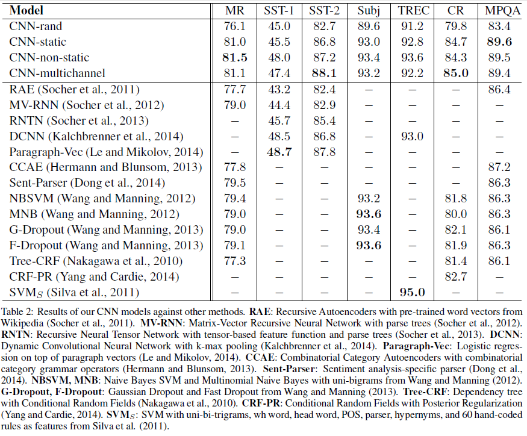

Convolutional Neural Networks for Sentence Classification

# 卷积神经网络应用于句子分类

## 摘要

我们报告了一系列基于卷积神经网络（CNN）的实验，这些神经网络在针对句子级别分类任务的预训练单词向量的基础上进行了训练。 我们展示了一个简单的CNN，几乎没有超参数调整和静态vectors，在多个基准测试中均能达到出色的效果。 通过微调学习特定于任务的向量可进一步提高性能。 我们另外建议对体系结构进行简单的修改，以允许使用特定于任务的向量和静态向量。 本文讨论的CNN模型在7个任务中的4个改进了现有技术，其中包括情感分析和问题分类。

## 1 介绍

近年来，深度学习模型在计算机视觉（Krizhevsky等人，2012）和语音识别（Graves等人，2013）中取得了显著成果。 在自然语言处理中，深度学习方法的许多工作都涉及通过神经语言模型（Bengio等，2003； Yih等 2011； Mikolov等，2013）来学习单词向量表示，并在 学习的词向量进行分类（Collobert等，2011）。 词向量本质上是特征提取器，其将词从稀疏的V的1编码（这里V是词汇量）通过隐藏层投影到较低维度的向量空间上，该特征提取器对词在其维度上的语义特征进行编码。 在这种密集表示中，语义上接近的词在较低维向量空间中同样接近（以欧几里得或余弦距离）

卷积神经网络（CNN）利用带有卷积滤波器的图层应用于局部特征（LeCun et al。，1998）。 CNN模型最初是为计算机视觉而发明的，随后被证明对NLP有效，并且在语义解析（Yih等人，2014），搜索查询检索（Shen等人，2014），句子建模（Kalchbrenner）方面取得了优异的成绩。 等人（2014年）和其他传统的NLP任务（Collobert等人，2011年）。

在目前的工作中，我们训练了一个简单的CNN，在从无监督的神经语言模型获得的单词向量之上，具有一层卷积。 这些载体由Mikolov等人训练。 （2013）关于Google新闻的1000亿个单词，并且已公开可用。1我们最初使单词向量保持静态，仅学习模型的其他参数。 尽管对超参数的调整很少，但这个简单的模型在多个基准上均能获得出色的结果，这表明预训练的向量是“通用”特征提取器，可用于各种分类任务。 通过微调学习特定于任务的向量可以进一步改进。 最后，我们描述了对体系结构的简单修改，以允许通过具有多个通道使用预训练向量和特定于任务的向量。

我们的工作在哲学上与Razavian等人相似。 （2014年）表明，对于图像分类，从预训练的深度学习模型中获得的特征提取器在各种任务上表现良好，包括与训练特征提取器的原始任务截然不同的任务。

## 2 模型

模型架构由图1所示， 是Collobert et al. (2011)的CNN架构的一个微小的变体。 让$\mathrm{x}_i \in \mathbb{R}^k$是k维词向量对应于句子中的第i个单词。 句子的长度为n（必要时填充）被表示为
$$
\mathrm{x}_{1: n}=\mathrm{x}_{1} \oplus \mathrm{x}_{2} \oplus \ldots \oplus \mathrm{x}_{n} \tag{1}
$$
这里$ \oplus$是连接操作。一般来说，让$\mathrm{x}_{i:i+j}$来表示$\mathrm{x}_{i}, \mathrm{x}_{i}+1, \dots, \mathrm{x}_{i+j}$

 卷积运算涉及到卷积核$\mathrm{w} \in \mathbb{R}^{hk}$, 它被应用到一个h字窗口来产生一个新特征。例如，一个特征$c_i$由窗口$\mathrm{x}_{i:i+h-1}$生成：
$$
c_{i}=f\left(\mathbf{w} \cdot \mathbf{x}_{i: i+h-1}+b\right) \tag{2}
$$
这里$b \in \mathbb{R}^{n-h+1}$是一个偏置项$f$是一个非线性函数例如 双曲正切，这个卷积核应用于句子中每个可能的单词窗口$\{\mathrm{x}_{1:h},\mathrm{x}_{2:h+1},...,\mathrm{x}_{n-h+1:n}\}$ 来产生特征映射
$$
\mathbf{c}=\left[c_{1}, c_{2}, \ldots, c_{n-h+1}\right] \tag{3}
$$
通过$c \in \mathbb{R}^{n-h+1}$. 然后我们应用一个最大超时池操作(Collobert et al., 2011)在特征图上取最大值$\hat{c}=\max \{\mathbf{c}\}$ 作为对应于此特定卷积核的特性。  这个想法是为了捕获最重要的功能—每个功能映射具有最高的价值。这种汇集方案自然要处理可变的句子长度。 

我们已经描述了从一个卷积核中提取一个特征的过程。 该模型使用多个卷积核（窗口大小各异）来获取多个特征。 这些特征形成倒数第二层，并传递到完全连接的softmax层，其输出是标签上的概率分布。

在一种模型变体中，我们尝试使用两个单词向量的“通道”，一个在整个训练过程中保持静态，另一个通过反向传播进行微调（第3.2节）。2在多通道架构中，如图1所示，每个卷积核都会应用在这两个通道上，将结果相加以计算公式（2）中的$c_i$。 该模型在其他方面相当于单通道体系结构。 

###  2.1正规化 

为了进行正则化，我们在倒数第二层采用了权重向量的$l_2$范数约束（Hinton et al.，2012）。 删除通过在回滚传播过程中随机删除（即设置为零）隐藏单元的比例p来防止隐藏单元的共适应。 也就是说，给定倒数第二层$\mathbf{z}=\left[\hat{c}_{1}, \dots, \hat{c}_{m}\right]$（注意到这里我们由m个卷积核）， 而不是使用 
$$
y=\mathrm{w\cdot z}+b  \tag{4}
$$
对于正向传播中的输出单元y，使用dropout
$$
y=\mathrm{w\cdot (z \circ r)} +b \tag{5}
$$
这里$\circ$ 是按元素的乘法运算符吗，$\mathrm{r} \in \mathbb{R}^m$ 为伯努利随机变量的掩蔽向量，概率p为1。梯度只能通过未掩蔽单元反向传播。在测试时，学习的权向量按p进行缩放$\widehat{\mathrm{w}} = p\mathrm{w}$。$\widehat{w}$是用来（没有dropout）计算没看过的句子。  我们另外用$l_2$范式约束权重向量通过尺度变化$\mathrm{w}$,$||\mathrm{w}||_2=s$,当$||\mathrm{w}||>s$在梯度下降中。

##  3 数据集和实验设置 

 我们在各种基准上测试我们的模型。数据集的汇总统计数据如表1所示。 

- **MR**：电影评论，每个评论只有一句话。 分类涉及检测正面/负面评论（Pang和Lee，2005）。
- **SST-1**：斯坦福情感树库-MR的扩展，但提供了train / dev / test拆分和细粒度标签（非常积极，积极，中立，消极，非常消极），由Socher等人重新标记。 （2013）。
- **SST-2**：与SST-1相同，但删除了中性评论，并添加了二进制标签。
- **Subj**:  主观性数据集，其任务是将一个句子划分为主观性或客观性(Pang and Lee, 2004)。 
- **TREC**：TREC问题数据集-任务涉及将问题分为6个问题类型（问题是否与人，位置，数字信息等有关）（Li and Roth，2002）。
- **CR**：顾客对各种产品（相机，MP3等）的评论。 任务是预测正面/负面评论（Hu and Liu，2004）。

- **MPQA**：MPQA数据集的意见极性检测子任务（Wiebe et al，2005）。

### 3.1 超参数和训练

对于我们使用的所有数据集：修正线性单元， 3、4、5 卷积核窗口（h），每个卷积核窗口有100个特征图，dropout(p)为0.5，$l_2$约束（s）为3，最小batch为50. 这些值是通过SST-2开发集上的网格搜索选择的。 除了在开发集上提前停止外，我们不会执行任何特定于数据集的调优。对于没有标准开发集的数据集，我们随机选择10%的训练数据作为开发集通过Adadelta更新规则(Zeiler, 2012)。

### 3.2 预训练词向量

在没有大型监督训练集的情况下，使用从无监督神经语言模型获得的词向量进行初始化是提高性能的一种流行方法（Collobert等，2011； Socher等，2011； Iyyer等，2014）。 。 我们使用公开提供的word2vec向量，这些向量经过Google新闻1000亿个单词的训练。 载体的维数为300，并使用连续词袋架构进行了训练（Mikolov等，2013）。 在预训练的单词集中不存在的单词将随机初始化。

###  3.3模型的变化 

 我们用模型的几个变体进行了实验。 

- **CNN-rand**:我们的基线模型，其中所有的单词都是随机初始化的，然后在训练期间进行修改。

- **CNN-static**:一个从word2vec中预先训练向量的模型。所有单词（包括随机初始化的未知单词）都保持静态，只学习模型的其他参数。 

- **CNN-non-static**:和上面一样，但是预先训练的向量会针对每个任务进行微调。 

  **CNN-multichannel**：具有两组词向量的模型。 每组向量都被视为“通道”，并且每个滤波器都应用于两个通道，但是仅通过其中一个通道反向传播渐变。 因此，该模型能够微调一组矢量，同时保持另一组静态。 两个通道都使用word2vec初始化。

  

- 

 为了区分上述变量对其他随机因素的影响，我们通过在每个数据集中保持它们的一致性来消除其他随机因素的来源——cv -fold赋值、未知字向量的初始化、CNN参数的初始化。

##  4 结果与讨论  

表2列出了针对其他方法的模型结果。我们的带有所有随机初始化的单词（CNN-rand）的基准模型不能很好地发挥自己的作用。 尽管通过使用预先训练的向量可以预期获得性能提升，但是我们对这种提升的幅度感到惊讶。 即使是带有静态向量的简单模型（CNN-static）也会表现出色，与使用复杂池化方案的更复杂的深度学习模型（Kalchbrenner et al。，2014）或需要事先计算出语法分析树的应用（Socher et al。 等人，2013年）。 这些结果表明，经过预训练的向量是良好的“通用”特征提取器，可以在数据集中使用。 对每个任务的预训练向量进行微调会带来进一步的改进（CNN非静态）。

### 4.1多通道与单通道模型

我们最初希望多通道体系结构能够防止过拟合（通过确保学习的矢量与原始值的偏差不会太远），从而比单通道模型更好地工作，尤其是在较小的数据集上。 但是，结果参差不齐，因此有必要进一步进行正规化微调过程。 例如，代替使用非静态部分的附加通道，可以保持单个通道但采用允许在训练期间进行修改的额外尺寸。

###  4.2 静态表示与非静态表示 

与单通道非静态模型一样，多通道模型能够微调非静态通道，使其更适合手头的任务。 例如，在word2vec中，好与坏最相似，大概是因为它们在语法上几乎是等效的。 但是对于在SST-2数据集上微调的非静态通道中的矢量，情况就不再如此（表3）。 同样，对于表达情感，善与善比可以说更好，这确实体现在学习的向量中。

对于(随机初始化的)不在预训练向量集合中的标记，微调允许它们学习更有意义的表示:网络学习感叹号与热情洋溢的表达式相关联，逗号是连接词(表3)。

### 4.3 进一步研究

 我们报告一些进一步的实验和观察: 

- Kalchbrenner等。 （2014年）报道的CNN的架构与我们的单渠道模型基本相同，但效果却差得多。 例如，他们的带有随机初始化单词的Max-TDNN（时延神经网络）在SST-1数据集上获得37：4％，而在我们的模型中则为45：0％。 我们将这种差异归因于CNN具有更大的容量（多个滤镜宽度和特征图）。
- 事实证明，Dropout是一个很好的正则化器，可以使用大于必需的网络，然后让Dropout对其进行正则化。 Dropout持续增加2％–4％的相对表现。
- 当随机初始化不在word2vec中的单词时，通过从$U [-a, a]$选择a使得随机初始化的向量具有与预训练向量相同的方差。 有趣的是，在初始化过程中采用更复杂的方法来镜像预训练向量的分布是否会带来进一步的改进。
- 我们简要地尝试了由Collobert等人训练的另一组公开可用的单词向量。 （2011）在Wikipedia上发现8，word2vec的性能要好得多。 尚不清楚这是否归因于Mikolov等。 （2013）的架构或1000亿字的Google新闻数据集。
- Adadelta (Zeiler, 2012)对Adagrad (Duchi et al.， 2011)给出了类似的结果，但需要更少的epoch。 

##  5 结论 

在当前的工作中，我们描述了一系列基于word2vec之上的卷积神经网络的实验。 尽管对超参数的调整很少，但具有一层卷积的简单CNN仍然表现出色。 我们的结果增加了公认的证据，即词向量的无监督预训练是NLP深度学习的重要组成部分。