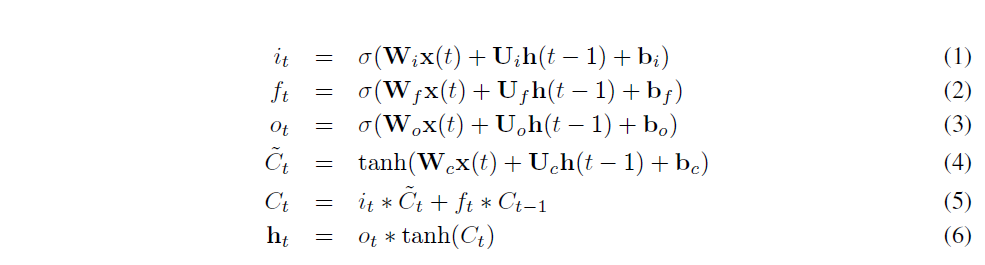
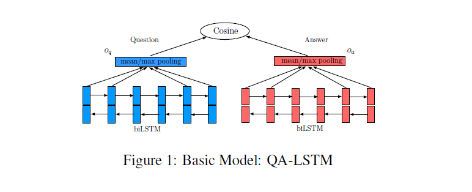
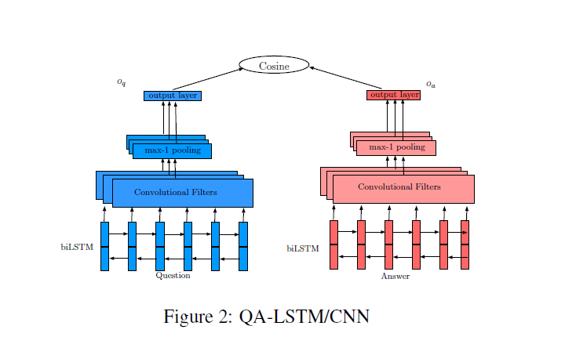
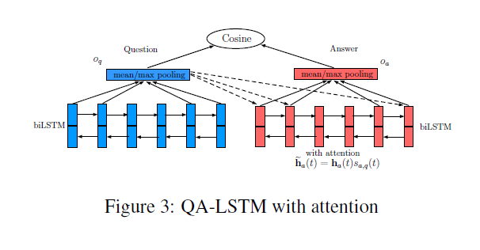
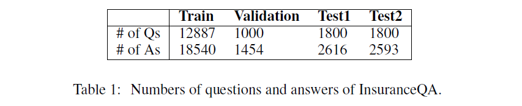
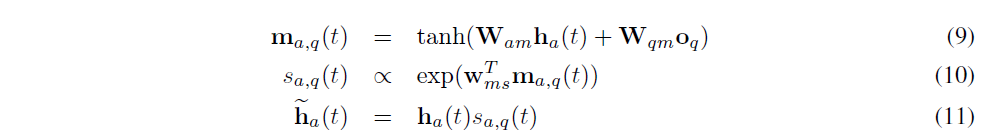
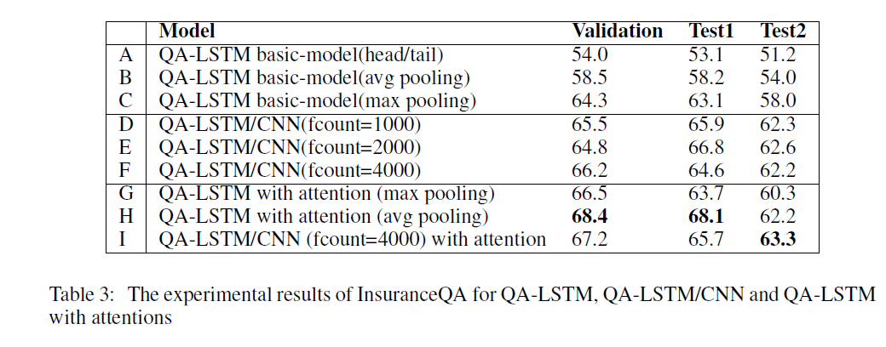
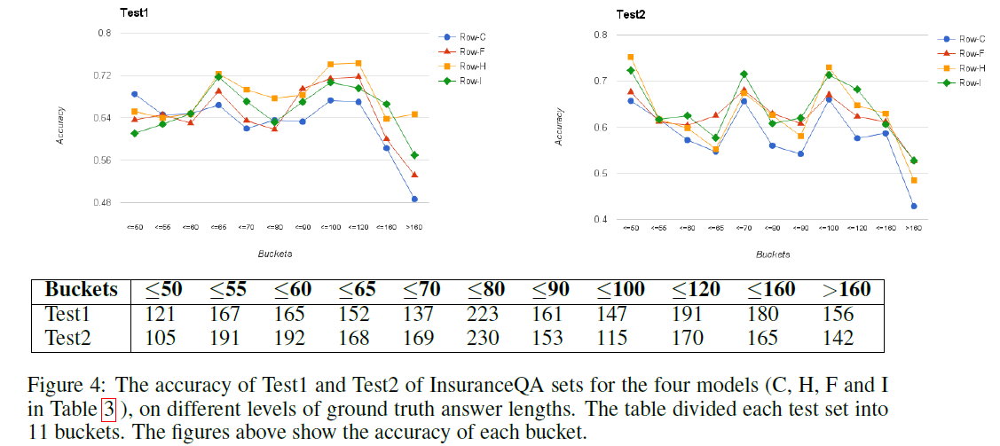
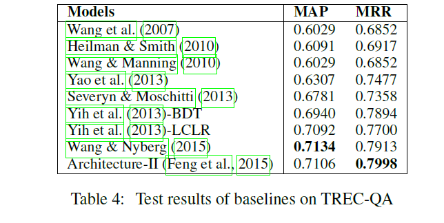

LSTM-BASED DEEP LEARNING MODELS FOR NON-FACTOID ANSWER SELECTION

# 基于LSTM的深度学习模型用于非实际答案的选择

## 摘要

这这篇文章中，我们我们为答案选择任务应用了一个通用的深度学习(DL)框架，它不依赖于手动定义的特性或语言工具。基本框架是基于双向长短时记忆(biLSTM)模型构建问答的嵌入，用余弦相似度来衡量它们的亲密度。我们在两个方向上进一步扩展了这个基本模型。一个方向是将卷积神经网络与基本框架相结合，定义一个更复合的问答表示。另一个方向是利用一种简单而有效的注意机制，根据问题上下文生成答案表示。提供了几种不同的模型。这些模型由两个数据集检查，包括treca - qa和InsuranceQA。实验结果表明，提出的模型明显优于几个强基线。

## 1 介绍

答案选择问题可以表述为:给定一个问题q和一个答案候选池$\{a_1,a_2,...,a_s\}$对于这个问题，我们的目标是去搜索最好的候选答案$a_k,1\leq k\leq s$,答案是任意长度的符号序列，一个问题可能匹配多个真实答案。在测试中，问题的回答可能不会在培训阶段被观察到。在典型的问答系统中，答案选择是一个重要的组成部分。它也是一个独立的任务，在知识库建设和信息提取方面有应用。

这项任务的主要挑战是，正确的答案可能不会直接与问题共享词汇单元。相反，它们可能只在语义上相关。此外，答案有时是嘈杂的，包含大量不相关的信息。

最近，深度学习模型在各种自然语言处理任务中获得重大的成功，例如语义分析（Tang et al.,2015）,机器翻译(Bahdanau et al.,2015)和文本摘要(Rush et al., 2015).

在这篇文章中,我们提出一个深度学习框架来经行问题选择,过程中不需要任何特征工程,语言学工具,或者格外的资源.这个框架基于对问题和答案分别建立双向长短时记忆(biLSTM)模型，与池化层连接，利用相似度度量度量匹配度。 我们从两个方面改进了这个基本模型。首先，一个简单的池化层可能存在无法保存局部语言信息的问题。为了更好的嵌入问题和答案，我们在biLSTM上构建了一个卷积层(CNN)结构。其次，为了更好地根据问题区分候选答案，我们将一个简单而有效的注意模型引入到该框架中，根据问题上下文生成嵌入的答案。 

 我们报告了两个答案选择数据集的实验结果:(1)InsuranceQA (Feng et al.,2015) 一个最近发布的大型非真实的QA数据集，来自保险领域。提出的模型与两个非DL基线和一个基于CNN的强DL基线相比，表现出了显著的性能提升.(2)TREC-QA, 是由 wang et al.(2007)创建. 基于文本检索会议(TREC)的QA跟踪数据。  所提出的模型优于各种强基线。 

 论文其余部分组织如下:第2节阐述了选择答案的相关工作;第3节提供建议模型的详情;InsuranceQA和treci - qa数据集的实验设置和结果分别在第4节和第5节中讨论;最后，我们在第六部分得出结论。 

## 2 相关工作

 以前的答案选择工作通常使用特征工程,语言学工具,或者格外的资源.例如,语义特征被构造基于WordNet(Yih et al., 2013). 该模型基于词的语义关系对语义相关词进行配对。在(Wang & Manning,2010;Wang et al.,2007), 答案选择问题转换为问题/答案解析树之间的语法匹配。有些工作尝试使用依赖项解析树之间的最小编辑序列来实现匹配(Heilman & Smith, 2010; Yao et al., 2013).最近, 实现了判别树-编辑特征提取和解析树工程的自动化(Severyn & Moschitti, 2013).

虽然这些方法显示了有效性，但是它们可能会因为引入语言工具(如解析树和依赖树)而导致额外资源的可用性、特性工程的工作量和系统复杂性。

之前已有使用深度学习技术进行答案选择任务的方法。非事实性问题的回答方式一般有以下几个方向:首先，学习问题和答案表示，并通过一定的相似性度量进行匹配(Feng et al., 2015; Yu et al., 2014; dos Santos et al., 2015).其次，根据问题和答案构造一个联合特征向量，然后将任务转换为一个分类或学习排序问题(Wang & Nyberg, 2015).最后,最近提出一个文本生成方法本质上可以用于答案的选择和生成(Bahdanau et al., 2015; Vinyals & Le, 2015).

本文提出的框架属于第一类。我们的方法和工作有两个主要的不同。我们的方法和(Feng et al.， 2015)的工作有两个主要区别:（1）架构发展于(Feng et al.， 2015)仅基于CNN，而我们的模型基于双向LSTMs，更有能力利用长时间连续的上下文信息。此外，为了更好的性能，我们还在biLSTM的顶部集成了CNN结构。（2) Feng et al.(2015)独立处理问题和答案，而提出的结构开发了一个高效的关注模型，根据问题生成答案嵌入。 

## 3 方法

在这一节， 我们描述了提出的框架及其变化。我们首先介绍了基于问题和候选答案的双向LSTM的总体框架，然后利用相似度度量度量问题答案对之间的距离。在下面的两个小节中，我们将从两个独立的方向扩展基本模型。

### 3.1 基本模型:QA-LSTM

长短时记忆(LSTM):递归神经网络(RNN)被广泛用于处理变长序列输入。远程历史数据被存储在一个递归的隐藏向量中，该隐藏向量依赖于前一个隐藏向量。LSTM（Hochreiter & Schmidhuber，1997）是目前RNN中比较流行的一种变体，用于缓解RNN的梯度消失问题。  我们的LSTM实现与(Graves et al., 2013)中的类似，经行了较小的改动。给予一个输入序列$\mathbb{x}=\{\mathbb{x}(1),\mathbb{x}(2),...,\mathbb{x}(n)\}$,这里$\mathbb{x}(t)$是E维词嵌入向量在这篇文章中。隐藏层向量$\mathbf{h}(t)$大小是H 此时，步骤t更新如下 

在LSTM架构中，有三个门（输入门$i$,遗忘门$f$,输出门$o$）,和一个细胞记忆向量$c$。$\sigma$是$sigmoid$函数。输入门可以确定传入向量$x_t$如何改变存储单元的状态。输出门允许存储器单元对输出产生影响。最后，遗忘门允许单元格记住或忘记它以前的状态。$\mathbf{W} \in R^{H \times E}$,$\mathbf{U} \in R^{H \times H}$,$\mathbf{b} \in R^{H \times 1}$ 为网络参数。 

**双向长短时记忆(biLSTM):**  单向lstm的缺点是不能利用来自未来令牌的上下文信息。双向LSTM通过对两个方向上的序列进行处理，利用之前的上下文和未来的上下文，生成两个独立的LSTM输出向量序列。一个按正向处理输入序列，另一个按逆向处理输入序列。每个时间步长的输出是两个方向上的输出向量的串联，及$h_{t}=\overrightarrow{h_{t}} \| \overleftarrow{h_{t}}$。

**QA-LSTM:** 这项工作的基本模型如图1所示。BiLSTM独立地生成问题和答案的分布式表示，然后利用余弦相似度度量它们的距离。(Feng et al.， 2015;Weston et al.，2014;Hu et al. 2014)将训练目标定义为Hinge Loss。
$$
L=\max\{0,M-cosine(q,a_+)+cosine(q,a_\_)\}  \tag{7}
$$
这里$a_+$是真实答案，$a_\_$是从整个答案空间中随机选择了一个错误答案，M是恒定边距。我们将具有多个基本真理的问题视为多个训练示例，每个示例对应一个基本真理。

基于单词级的biLSTM输出，有三种简单的方法来生成问题和答案的表示:(1)平均池;(2)最大池;(3)最后两个方向上的向量的拼接。并与第五部分的实验结果进行了比较。在余弦相似度匹配之前，对QA表示进行Dropout操作。

最后，通过初步的实验，我们发现问答双方共享相同网络参数的体系结构明显优于问答双方各自拥有参数的体系结构，且收敛速度更快。正如(Feng et al.， 2015)中所讨论的，这是合理的，因为对于一个共享层网络，问题中的相应元素和答案向量代表相同的biLSTM输出。而对于具有独立的问答参数的网络，则不存在这样的约束，模型具有双规模。

### 3.2 QA-LSTM/CNN

在先前的一小节中，我们只通过简单的操作(如max或mean pooling)来生成问题和答案的表示形式。在本小节中，我们将使用一个基于biLSTM输出的CNN结构，以便给出更复合的问题和答案表示。

本文中CNN的结构与in (Feng et al.，2015)的结构相似，如图2所示。与传统的前向神经网络不同，在前向神经网络中，每个输出与每个输入是相互作用的，卷积结构只在一个滤波器大小为m的输入之间施加局部相互作用。

 在本工作中，对于biLSTM中每个大小为m的窗口输出向量，即 $\mathbf{H}_m(t)=[\mathbf{h}(t),\mathbf{h}(t+1),..,\mathbf{h}(t+m-1)]$ , t是某个时间步长，卷积filter将生成一个值，如下所示。
$$
o_F(t)=\tanh\left[\left(\sum_{i=0}^{m-1}\mathbf{h}(t+i)^T\mathbf{F}(i)\right)+b\right] \tag{8}
$$
这里b是偏置，$\mathbf{F}$和b是这个filter的参数。

像传统CNNs一样，一个最大K池化层构建在卷积层之上。直观的，我们想要强调top-k个值来自每一个卷积filter。通过k-MaxPooling，一个过滤器将保留最大的k个值，这表示一个过滤器与输入序列匹配的最高程度。 

最后。是N个平行filters，通过不同的参数初始化，和卷积层得到N维输出向量。我们得到两个输出向量具有$kN$分别对于每个问题和回答。在这项工作中，$k=1,k>1$没有显示出明显的提高在我们之前的实验之中。这个结构的直觉是，我们并没有将每个token的词汇信息作为之前的小节来平均考虑，而是强调了答案的某些部分，这样QA-LSTM/CNN可以更有效的区分基本事实和错误答案。

###  3.3 基于注意力的QA-LSTM 

在前一小节中，我们描述了基本模型的一个扩展，它的目标是分别为问题和答案提供更多的复合嵌入。在本小节中，我们将从另一个角度研究扩展。我们利用一个简单的注意力模型来生成基于问题的回答向量，而不是独立地生成QA表示。 

当双向LSTM模型必须在问题和答案上长距离传播依赖关系时，隐藏向量的固定宽度成为瓶颈。注意力机制可以通过动态调整问题答案中信息量更大的部分来缓解这一弱点。这一策略已被用于许多其他自然语言处理任务，如机器翻译(Bahdanau et al., 2015; Sutskever et al., 2014), 句子摘要(Rush et al., 2015)和事实的问题回答(Hermann et al., 2015; Sukhbaatar et al., 2015).

受到(Hermann et al., 2015)工作的启发，我们在基础模型上开发了一个非常简单但是有效的词级别的注意力。图3展示了该模型的结构。在平均池化之前，每个biLSTM输出向量将乘以一个softmax权值，该权值由biLSTM的问题嵌入决定。

特别的， 给定第t步时答案边biLSTM的输出向量，$\mathbf{h}_a(t)$,和问题嵌入,$\mathbf{o}_q$, 每个回答字符的更新向量$\widetilde{h}_a(t)$表示如下.

这里$W_{am},W_{qm},W_{ms}$是注意力参数。从概念上讲，注意力机制赋予特定单词更多的权重，就像tf-idf赋予每个单词一样。然而，前者是根据问题信息来计算权重的。这种方法与(Hermann et al.， 2015)中的方法的主要区别于，Hermann et al.(2015)的细心读者强调支持事实的信息性部分，然后使用查询和支持事实的组合嵌入来预测事实性答案。在这项工作中，我们直接使用基于注意力的表现来测量问题/答案的距离。实验表明，该注意机制能根据试题文本更有效地区分正确答案和错误答案。

### 3.4 具有注意力的QA-LSTM/CNN

前面介绍的两个扩展以一种简单的方式组合在一起。第一，biLSTM问题的隐藏层向量$\mathbf{h}_a(t)$乘以$s_{a,q}(t)$,它是从问题平均池化向量$o_q$,和更新$\widetilde{h}_a(t)$,在式9-11中说明。然后，原始的问题和更新后的答案隐藏向量分别作为CNN结构的输入，使得问题上下文可以用来评估CNN输入的softmax权值。从实验中，我们观察到这两种扩展根据不同的数据集对性能改进的贡献是不同的。然而，关注QA-LSTM/CNN可以超越这两个数据集的基线。

## 4  INSURANCEQA实验 

 在前面部分描述了许多模型之后，我们评估了Feng et al.(2015)在保险领域数据集InsuranceQA上提出的方法。InsuranceQA数据集提供一个训练集、一个验证集和两个测试集。我们没有看到两个测试的问题有明显的分类差异。 我们能够看到InsuranceQA数据集的细节在（Feng et al. 2015）. 我们在表1中列出了数据集的问题和答案的数量。 一个问题可能对应多条答案。问题比答案短的多。问题的平均长度是7，答案的平均长度是94.对于问题较长的答案，对于答案的选择提出了挑战。这个语料库包含了24981个独特的问题。对于验证集和测试集，数据集同样包含了500个候选答案对于每个问题。这些答案池包含了正确的答案和一些随机选取的答案。第一正确的答案是被包含的

### 4.1设置

本工作中的模型由Theano (Bastien et al.， 2012)从零开始实现，所有实验都在GPU集群中处理。我们使用验证集的准确性来定位最佳的epoch和用于测试的最佳超参数设置。

词嵌入训练通过word2vec(Mikolov et al., 2013),词向量的大小是100。词嵌入也是参数，并在训练期间优化。随机梯度下降（SGD）是一种优化策略。我们试了不同的边际值，例如0.05，0.1和0.2，最终确定值为0.2.我们也尝试采用$l_2$正则化在训练目标上。然而，初步的实验表明，正则化因子并没有显示出任何改善。此外，LSTM输出矢量的一维尺寸为141，这使得biLSTM的参数数量与一维尺寸为200的LSTM相当。

 我们对我们的模型进行了小批量的培训(批量大小B为20)，问题和答案的最大长度L为200。任何超出此范围的字符都将被丢弃。因为一个小型批处理中的问题或答案可能有不同的长度，所以我们求助于掩码矩阵$M \in R^{B \times L}$ 来指示每个字符序列的实际长度。 

### 4.2 BASELINES

为了比较，我们在表2中报告了4中基线的性能：2个最先进的non-DL方法和基于CNN的强DL方法的两种变体。 

**词袋模型**  该问题及其所有候选答案的idf加权词向量之和用作特征向量。类似于这项工作，候选人重新排序根据余弦相似的问题。 

**Metzler-Bendersky IR模型:**   一种最先进的加权相关(WD)模型，它使用基于术语和基于术语邻近性的排序特征的加权组合来为每个候选答案打分。 

**Architecture-II 在(Feng et al., 2015):**  该方法不使用LSTM，而是使用CNN模型学习给定问题及其候选答案的分布式向量表示，并通过与问题的余弦相似度对答案进行评分。在这个基线中没有使用注意力模型。 

**欧氏几何平均值和s形点积(GESD)： ** GESD是用来测量问题和答案之间的距离。这是在(Feng et al.， 2015)中表现最好的模型。 

###  4.3结果与讨论 

本节对实验结果进行了详细的分析。表3总结了我们的保险质量评估模型的结果。从第(A)行到第(C)行，我们例举了QA-LSTM没有使用CNN架构和attention模型。

它们在如何利用biLSTM输出向量形成问题和答案的句子嵌入方面存在差异，如3.1节所示。我们可以观察到，只连接来自两个方向(A)的最后向量的效果最差。使用maxpooling是令人惊讶的(C)比平均池要好得多(B)，潜在的原因是max-pooling为每个维度提取了更多的局部值，使得更多的局部信息可以反映在输出嵌入上。

通过行（D）到（F），CNN层建立在biLSTM的顶部与不同的filter数目。我们设置filter宽度m=2，我们没有看到更好的性能当m增加到3或者4的时候。行（F）具有4000个filters获得最佳验证精度，获得与最佳基线相当的性能（Row（D）在表2中）。行F共享了高度相似的CNN结构与Architecture-II(Feng et al., 2015),除了后者使用一个浅的隐藏层来将词嵌入转换成CNN结构的输入，而行F将biLSTM的输出作为CNN的输入。

行（G）和（G）与注意力模型的QA-LSTM相对应。(G)用最大池连接注意后答案的输出向量，(H)用平均池连接注意后答案的输出向量。与模型(C)相比，模型(G)在验证和Test2集上都有超过2%的改进。对于平均池化层(B)的模型，注意力的改善更为显著。与(B)相比，模型(H)在所有数据集上都比(B)高出8%以上，并且在验证、Test1和Test2集上分别从最佳基线得到3%、2.8%和1.2%的改进。与Architecture II在(Feng et al.， 2015)相比，后者涉及了大量的CNN的filters， (H)模型参数较少。 

第(I)行对应第3.4节，其中CNN与注意机制相结合。虽然与(F)相比，所有的set都有1%的改善，但是与(H)相比，我们并没有看到明显的改善。我们认为有效的注意力可能在CNN的优化中消失了。然而，(H)和(I)均优于所有基线。

我们还研究了所提出的模型，看看它们是如何处理长答案的。 我们将Test1和Test2集的问题按照它们的基本事实的平均长度分成11个部分。在图4的表格中，我们列出了桶级别和属于每个桶的问题的数量，例如，Test1有165个问题，它们的真实长度$55<L\leq60$,我们选择模型（C），（F）和（I）在表3中来进行对比。模型（C）没有注意力和句子嵌入，只有最大池化。模型（F）利用CNN，然而模型（H）和（I）整合了注意力。如4图中左图所示，(C)与其他模型相比，答案更短的数据集中获得更好或接近的性能（$\leq50,\leq55,\leq60$）。然而，随着地面长度的增加，(C)与其他模型之间的差距越来越明显。在Test2的右图中也观察到了类似的现象。这表明了QA-LSTM基本模型的两个扩展的有效性，特别是对于长时间回答的问题。

Feng等人(2015)报告称，GESD在他们的模型中比余弦相似度更好。然而，使用GESD作为相似度评分的模型并没有提高准确性。

最后，我们将余弦相似度替换为MLP结构，MLP结构的输入(282x2维)是问题和答案嵌入的拼接，输出是单个相似度评分，并使用各种隐藏层大小(100,500,1000)对修改后的模型进行测试。我们观察到，修改后的模型不仅得到>10%的准确率下降,而且收敛的十分缓慢。一种可能的解释是，MLP涉及更多的网络参数，这使得训练更加困难，尽管我们认为MLP可能部分地避免了由余弦相似度引入的将问题和答案投射到同一高维空间的概念挑战。

## 5 TREC-QA实验 

在本节中，我们将详细介绍使用treci - qa数据集的实验设置和结果。 

### 5.1 数据、指标和基线

在这篇文章中，我们放弃了TREC-QA，由Wang et al. (2007)创造基于文本检索会议(TREC) QA跟踪(8-13)数据。我们遵循训练/验证/测试问题选择(Wang & Nyberg, 2015)准确的方法，所有只有肯定或否定答案的问题都被删除。
最后，我们有1162个培训问题，65个发展问题和68个测试问题。

在之前的工作中，我们使用了平均平均精度(MAP)和平均倒数等级(MRR)作为评估指标，使用官方评估脚本计算。

在表4中，我们列出了这个数据集上以前的一些工作的性能，可以参考(Wang & Nyberg, 2015)。我们在(Feng et al.， 2015)中从零开始实现了ARchitecture-II。Wang & Nyberg(2015)和Feng et al.(2015)分别是MAP和MRR上的最佳基线。

###  5.2 设置 

我们保持配置与4.1节中的InsuranceQA相同，除了以下差异:首先，我们将minibatch size设置为10;其次，我们将问题和答案的最大长度设置为40，而不是200。(Wang & Nyberg, 2015)，我们使用了由word2vec训练和提供的300维向量。 最后，我们使用epoch的模型和验证集上的最佳映射进行训练。此外，虽然treco - qa数据集为每个训练问题提供了否定答案候选，但我们从训练集中所有候选答案中随机选择否定答案。 

###  5.3结果 

表5展示了提出模型的性能。与模型（A）比较，这是在biLSTM上面的平均池化，但是没有注意，模型（B）具有注意力改进MAP 0.7%， MRR大约2%。  CNN和QA-LSTM的结合（模型C）， 从模型(A)中对MAP和MRR进行了更大的改进。 模型（D），它组合了模型（B）和（C）， 在MAP上达到最佳基线的性能和竞争力，有2~4%的提高在MRR上与(Wang & Nyberg, 2015)和(Feng et al., 2015)相比。最后，模型（E），它与相同的模型(D)相对应，但使用LSTM隐藏向量大小为500，在两个指标上都获得了最好的结果，并且优于基线。

## 6 结论

本文采用基于双向lstm的深度学习框架研究了答案选择问题。该框架不依赖于特征工程、语言工具或外部资源，可以应用于任何领域。我们在两个方面进一步拓展了这一基本框架。首先，我们将一个卷积神经网络结合到这个框架中，以便为问题和答案提供更复合的表示。其次，我们整合了一个简单而有效的注意机制来生成基于问题的答案嵌入。 最后，两个扩展合并在一起。我们使用TRECQA数据集和最近发布的InsuranceQA数据集进行实验。实验结果表明，所提出的模型优于各种强基线。在未来，我们想进一步评估针对不同任务提出的方法，如答案质量预测社区QA和识别文本蕴涵。在结构层面，我们计划将注意机制提升到短语或句子层面。