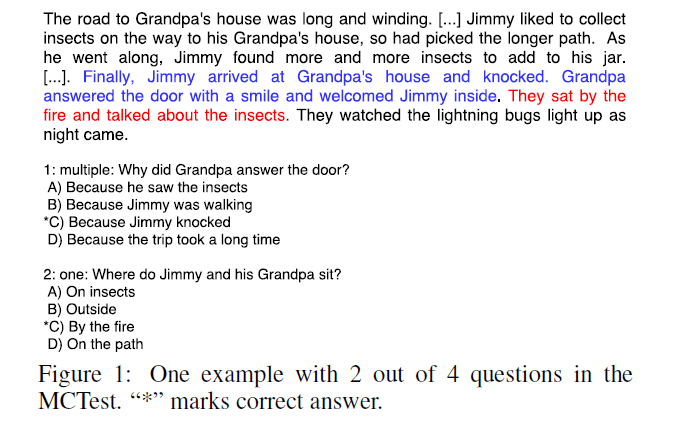

Attention-Based Convolutional Neural Network for Machine Comprehension

# 基于注意力的机器理解卷积神经网络

## 摘要

 理解开放域文本是自然语言处理（NLP）的主要挑战之一 。 机器理解基准测试评估系统仅基于文本内容理解文本的能力。 在这项工作中，我们在MCTest上研究机器理解问题，一个问答（QA）基准。之前的工作主要基于特征工程方法。我们提出了一个神经网络框架，命名为基于分层注意的卷积神经网络(HABCNN), 在不使用任何手动设计的特性的情况下完成此任务。 特别的来说，我们探索HABCNN对于这个任务通过两条规则，一个是通过传统的文档联合建模，问题和回答，另一个是通过文本蕴涵（textual entailment），HABCNN使用注意力机制来探测关键短语，关键句子和关键片段与问题的回答相关。实验表明，HABCNN比之前的深度学习方法上有较大的优势。

##  1 介绍

赋予机器理解自然语言的能力是NLP的一个长期目标，并有望革新人们与机器交互和检索信息的方式。Richardson et al.[2013]提出了机器理解的任务，与MCTest一起。一个用于评估的问题回答数据集。机器理解文本的能力通过提出一系列问题来评估，其中每个问题的答案只能在相关的文本中找到。解决方案通常侧重于文本的一些语义解释，可能采用某种形式的概率或逻辑推理来回答问题。尽管最近有许多的相关任务[Weston
et al., 2014; Weston et al., 2015; Hermann et al., 2015;Sachan et al., 2015]问题还远没有解决。

机器理解是一个开放领域的问答问题，其中包含了一些事实性的问题，但答案可以通过提取或归纳关键线索而得到。图1展示了一个MCTest中的例子。每个例子包含一个文本，四个相关联的问题；每个问题跟随四个候选答案，其中只有一个是正确的。

问题在MCTest中有两个种类：“单选”和“多选”。标签表示需要文档中的一个或多个句子来回答这个问题。要正确回答例子中的第一个问题，需要两个蓝色的句子;对于第二个问题，只有红色的句子可以帮助。以下是对整个MCTest的观察结果。（i）大部分文本中的句子与答案是不相关的，这就需要我们把注意力放在一些关键的地区（ii）候选答案可以是长度和抽象级别灵活的文本，并且可能不出现在文档中。例如，第二个问题的考生B是“outside”，这是一个单词，在文档中不存在，而第一个问题的考生答案是较长的文本，文本中有一些助词，如“Because”。这就要求我们的系统通过提取和抽象来处理灵活的文本。(iii)有些问题需要多个句子来推断出答案，而这些关键的句子大多彼此相近(我们称之为片段)。因此，我们的系统应该能够在潜在的单句线索和片段线索之间做出选择或妥协。

之前的工作大多基于特征工程。相反，这项工作率先提出了一种没有任何语言特征的深度神经网络方法。

具体的，我们提出HABCNN，一种基于分层注意的卷积神经网络，在两个路线图中解决这个任务。在第一个例子中，我们以两种不同的方式投影文档，一种基于回答-注意，然后比较两个投影文档表示，以确定答案是否与问题匹配。在第二种方法中，每个问答对都被重新格式化为一个语句，然后通过文本蕴涵处理整个任务。

在这两个路线图，卷积神经网络(CNN)的探索，以建模所有类型的文本。像人类通常做QA任务一样，我们的模型期望能够发现关键的片段，关键的句子，和关键词或者句子在文本中。为了检测问题所需要的信息部分，我们探索了一种对文档建模的注意机制，使其表示集中包含所需的信息。在实践中，在QA任务中，我们的系统不是自上而下地模仿人类，而是自下而上地对文档进行建模，从单词级到代码片段级积累最相关的信息。我们的方法在三个方面是新颖的（i）文档由分级CNN建模，其粒度不同，从单词到句子级别，然后从句子到片段级别。选择CNN而不是其他序列模型如递归神经网络[Mikolov et al.,2010]，长短时存储器(LSTM [Hochreiter and Schmidhuber, 1997]), 门循环单元(GRU [Cho et al.,2014])等的原因，是因为我们认为CNNs更适合检测文档中的关键句和句子中的关键短语。再次考虑图中的第二个问题原句“They sat by the fire and talked about he”包含了比所要求的更多的信息。我们不需要知道“They sat by the fire and talked about he insects”。序列建模神经网络通常通过累积整个序列来对句子意义进行建模。CNNs采用了卷积池的步骤，应该可以检测一些突出的特征，不管这些特征来自哪里。（ii）在图1的例子中，显然，不是所有的句子都需要一个问题，通常不同的问题需要不同的片段。因此，同一个文档应该根据问题的不同有不同的表示。为此，我们将注意力引入到层次化的CNN中，以指导动态文档表示的学习，这些动态文档表示与问题的信息需求非常匹配。(iii) 句子和片段级别的文档表示都能提供问题所需的信息，因此开发了一个高速公路网络将它们结合起来，使我们的系统能够灵活地进行权衡。

总的来说，我们做出了三个贡献。(i)我们提出了一个基于分层注意的CNN系统“HABCNN”。据我们所知，这是第一个基于深度学习的系统其特定的任务。(ii)先前i的基于深度神经网络的文档建模系统大多生成一般的表示，这项工作是第一个将注意力集中在文档表示上，从而使文档表示偏向于问题需求。(iii)我们的HABCNN系统远远超过其他深度学习竞争对手。

## 2 相关工作

现在存在的系统对于MCTest任务大部分是基于手动的特征工程。代表工作包括[Narasimhan and Barzilay, 2015; Sachan et al., 2015; Wang and McAllester, 2015; Smith et al., 2015].在这些工作中，一个常见的规则就是去定义一个基于特征向量的正则化损失函数，然后大部分努力集中在设计一个高效的特征基于各种规则。