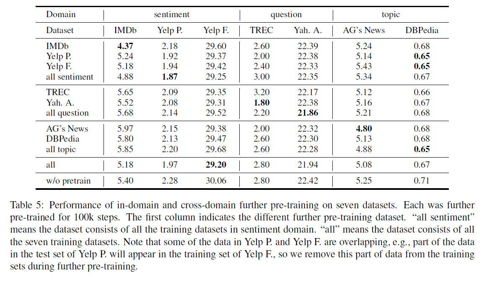

How to Fine-Tune BERT for Text Classification?

# 如何微调BERT文本分类?

## 摘要

语言模型预训练已被证明在学习通用语言表示方面是有用的。作为一种最先进的语言模型预训练模型，BERT(双向编码器)在许多语言理解任务中取得了惊人的成绩。在本文中，我们进行了详尽的实验，研究了BERT在文本分类任务中的不同微调方法，并给出了BERT微调的一般解决方案。最后，本文提出的解决方案在八个被广泛研究的文本分类数据上得到了最新的结果。

## 1 介绍

文本分类是一个经典的自然语言处理(NLP)问题。任务是将预定义的类别分配给给定的文本序列。一个重要的中间步骤是文本表示。以前的工作使用各种神经模型来学习文本表示，包括卷积模型(Kalchbrenner et al., 2014; Zhang et al.,2015; Conneau et al., 2016; Johnson and Zhang,2017; Zhang et al., 2017; Shen et al., 2018),循环网络(Liu et al., 2016; Yogatama et al.,2017; Seo et al., 2017),和注意力机制(Yang et al., 2016; Lin et al., 2017).

另外，大量的工作表明，在大型语料库上预先训练的模型有利于文本分类和其他NLP任务，可以避免从零开始训练新模型。一种预先训练好的模型是词嵌入，例如word2vec(Mikolov et al., 2013)和GloVe(Pennington et al.,2014),或上下文化的词嵌入，如CoVe(Mc-Cann et al., 2017)和ELMo(Peters et al.,2018)。这些词嵌入通常用作主要任务的附加功能。另一种预训练模型是句子级别的。Howard and Ruder (2018)提出ULMFiT一种用于预训练语言模型的微调方法，在六个广泛研究的文本分类数据集上获得了最新的结果。最近，通过使用大量未标记的数据，预先训练的语言模型在学习通用语言表示方面显示出了很大的用处:例如,OpenAI GPT(Radford et al.,2018)和BERT(Devlin et al., 2018).BERT是基于多层双向Transformer(Vaswani et al., 2017)，并在纯文本上进行训练，用于掩码单词预测和下一个句子预测任务。

尽管BERT在许多自然语言理解(NLU)任务中取得了惊人的成绩，但其潜力仍有待充分挖掘。很少有研究通过增强BERT来进一步提高目标任务的性能。

在本文中，我们研究如何最大限度地利用BERT进行文本分类任务。我们将探索几种微调方法增强了BERT在文本分类任务中的性能。我们设计了详尽的实验来详细分析BERT。

本文的贡献如下:

- 提出了一种对训练前的BERT模型进行微调的通用解决方案，该方案包括以下三个步骤:(1)进一步对BERT进行任务内训练数据或域内训练数据的预训练;(2)可选微调BERT与多任务学习，如果几个相关的任务是可用的;(3)对BERT进行目标任务的微调
- 我们还研究了BERT在目标任务中的微调方法，包括长文本预处理、层选择、层间学习率、灾难性遗忘和低概率学习问题。

- 我们在七个被广泛研究的英文文本分类数据集和一个中文新闻分类数据集上取得了最新的技术成果。

## 2 相关工作

在NLP领域，借用从其他任务中学到的知识越来越受到人们的关注。我们简要回顾了两种相关的方法:语言模型预训练和多任务学习。

### 2.1 语言模型预训练

预训练词向量(Mikolov et al.,2013; Pennington et al., 2014),作为现代NLP系统的一个重要组成部分，相对于从头开始学习的嵌入式，NLP系统可以提供显著的改进。词向量的泛化，如句子嵌入(Kiros et al.,2015; Logeswaran and Lee, 2018)或段落嵌入(Le and Mikolov, 2014),也用作下游模型的特性。

Peters et al. (2018)将来自语言模型的嵌入连接起来，作为主要任务的附加特性，并为几个主要的NLP基准测试推进最新技术。除了使用无监督数据进行预训练外，使用大量监督数据进行迁移学习也可以取得良好的效果，如自然语言推理(Conneau et al., 2017)和机器翻译(McCann et al., 2017)。近年来，在具有大量未标记数据的大型网络上对语言模型进行预处理，并对下游任务进行微调的方法，在多个自然语言理解任务上取得了突破，如OpenAI GPT(Radford et al., 2018)和BERT(Devlin et al., 2018). Dai and Le (2015)使用预训练语言模型但是过拟合在10k个标注数据集上进行训练。而Howard and Ruder(2018)则提出了ULMFiT，并在文本分类任务中取得了最先进的结果。BERT是预训练模型在关于掩码语言模型任务和下一个句子预测任务通过一个大型跨域语料库。与之前的双向语言模型（biLM）不同，局限于两个单向语言模型的组合(即。，左至右及右至左)，BERT使用一种遮掩语言模型来预测词。这些词被随机的遮掩和替换。BERT是第一个基于微调的表示模型，它为一系列NLP任务实现了最先进的结果,显示微调方法的巨大潜力。在本文中，我们进一步探讨了BERT微调方法的文本分类。

### 2.2 多任务学习

多任务学习(Caruana, 1993; Collobert and Weston, 2008)是另一个相关的方向。Rei (2017) and Liu et al. (2018)利用该方法对语言模型和主要任务模型进行联合训练。Liu et al. (2019)通过合并BERT作为共享文本编码层，扩展LLiu et al. (2015)最初提出的MT-DNN模型。MTL每次都需要从头开始训练任务，这使得它效率低下，通常需要仔细权衡特定任务的目标函数(Chen et al.， 2017)。但是，我们可以使用多任务BERT微调，通过充分利用共享的预训练模型来避免这个问题。

## 3 BERT用于文本分类

基于BERT的模型包含一个编码器与12个Transformer模块，12个自注意力头，隐藏层的大小是768。BERT接受一个不超过512个标记的序列的输入，并输出序列的表示形式。序列有一个或两个段，其中序列的第一个令牌总是[CLS]，它包含特殊的分类嵌入，另一个特殊令牌[SEP]用于分隔段。

对于文本分类任务，BERT将第一个令牌[CLS]的最终隐藏状态h作为整个序列的表示。在BERT的顶部加入一个简单的softmax分类器来预测标签$c$的概率:
$$
p(c|\mathbb{h})=\mbox{sftmax}(W\mathbb{h})
$$
其中$W$为特定任务的参数矩阵。我们通过最大化正确标签的log概率来联合微调来自BERT和$W$的所有参数。

## 4 研究方法

当我们使BERT适应目标域中的NLP任务时，需要一个适当的微调策略。在本文中，我们将从以下三个方面寻找合适的调优方法。

1）**微调策略**：当我们对目标任务的BERT微调时，有许多方法利用BERT。例如，BERT的不同层捕获不同层次的语义和语法信息，哪一层更适合目标任务?如何选择更好的优化算法和学习速度?

2）**进一步预训练**：BERT在一般域中训练，一般域中的数据分布与目标域不同。一个自然的想法是用目标域数据对BERT进行进一步的预训练。

3）**多任务微调**：没有预训练LM模型，多任务学习已经显示出利用多任务间共享知识的有效性。当目标域中有多个可用任务时，一个有趣的问题是，它是否仍然可以同时对BERT的所有任务进行调优。我们对BERT进行微调的一般方法如图1所示。

### 4.1 微调策略

神经网络的不同层可以捕获不同级别的语法和语义信息(Yosinski et al., 2014; Howard and Ruder,
2018)。

为了使BERT适应目标任务，我们需要考虑以下几个因素:1)第一个因素是长文本的预处理，因为BERT的最大序列长度为512。2)第二个因素是层的选择。正式的基于BERT的模型包含一个嵌入层，12层编码器，和池化层。我们需要为文本分类任务选择最有效的层。3)第三个因素是过度拟合问题。一个更好的优化与适当的学习率是需要的。

直观地说，BERT模型的底层可能包含更多的一般信息。我们可以根据不同的学习速度对它们进行微调。

根据Howard and Ruder (2018),我们分割参数$\theta$为$\{\theta^1,...,\theta^L\}$,这里$\theta^l$包含了BERT第$l$层的参数。

然后更新参数如下:

$\theta_t^l=\theta_{t-1}^l-\eta^l\cdot\triangledown_{\theta^l}J(\theta) , \tag{2}$

这里$\eta^l$代表第$l$层的学习率。

我们对于$\eta^L$设置了基础的学习率$\eta^{k-1}=\xi\cdot\eta^k$,这里$\xi$是一个衰减因子，小于等于1。当$\xi<1$,低的层有较低的学习率相对于高的层。当$\xi=1$时，所有的层有相同的学习率。这等同于常规的最近梯度下降（SGD）。我们将在第5.3节中研究这些因素。

### 4.2 进一步预训练

BERT模型是在通用域语料库中预先训练的。对于文本分类任务在特殊领域，类似于电影评论，它的数据分布可能于BERT不同。因此，我们可以使用遮语言模型和下一句预先任务来预训练BERT在特殊的领域中。另外还有三种预训练的方法。

1）在任务内预训练，BERT进一步根据目标任务的数据预训练。

2）邻域内预训练，其中训练数据获得来自相同邻域的目标任务。例如，有几个不同的情感分类任务，它们有着相似的数据分布。我们可以进一步预训练BERT通过组合来自这些任务的数据。

3）交叉领域预训练，其中，训练前数据从相同的域和其他不同的域获取到目标任务。

我们将在第5.4节中研究这些不同的方法来进一步进行预培训。

### 4.3 多任务微调

多任务学习也是一种有效的共享从多个相关监督任务中获得的知识的方法。与Liu等人(2019)类似，我们也在多任务学习框架中使用微调BERT进行文本分类。

所有的任务共享BERT层和嵌入层。唯一不共享的层是最后的分类层，这意味着每个任务都有一个私有的分类器层。实验分析见第5.5节。

## 5 实验

我们调查了几个不同的微调模型，包括七个英语和一个中文分类任务。我们使用基础的BERT模型：从盒子中取出的BERT-base模型和中文的BERT模型。

### 5.1 数据集

我们在八个广泛研究的数据集上评估了我们的方法。这些数据集具有不同数量的文档和不同长度的文档，包括三个常见的文本分类任务:情感分析、问题分类和主题分类。我们在表1中显示每个数据集的统计信息。

**情感分析** 对于情感分析，我们使用了二进制电影评论IMDb数据集(Maas et al., 2011)和二元和五分类版本的Yelp评论数据集由Zhang et al.(2015)创建。

**问题分类** 对于问题分类，我们在TREC数据集(Voorhees and Tice, 1999)和Yahoo！ 回答数据集Zhang et al. (2015).的六分类版本上评估我们的方法。TREC数据集是用于问题分类的数据集，由开放域的、基于事实的问题划分为广义语义类别。与其他文档级数据集相比，TREC数据集是句子级的，训练实例较少。雅虎Answers数据集是一个大数据集，包含140万列样本。

**主题分类** 对于主题分类，我们使用大规模AG‘s新闻和DBPedia由Zhang et al. (2015)创建。为了测试BERT对中文文本的有效性，我们为搜狗新闻语料库创建中文训练和测试数据集。不像Zhang et al. (2015),我们直接使用汉字而不是拼音。数据集是SogouCA和SogouCS新闻语料库的组合(Wang et al.,2008)。我们根据URL来确定新闻的类别，比如“体育”对应“http://sports.sohu.com”。我们选择6个类别“体育”、“住宅”、“商业”、“娱乐”、“女性”和“技术”。每个班选择的训练样本数量为9,000个，测试1,000个。

**数据预处理**  根据Devlin et al.(2018),我们使用WordPiece词嵌入(Wu et al.,2016)包含30,000个标记词汇表，并用##表示拆分的单词块。因此，数据集中文档长度的统计是基于单词片段的。为了进一步训练BERT，我们使用spaCy在处理中文搜狗新闻数据集时，我们使用“。”、“?”和“!”作为分隔符来执行英文数据集中的句子分割。

### 5.2 超参数

我们使用基础BERT模型(Devlin et al., 2018)隐藏层大小为768，12个Transformer单元(Vaswani et al., 2017)和12个自注意力头，我们预训练BERT在一个TITAN XpGPU上，batch大小为32，最大序列长度为128，学习率为5e-5，训练步数为100,000，热身步数为10,000。

我们微调BERT模型在4块TITAN xpGPU上设置批大小为24确保充分利用GPU内存。dropout率保持在0.1我们使用Adam，$\beta_1=0.9$,$\beta_2=0.999$。我们使用倾斜的三角形学习率(Howard and Ruder, 2018),基础学习率为2e-5，热身比例为0.1，我们根据经验将epoch的最大数量设置为4，并将验证集上的最佳模型保存下来进行测试。

### 5.3 实验1：研究不同微调策略

在这一小节，我们使用IMDb数据集，来研究不同的微调策略。将正式的预训练模型设置为初始编码器https://github.com/google-research/bert。

5.3.1 处理长文本。

BERT最大的序列长度为512.将BERT应用于文本分类的第一个问题是如何处理长度大于512的文本。我们尝试以下方法来处理长文章。

**截断方法** 通常，文章的关键信息在开头和结尾。我们使用三种不同的截断文本的方法来执行BERT微调。

1.只截取头：保留最前面的510个字符（5512 to subtract the [CLS] and [SEP] tokens.）

2.只截取尾：保留最后面的510个字符

3。头+尾：根据经验选择前128个和最后382个字符。

**分层方法** 首先将输入文本分为k = L/510 部分。输入BERT得到k个文本片段的表示。每个片段的表示形式是最后一层的[CLS]令牌的隐藏状态。然后，我们使用均值池，最大池和自我注意来组合所有片段的表示。

表2展示了上述方法的有效性。头尾截断法在IMDb和搜狗数据集上的性能最好。因此，在接下来的实验中，我们将使用这种方法来处理长文本。

#### 5.3.2 不同层次的特征

BERT的每一层捕获输入文本的不同特征。我们研究了不同层次的特征的有效性。然后我们对模型进行微调，并记录测试错误率的性能。

表3显示了在不同层上对BERT进行微调的性能。BERT的最后一层的功能提供了最佳性能。因此，我们将此设置用于以下实验。

#### 5.3.3 灾难性遗忘

灾难性遗忘(McCloskey and Cohen,1989)这是迁移学习中一个常见的问题，即在学习新知识的过程中，预先训练好的知识被抹去。因此，我们也研究伯特是否患有灾难性遗忘问题。利用不同的学习速率对BERT进行微调，得到了MDb如图2所示的误码率的学习曲线。我们发现，较低的学习速率，如2e-5，对于BERT克服灾难性遗忘问题是必要的。当学习速率达到4e-4时，训练集不能收敛。

#### 5.3.4 分层递减率

表4显示了在IMDb数据集不同基本学习率和衰减因子的性能（见公式2）。研究结果表明将低学校率分配给低层网络可以更有效的微调BERT，一个合适的设置时$\xi=0.95$和lr=2.0e-5。

### 5.4 实验2：研究进一步预训练

此外，利用监督学习对BERT进行微调，可以通过无监督屏蔽语言模型和下一个句子预测任务对BERT进行训练数据的进一步预训练。在本节中，我们将调查进一步的预训练的有效性。在接下来的实验中，我们在微调阶段使用了最佳的实验1的策略。

#### 5.4.1任务内进一步的预训练

因此，我们首先调查了进一步的任务内预训练的有效性。我们采取进一步的预训练模型与不同的步骤，然后微调他们与文本分类任务。

如图三所示，进一步的预训练有助于提高BERT对目标任务的性能，100K训练步数后的达到最佳性能。

#### 5.4.2 域内和跨域进一步预训练

除了目标任务的训练数据外，我们还可以对来自同一领域的数据对BERT进行进一步的预训练。在本小节中，我们将研究进一步使用域内和跨域数据对BERT进行预训练是否能够继续提高BERT的性能。

我们将七个英文数据集分成三个域:主题、情感和问题。这种划分方式严格来说是不正确的。因此，我们还进行了大量的交叉提问前训练实验，其中每个任务都被视为一个不同的领域。

结果如图5所示。我们发现几乎所有进一步预训练任务模型表现的比原始BERT模型要好（行‘w/o预训练’在表5中）。通常，域内预训练比任务内预训练能带来更好的性能。在小的语句级TREC数据集上，任务内预训练对性能有一定的影响，而域内预训练利用了Yah.A.语料库可以在TREC上取得更好的效果。

跨域预训练（行‘all’在表5中）总的来说没有带来明显的好处。这是合理的，因为BERT已经在一个普遍的领域训练。

我们还发现，IMDb和Yelp在情感领域并不互相帮助。原因可能是IMDb和Yelp是电影和美食的情感任务。数据分布具有显著性差异。

#### 5.4.3 与以往模型的比较

我们比较我们的模型和以下几种模型：基于CNN模型，例如字符级CNN(Zhang et al., 2015),VD-CNN(Conneau et al., 2016)和DPCNN(Johnsonand Zhang, 2017);基于RNN的模型例如D-LSTM(Yogatama et al., 2017), Skim-LSTM(Seo et al., 2017)及分层注意网络(Yang et al., 2016);基于特征的转移学习方法，如rigion嵌入(Qiao
et al., 2018)和CoVe(McCann et al., 2017);以及语言模型的微调方法(ULMFiT)(Howard and Ruder, 2018),这是目前最先进的文本分类。

我们利用BERT模型的特征作为带自关注的biLSTM的输入嵌入实现了BERT- feat(Lin et al.,2017)。BERT-IDPT-FiT的结果与行“all sentiment”，“all question”和“all topic”相一致在表5中。而BERT-CDPTFiT的结果对应于其中的‘all’行。

如表6所示，BERT-Feat表现的比其他基线要更好，除了ULMFiT。除了在DBpedia数据集上略逊于BERTFeat之外，BERT-FiT的性能也更胜一筹

在其他七个数据集上完成。此外，这三种进一步的训练前模型都优于贝特-适合模型。我们以BERT-Feat为参考，计算每个数据集上其他BERT-FiT模型的平均增长百分比。BERT-IDPT-FiT表现最好，平均错误率降低了18.57%。

### 5.5 多任务微调

当文本分类任务有多个数据集时，为了充分利用这些可用数据，我们进一步考虑使用多任务学习进行微调。我们使用四个英文文本分类数据集(IMDb, Yelp P., AG, 和DBP).由于Yelp f的测试集和Yelp P.的训练集存在重叠，所以不包括Yelp F.数据集，也不包括两个问题域数据集。我们分别在所有七个英语分类数据集上使用官方的BERTbase权值和进一步预训练的权值进行实验为了对每个子任务实现更好的分类结果，在一起进行微调之后，我们对各个数据集上的额外步骤进行微调，使用较低学习速度。

表7展示了基于BERT的多任务微调，效果得到改善。虽然如此多任务微调并不意味着对BERT-CDPT在in Yelp P. and AG.有帮助。由于BERT-CDPT模型已经包含了丰富的领域特定信息，因此多任务调优和跨域预训练可能是替代方法，而多任务学习对于改进相关文本分类子任务的泛化可能不是必需的。

### 5.6 实验4:小概率学习

预先训练的模型的好处之一是能够在小的训练数据中为下游任务训练一个模型。我们对不同数量的训练实例进行了BERT-FiT和BERT-ITPT-FiT的评价。我们选择IMDb训练数据的一个子集，并将其输入BERT-FiT和BERT-ITPT-FiT。我们在图4中显示了结果。

实验结果表明，BERT算法对小样本数据有明显的改进。进一步预训练可以进一步提高它的表现，这将把错误率从17.26%提高到9.23%通过训练数据的0.4%。

### 5.7 实验5：进一步预训练BERT Large

在这一小节中，我研究了$\mbox{BERT}_{\mbox{LARGE}}$是否与$\mbox{BERT}_{\mbox{BASE}}$有着类似的发现。我们进一步预训练Google的预训练$\mbox{BERT}_{\mbox{LARGE}}$模型在1张Tesla-V100-PCIE 32 GPU上，batch大小为24，最大序列长度为128，120K个训练次数。对于目标任务分类器BERT微调，我们将批处理大小设置为24，并对$\mbox{BERT}_{\mbox{LARGE}}$进行微调4个Tesla-V100-PCIE 32G gpu，最大序列长度512。

如表8所示，ULMFiT几乎在所有任务中表现的比$\mbox{BERT}_{\mbox{BASE}}$更好但是不如$\mbox{BERT}_{\mbox{LARGE}}$。然而，随着具体任务的进一步培训，这种情况发生了变化。甚至$\mbox{BERT}_{\mbox{BASE}}$在所有任务阿航表现的比ULMFiT都要好。$\mbox{BERT}_{\mbox{LARGE}}$任务特殊的微调取得了SOTA结果。

## 6 结论

在本文中，我们进行了广泛的实验，以研究针对文本分类任务对BERT进行微调的不同方法。 有一些实验结果：1）BERT的顶层对于文本分类更有用； 2）通过适当地逐层降低学习速度，BERT可以克服灾难性的遗忘问题； 3）任务内和领域内的进一步预训练可以显着提高其性能； 4）先前的多任务微调对单任务微调也有帮助，但其好处比进一步的预训练要小； 5）BERT可以使用小尺寸数据改善任务。 有了以上发现，我们在八个经过广泛研究的文本分类数据集中实现了最先进的性能。 将来，我们将对BERT的工作方式进行更多的了解。
$$

$$

