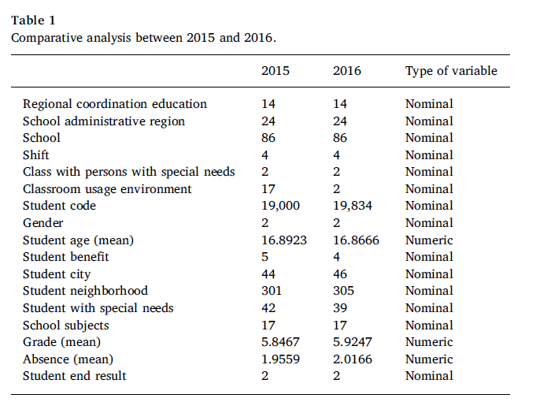
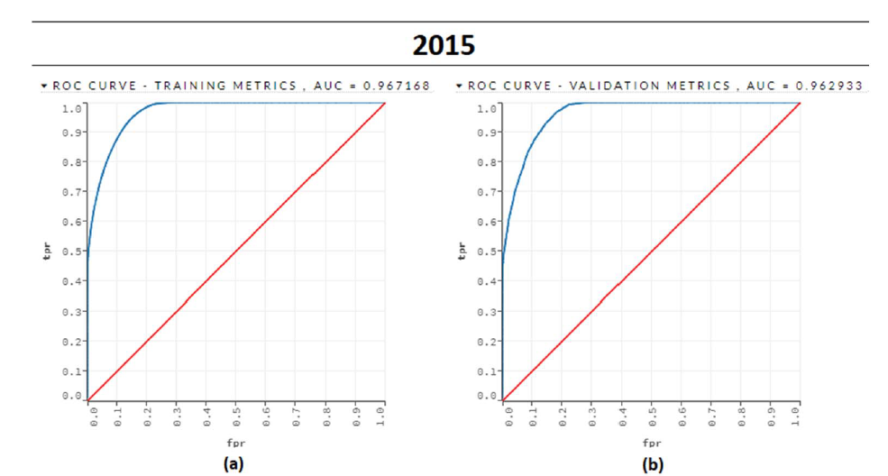
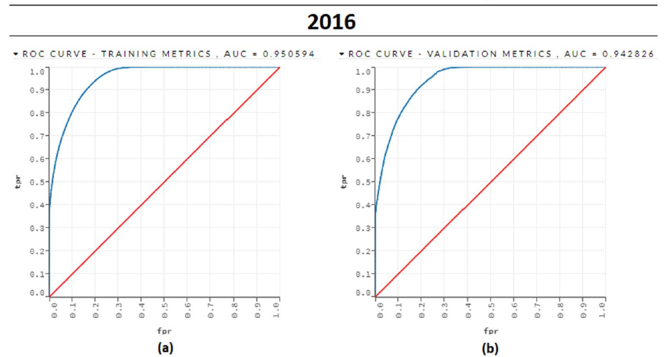
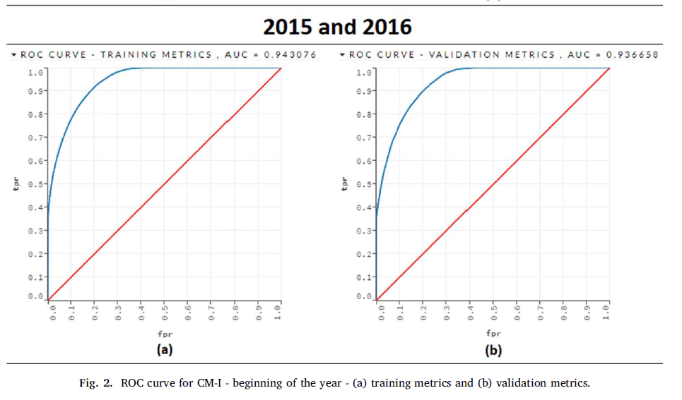
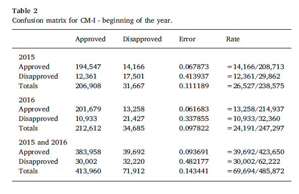
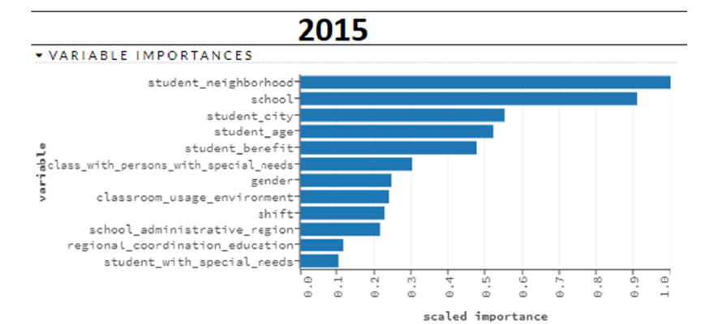
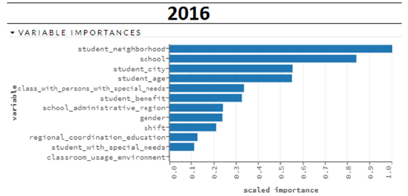
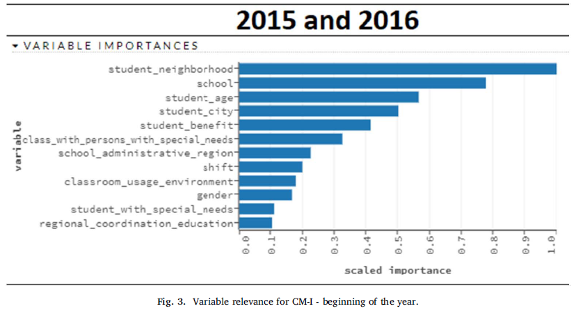

Educational data mining: Predictive analysis of academic performance of
public school students in the capital of Brazil

# 教育数据挖掘:巴西首都公立学校学生学习成绩的预测分析

## 摘要

我们对巴西联邦区公立学校2015年和2016年学期学生的学习表现进行了预测分析。最初，我们进行了描述性统计分析，以从数据中获取见识。 随后，获得了两个数据集。第一个数据集包含在学年开始前获得的变量，第二个数据集包含在学期开始后两个月收集的学术变量。分类模型基于梯度提升机（GBM）创建用于预测每个数据集的学生在学年结束时的学业成绩。结果显示，通过特征‘分数’和‘缺席’与学生在学年结束时的学业成绩最相关。对人口统计属性的分析揭示了这一点“邻居”、“学校”和“年龄”也是学生学业成败的潜在指标。

## 1介绍

描述性统计是通过对充分的图表、图形和数字指标的阐述，对数字数据进行选择、分析和解释(Reis, Melo, Andrade, & Calapez, 1999).换句话说，描述统计性能够被认为是一组总结在某一调查中收集到的数据的分析技术，在本文的案例中，参考关于巴西联邦地区公立学校高中生2015到2016学年的选定变量的数据。它们通常组织为图形、表格和图形，以提供报告来提交关于数据集中趋势和分散的信息。因此，这里描述的参数是:最小值、最大值、值的和、得分、平均值、模式、中值、方差和标准差。

描述性统计分析在提供特定数据集的基本描述性信息方面是有效的。然而，发现与大量数据相关的新知识模式代价高昂。因此,为了处理这个的质量数据和发现新的模式更有效,本文旨在回答以下研究问题:我们如何才能获得隐性模式发现的数据为公立高中学生在巴西联邦地区超越观察描述性统计分析只包括他们的成绩?

回答这个问题的答案和随后获得的知识支持了本研究的总体目标，即向城市官员、教师和辅导员提供信息，帮助他们制定公共政策、教学材料和社会工作计划，以支持公立学校巴西联邦地区的学生。我们的目标群体是高三的学生，我们的具体目标是帮助他们把成绩提高到至少及格的水平，这样他们的学业轨迹就不会中断，保证他们毕业。

为了达到这个目的，数据挖掘分类方法，和梯度增强机(GBM)算法在2015年年初和2016年，甚至在学生的任何成绩之前，就已经使用该方法来绘制与低成绩和失败最相关的变量。随后，随着时间的推移，我们将他们的成绩分数(两月一次的成绩)合并起来，以验证这些分数如何影响模型的精度，并帮助确定哪些学生容易失败。最后，通过这些信息对这些学生的教学支持越来越多有效，特别的，关于高三学生的数据，在学年开始时指出他们中哪些人可能需要教育支持，从而在学年结束时将失败率降到最低。

因此，本文组织如下。第2节介绍了教育数据挖掘的文献综述。第三部分介绍了相关的工作。第4节描述了所使用的方法。第5节给出了结果。最后，第6节概述了结论并指出了今后工作的可能性。

## 2教育数据挖掘

教育数据挖掘(EDM)可以定义为传统数据挖掘技术在教育数据分析中的应用，旨在解决教育环境中的问题(R. S.~Baker & Yacef, 2009).一些EDM应用程序包含了电子教学系统的开发(Lara, Lizcano, Martínez, Pazos, & Riera, 2014),教学支持(Hung & Crooks, 2009),教育数据聚类(Chakraborty, Chakma, & Mukherjee, 2016),学生成绩的预测(Kabra & Bichkar, 2011)。这项研究的重点是学生的表现预测，因为我们感兴趣的是了解影响他们在学校表现的主要因素(社会、个人和学术)。为了更好地了解学生的学习成绩和学习风格，以及与这些直接相关的各种问题，研究人员一直在开发探索这一背景的数据挖掘方法(R. S. J.D.~Baker, 2010).目前，巴西的许多州已经有了大量关于各类学校学生学业进展的数据。这些数据的收集是教育领域数据收集工具现代化的结果，包括各种教育软件和学校管理工具(Koedinger, Cunningham, Skogsholm, & Leber, 2008).例如,联邦地区的教育部长一直在使用免费软件iEducar管理学生信息。

DM使用这些教育系统的数据库来更全面地了解学生和他们的学习风格，以努力设计教育政策，提高他们的学术表现水平

并在每个学年结束时降低失败率。例如，EDM有助于发现关于学生学习过程的新模式和新知识。使用该模型，可以验证和评估教育系统的某些方面，从而达到提高教育质量的目的(Romero, Ventura, &De~Bra, 2004).其中一些想法来自于数据挖掘在电子商务系统中的应用，该系统旨在识别消费者的兴趣，这可能有助于提高销售。然而，EDM与传统数据挖掘有一些不同之处，如:目标、数据集和技术(Raghavan, 2005).同时，虽然大多数传统的数据挖掘技术可以直接应用于教育数据，但由于教育环境的特殊性，有些技术需要进行调整才能达到目的。这种环境有几个自然群体，比如学生、教师、协调员和主管。因此，教育信息可以从不同的角度进行分析，因为每个群体都有自己的使命和目标(Hanna, 2004).最后，这些信息可以对这些小组有实际的用途，例如，发现学生学习的新模式可以被教师用来准备他们的课程。学生也能从自己的学习过程中得到反馈(Merceron & Yacef, 2005).值得注意的是，20世纪90年代的大多数研究也旨在预测学生的表现，但数据量比现在少得多。随后，最近的研究工作，如，Romero and Venture（2010），利用教育环境中信息系统生成的新数据，能够提供更相关、更可靠的信息。这些新技术除了提供更高的可信度外，还能够管理近年来获得的大量教育数据。

## 3相关工作

在教育环境中，数据挖掘适用于各种目的和完成各种任务。例如R. S. J.D.~Baker (2010) and R. S.~Baker and Yacef (2009)提出教育数据挖掘的四个主要邻域：

改进学生模型;改进域模型;利用学习软件研究教学支持;以及学生学习方面的科学研究。此外，他们还提出了五种预测方法;聚类;关系挖掘;为人类判断而进行的数据蒸馏;还有模型的发现。Castro, Vellido, Nebot, and Mugica (2007)提出要教育数据挖掘以下几个任务或者应用：评估学生学术表现；根据学生的学习行为提供辅修课程;评估网上课程提供的教育资源;对远程教育课程的教师和学生进行反馈;解决学生学习中的非典型行为。

Romero and Ventura (2010)为利用教育数据挖掘技术的主要任务建立自己的类别:分析和可视化，提供反馈，建议，预测性能，学生建模，行为检测，分组学生，社会网络分析，开发概念图，规划课件的编排与制作。最常用的任务是回归、分类、集群和关联规则。数据挖掘中最常用的算法有决策树、神经网络和贝叶斯网络。

Fonseca and Namen (2016)找出影响学生数学学习的因素，包括正面因素和负面因素。他们使用KDD方法，重点关注数据开采阶段。本文的结论部分对所发现的一些模式进行了分析和讨论。

Dutt, Ismail, and Herawan (2017)对聚类算法及其在EDM环境下的适用性和可用性进行了系统的文献综述。在回顾文献的基础上概述了未来的见解，并确定了进一步研究的可能性。

Slater, Joksimović, Kovanovic, Baker, and Gasevic (2017)讨论熟悉多种工具的重要性-EDM/LA研究实践的数据分析工具箱。

Asif, Merceron, Ali, and Haider (2017)运用数据挖掘的方法研究大学生的学习成绩学生，关注他们两个方面的表现。首先，预测学生在四年学习计划结束时的学业成绩。其次，研究典型进展并与预测结果相结合。已经确定了两个重要的学生群体:低成就和高成就。结果表明，通过关注少数几门表现特别好或特别差的课程，有可能向表现差的学生提供及时的警告和支持，向表现好的学生提供建议和机会。

在这篇文章中，我们对初中生(高三学生)的学习成绩进行了预测分析，类似于Fernandes, Carvalho,Holanda, and Van~Erven (2017).与这篇文章相反，本研究对Fernandes研究的模型进行了补充，生成了一个新方法，使用的数据来自2016学年。进一步，为了减少过拟合的可能性，另一个模型同样生成来此同样的学年。这些模型的产生将作为制定政策和进行教学干预的基础，以便在每个学年结束时提高这些学生的成绩，从而可能减少失败的次数。

## 4提出的方法

本研究中使用的方法是基于传统的跨行业数据挖掘标准流程（CRISP-DM）(Chapman et al., 2000).我们选择CRISP-DM的原因在于其在基于数据挖掘的设计中的步骤的适用性，以预测一年学业周期结束时学生的表现。 六步CRISP-DM模型如图1所示，并在下面进行描述：

1. 业务的理解。这个初始阶段侧重于从业务角度理解项目目标和需求。在这个阶段，我们使用了iEducar数据库，该数据库由与每个学生相关的若干属性组成，如双月成绩、所修课程和缺勤。此数据库在状态中使用
联邦地区教育部(SDEFD)。在检索到这个数据集之后，我们定义了研究目标——降低高三学生的失败率。预测学生的表现是实现这一目标的一种手段，也是观察在学年开始时获得的属性的一种手段。值得注意的是，第一阶段的属性不包括最初的成绩，因为它发生在学年开始之前，而且无法获得这方面的信息。这种策略使我们能够识别出在学年结束时最有可能不及格的学生。有了这类信息，教育专家可以在年初把额外的精力集中在这些特定的学生身上。

2. 数据的理解。数据理解阶段从最初的数据收集开始，然后是旨在让用户熟悉这些数据的活动。我们用的是H2O，它被描述为一个记事本风格的H2O开源用户界面。使用这个接口，我们可以导入文件、构建模型并迭代地改进它们，同时处理大量的数据以在更少的时间内生成更好的结果。基于我们的模型，我们可以做出预测，并添加丰富的文本来创建我们工作的小插图——所有这些都在流的基于浏览器的环境中。在这一阶段，我们对17个变量进行了分析，即:SDEFD指定的学区;学校所在城市;学校名称;类时期;课堂上有特殊需要的学生;类型的课堂;学生的名字;性;年龄;政府授予的地位;学生居住地-所在城市;学生的居住地-邻里;学生的特殊需要(如有);学校科目;前两个月的成绩;缺席;学生是否通过/不通过学年。这种描述性分析产生了每个变量的域

3. 数据准备。此阶段涵盖了从初始原始数据构建最终数据集(被输入建模工具的数据)的所有活动。

   为了生成下一阶段使用的模型，准备了数据集的变量。本研究的目的是比较两组不同变量对学生成绩的预测能力。因此，数据的关键思想准备工作是建立两个数据集，其中第一个数据集只包含学生的个人、社会和地理信息，另一个则考虑这些变量，但包括学术变量，例如学校科目，年级和缺勤。 为每个数据集创建了一个分类模型，可以对其性能进行评估和比较，以准确预测学生在学年末是否会通过/未通过。 换句话说，比较两个分类模型之间的表现可以使我们验证与学生表现相关的数据集变量的判别能力。 第5节提供了获得的数据集的详细信息。

另一个则考虑这些变量，但包括学术变量，例如学校科目，年级和缺勤。 为每个数据集创建了一个分类模型，可以对其性能进行评估和比较，以准确预测学生在学年末是否会通过/未通过。 换句话说，比较两个分类模型之间的表现可以使我们验证与学生表现相关的数据集变量的判别能力。 第5节提供了获得的数据集的详细信息。