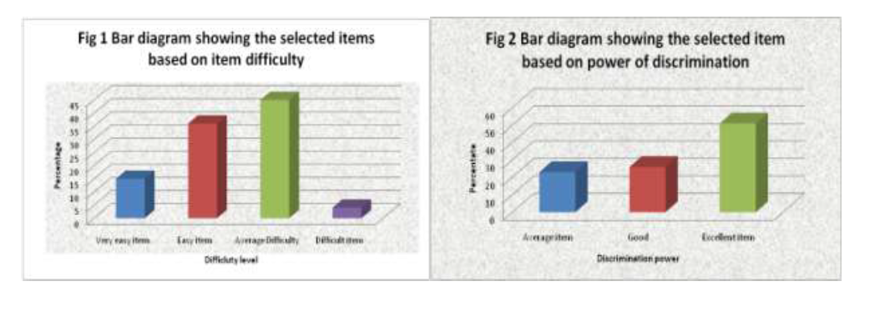
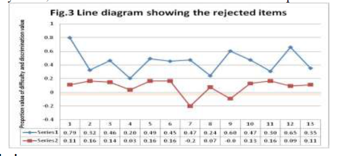

ANALYSIS OF TEST ITEMS ON DIFFICULTY LEVEL AND DISCRIMINATION INDEX IN THE TEST FOR RESEARCH IN EDUCATION

# 教育研究中的困难程度和辨别度指数测试项目分析

## 摘要

这项工作的目的是分析教育研究硕士（M.Ed）的学生教师在“教育研究”主题中进行测试的研究人员的测试项目。 它涉及项目难度和项目辨别度。 在不同的教育学院中，对200名随机抽取的学生教师使用了多项选择题测试作为数据收集工具。 这项研究的样本包括两个性别。结果表明，大多数项目的难度和辨别度程度都在可接受的范围内，但也有一些项目由于辨别度指数低而被拒。

**关键词**:项目分析;教育研究;难度 

## 介绍

 教师教育的研究生是未来的教师教育者。对于教师培训人员，始终需要研究方法论论文。 对研究的精通将帮助教师培训生从事具有挑战性的教师职业。 多项选择题是在教师教育中回答研究生知识能力的最常用工具类型。

项目分析是指为测试中的每个项目计算的一组混合统计信息。 项目分析有助于确定每个项目在整个测试中的作用。 项目分析的主要目的是通过修改或消除无效项目来改进测试。 项目分析的另一个重要方面专门针对成就测试。 在这里，项目分析可以提供有关应试者学到了什么以及他们没有学到的重要诊断信息。 确定项目分析的方法有很多。 评估项目有效性的程序在一定程度上取决于研究人员的偏爱和测试目的。

测试的项目分析是在构建测试的初稿，对样本进行管理并计分之后进行的。 进行制表以确定每个项目的以下两个重要特征。

1.难度或物品难度等级，以及
2.测试项目的辨别力或项目辨别力

以上两个指标有助于期末考试的题型选择。另一个步骤是根据合格人员对测试项目的适用性的判断来进行项目选择，这一步骤将计算测试的项目难度和项目识别。(Aggarwal, 1986)。有几种方法的项目分析所描述的各种文本完全基于建设的测试。 

## **项目难度**

 试题难度可以定义为答对试题的考生比例。题目难度是学生正确回答题目的百分比，也称为p值。范围从0%到100%，值越高，项目越容易。P值超过0.90是非常容易的项目，可能是一个不值得测试的概念。p -值低于0.20表示有困难的项目，应审查可能混淆的语言或内容需要重新指示。最优难度为0.50，最大程度区分高成就者和低成就者。

下面的公式是用来计算难度等级的。 
$$
DL=(Ru+Rl)/(Nu+Nl)
$$
这里

Ru= 高年级学生中回答正确的人数

Rl= 低年级学生答对的人数 

Nu= 高年级学生人数 

Nl= 低年级学生人数 

## **项目辨别度** 

项目辨别力或测试项目的辨别力是指一个项目的成功或失败表明其拥有被测能力的程度。它决定了所给项目在功能或能力上对考生的区别程度。这个值的范围是0.0到1.00。值越高，对项目的辨别力越强。一个具有高度辨别能力的项目表明，考试分数高的学生答对了题，而考试分数低的学生答对了题。 

根据以下公式计算辨别度:
$$
辨别度=RU-RL/NU(or)NL
$$
 程序包括以下步骤: 

1. 管理约200个样本的草稿测试
2.  确定27%的高考生和27%的低考生在总分上的最高分数和最低分数。
3.  计算每一题，答对的考生比例。
4.  判别指数DI将由上述公式给出
5.  通过使用临界定量检验和保留阳性和显著性差异的项目，可以对DI进行显著性检验。
6.  判别指数的取值范围为-1.00 到 +1.00
7.  有负面判别的项目被拒绝。判别指数高于0 .20的项目通常被认为在大多数学术成就测试中是令人满意的(Aggarwal, 1986) 

## **研究目的**

 本研究的主要目的是找出多项选择题的试题难度和辨析能力。 

## **总体与样本**

在这项工作中，所有在泰米尔纳德邦学习教育学硕士的学生-教师组成了研究的人群。本研究采用随机抽样的方法，抽取200名学生。样本由男教师和女教师组成。

## **工具**

测试了60个项目用于数据收集。 该测试是由研究人员在一些学科专家的帮助下，根据泰米尔纳德邦师范教育大学教育硕士课程的教学大纲而制定的。 Bloom的修订分类法被用作测试构建的框架。 测试中的总项目为60。测试以英语进行。

## **数据收集**

试验由研究人员自己进行数据收集。该研究得到了目标院校管理人员的全力支持。

## **数据组织与分析** 

将学生的总成绩输入Microsoft Excel表格，并按降序排列，然后选择54位（27％）高和低成就学生进行项目分析。 假设中间46％的行为类似，则将它们从分析中排除。 使用上面讨论的难度等级和判别指标的公式进行分析。

测试中的项目既不应太容易也不会太困难； 因此必须在两者之间保持平衡。 任何被称为良好测量仪器的测试都必须在测试开始时放置一些难度较高的项目，在中等和中等难度下出现一些难度范围从40％到60％的项目。 有时难度指数较低，应该出现在结尾处。 但是通常，项目难度在20％到80％之间的项目都包含在测试中。 （Singh.Y.K。2012）。 根据上述标准，研究人员选择项目。 在80％的辨别力中仅发现7个项目，并且选择了这些项目。 下图显示了根据项目难度和项目判别选择的项目。

## **讨论**

60项中有13项(21%)由于难度或辨别度而被拒。有35个项目(58%)没有修改就被接受了，而有12个项目在必要的修改后才被接受。下图显示了被拒绝的项目。系列1表示难度指数，系列2表示项目的分辨能力。 

**结果和结论**

本文的研究结果对学生、教师和测试开发人员都有一定的指导意义。他们挑选物品时应该非常小心。可接受项目的大小将取决于测试的长度、难度指数的范围和设计测试的目的。较差的项目被删除或改进，以纳入最终测试。这项工作可以在其他科目中重复，为学生社区开发一个良好的项目库。任何教育研究中使用的工具的主要功能是推断学生的能力，并提供信息。