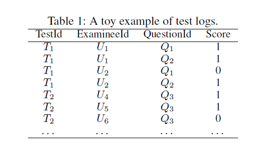

Question Difficulty Prediction for READING Problems in Standard Tests

# 标准测试中阅读问题的难度预测

## 摘要

标准测试的目的是评估考生的表现，使用不同的测试有一致的困难。因此，一个关键的需求是在测试之前预测每个测试问题的难度。现有的研究通常基于教育专家(如教师)的判断，可能是主观的、劳动密集型的。在本文中，我们提出了一种新的基于测试感知注意的卷积算法，用于标准测试中阅读问题(英语测试中的典型问题类型)的问题难度预测(QDP)任务自动解决的神经网络(TACNN)框架。具体来说，考虑到试题丰富的历史测试日志和文本材料，我们首先设计了一个基于cnn的架构来提取试题的句子表示。然后，我们利用注意力策略来限定每个句子对问题的难度贡献。针对不同测试中试题难度的不可比性，提出了一种基于测试的两两训练策略，并生成难度预测值。在真实数据集上的大量实验不仅证明了TACNN的有效性，而且为跟踪问题的注意力信息提供了可解释性的见解。

## 1.介绍

在广泛使用的标准测试中，如托福或SAT，考生经常被允许重新参加考试，选择更高的分数进入大学(Zhang and Yanling 2008)。这一规定提出了一个重要的要求，即选择具有一致性困难的试卷，以保证考试的公平性。因此，对测试的测量引起了广泛的关注(Boopathiraj and Chellamani 2013)。在测量中，最关键的需求之一是预测每个具体测试问题的难度，即，考**生答错题的百分比**(Hontangas et al. 2000)。不幸的是，在进行测试之前，问题的难度是无法直接观察到的，传统的方法往往求助于专业知识，如手工标注或人工组织测试(Fuchs et al，1992)。显然，这些以人为本的解决方案是有限的，因为它们是主观的和劳动密集型的，结果也可能有偏见或误导(我们将用实验来说明这一发现)。因此，在不需要人工干预的情况下自动预测问题难度是一个亟待解决的问题。幸运的是，随着自动阅卷系统记录的大量考试，考生的考试日志和试题的文本材料作为辅助信息越来越多，这有利于数据驱动的解决方案，难度预测(QDP)任务，特别是对于典型的阅读问题。例如，图1(a)显示了一个包含两个问题的阅读问题示例，每个问题都包含相应的文档材料(TD)，问题(TQ)和选择(TO)。

实际上，也有一些工作在阅读问题的文本理解上，例如，机器理解*(Yin,Ebert, and Sch¨utze 2016; Sachan et al. 2015).*然而，这些工作不能直接应用到QDP的标准测试，因为在这个任务的独特挑战。首先,阅读问题包含文本材料的多个部分即。文本（TD）、问题（TQ）、选项（TO）在图1(a)中，

这需要一种统一的方式来从语义的角度理解和表示它们。其次，有必要区分文本材料对特定问题的重要性，因为不同的问题涉及到文本的不同部分。例如$Q_1$在图1（a）中与蓝色高亮的句子有关，$Q_2$更关注绿色的句子。第三，在图1（b）中，问题（$Q_1,Q_2$）显然在不同测试（T1到T8）中有着不同的难度。 这一证据表明，不同的问题在不同的测试中是不可比拟的。 例如，我们不能得出结论$Q_2$在$T_1$中有着0.6的难度值。比$Q_1$在$T_2$中的0.37难度值更难，因为考生是不同的， 因此，有必要在QDP中考虑这些困难偏差。 

 要解决QDP的上述挑战， 我们提出了一种新的基于测试感知注意力的卷积算法神经网络(TACNN)框架，用于在测试前自动预测阅读问题的问题难度。具体来说，给定历史考试日志和试题的文本材料，我们首先设计一个统一的
基于cnn的架构，利用所有文本材料的语义表示(即、TD、TQ和TO)，这样每个问题的文本的多个部分可以在一个公共的可比较空间中建模。 然后，我们利用注意力策略来限定每个句子对一个问题的难度贡献。接下来，为了训练TACNN并生成每个问题的难度预测值，我们提出了一种基于测试的两两策略来消除不同测试中的难度偏差。  最后，在大型真实数据集上的大量实验验证了我们提出的框架的有效性和解释力。据我们所知，这是标准测试中第一个全面的QDP任务数据驱动解决方案。 

## 2相关工作

通常来说，相关工作可以被分为以下两类。 即。教育心理学中的问题困难研究和自然语言处理中的文本理解研究。 

 **教育心理学中的疑难问题。**  问题困难是教育心理学领域长期以来的研究课题。之前的一些研究主要集中在评估可能导致问题难度的因素上。 例如，Beck et al.(1997) 认为问题属性和考生的能力都会影响问题的难度。 Kubinger et al.(2007) 发现一些属性与问题难度相关，如问题类型、问题结构和知识深度。 另一个方向是试图利用考生从考试中得到的反馈来进行问题评估，并形成一些心理学理论  例如，经典测试理论(CTT) (Alagumalai and Curtis 2005)认知诊断评估(CDA)(Roussos,Stout 2006;Wu et al. 2015)。 CTT从统计的角度对问题难度进行评估，而CDA则将其作为一个参数，通过一个类似于逻辑函数的模型从考生的回答中获得。  为了在实践中预测问题的难度，传统的解决方案往往求助于专业知识，这严重依赖于测试准备的手工标记(Fuchs et al. 1992)。

这些作品的共同局限是需要人工干预，需要大量的人力和专业知识。不同的是，我们的研究从数据驱动建模的角度来看是一个完整的解决方案。 

 **NLP领域的文本理解。** 我们的框架中最关键的步骤之一是理解和表达所有文本材料(Hua et al. 2015,cui et al。
2016), 旨在为阅读问题中出现的问题提取文本难点。这与自然语言过程(NLP)的许多研究相关， 如问题选择(Yu et al. 2014)，  文本蕴涵（Bowman et al.2015）,和机器理解（Yin，Ebert，and Schutze 2016；Sachan et al 2015）. 常，现有的方法可以分为两类:语言建模 (Smith et al. 2015)和神经网络（NN）（Hermann et al.2015）。在语言模型中， 一些有代表性的著作侧重于挖掘每个问题的句法和语义结构，包括句子结构 (Bilotti et al.2007) 和词汇语法 (Wang, Smith, and Mitamura 2007). 相反，基于nn的模型试图将问题自动转换为语义表示。例如, Hermann et al. (2015)提出了一个两层的深度LSTM模型用于将每个问题的文本上下文作为文档上的动态上下文来学习。Yin et al. (2016) 将注意力方法整合到CpaperNN中，将问题从单词、短语到句子的观点进行建模。 

 然而，所有这些解决方案都集中在机器选择答案的难度上，而不是预测标准测试的难度。因此，现有的解决方案很难直接应用到QDP任务中。 

##  3 TACNN框架 

 在本节中，我们首先正式介绍QDP任务，然后介绍TACNN的技术细节。最后，提出了基于测试的两两训练策略。 

###  问题与研究概况 

在这篇论文中，我们关注的是QDP在标准测试中的阅读问题，而其他一些类型的问题，如听，写，说，将在未来的讨论和研究。

 **定义1(问题定义)。** 通常给一系列阅读问题题目包含 文本(TD)、问题(TQ)、选项(TO)，每个问题$Q_i$有一个难度属性$P_i$(e.g.,0.6)从测试日志中获得（见表1），我们的目标是尽可能的 利用问题的组合实例 $Q_i$（见表2）来训练一个模型$\mathcal{M}$(即TACNN) 这可以用来估计新进行的测试中问题的难度。 

在图二中， 我们的解决方案是一个两阶段的框架，包括一个培训阶段和一个测试阶段:  1)在培训阶段，给出考生的考试日志和试题的文本材料(见表2) ，我们提出TACNN来理解和表示 所有文本材料的每个问题 $Q_i$ 相应的预测文本难度 $\widetilde{p}_1$。然后考虑到难度偏差在图1（b）中的显示，我们提出 一个训练TACNN的测试相关的两两策略。 

 2)在测试阶段，在得到训练好的TACNN后，对于每一个没有测试日志的新问题，我们可以利用现有的文本材料估计其难度。 

### TACNN的组件

在各个小节，我们将介绍TACNN的技术细节， 学习将问题的文本材料表示为预测的困难。 如图3所示，TACNN主要由四个组件组成，即，输入层，句子-CNN层，注意层和预测层。特别的，句子-CNN层和注意力层是最关键的技术即前者旨在从句子语义的角度学习每个问题的所有文本材料，如图4所示;而后者通过限定文本材料的贡献来学习每个问题的注意表征。 

**输入层。**输入TACNN的是问题$Q_i$的所有文本材料，文章（$TD_i$）,问题（$TQ_i$），和选项（$TO_i$）。直觉上，$TD_i$是 是由一系列的句子形式化的 $TD_i={s_1,s_2,...,s_M}$这里M是序列长度 。$TQ_i$和$TO_i$中每个选项都是独立的句子。 此外每个句子 由一系列的单词$s={w_1,w_2,...,w_N}$组成,这里$w_i\in \mathbb{R}^{d_0}$ ,由$d_0$预训练0维词向量初始化，N是句子的长度。最终， 文本用张量表示$TD_i \in \mathbb{R}^{M\times\N\times d_0}$ 。问题$TQ_i$或者$TO_i$中的每个选项被表示为矩阵$s \in \mathbb{R}^{N\times d_0}$。

 **句子-CNN层。** 第二层是句子CNN层，我们的目标是学习每个句子的表达从单词级。在这里, 我们选择基于cnn的架构有以下原因:1)通过利用卷积池化操作，CNN更适合从局部到全局捕捉每句话的主导信息(Yin, Ebert, and Schutze 2016)。  这与考生普遍的阅读习惯是一致的，考生通常会通过一些当地的关键词来理解每个句子。 2) CNN可以在更大的尺度上挖掘词与词之间的相互作用，学习句子的深层语义表征。3)与其他深度学习结构DNN、RNN相比，CNN利用共享卷积滤波器进行训练，降低了模型复杂度(Ma, Lu, Li 2015)。

 如图4所示，句子CNN层是传统CNN层(Collobert et al. 2011)的一个变体，它交替使用多个卷积层和p-max池，每个句子在最后逐渐总结为一个固定长度的向量表示。在这里，我们将详细介绍第一个卷积池操作，并以类似的方式定义下面更深入的操作。 

具体的，在图4中所展示，给一个句子矩阵输入$s \in \mathbb{R}^{N \times d_0}$, 宽卷积操作在一个滑动窗口的每k个单词与一个核 $k\times 1$。 正式地，给出输入句子 $s={w_1,w_2,...w_N}$.第一个卷积操作设置来获得一个新隐藏序列，即$h^c=\{\vec{h}_1^c,..., \vec{h}_{N+k-1}^c\}$,这：
$$
\vec{h}_{i}^{c}=\sigma\left(\mathbf{G} \cdot\left[w_{i-k+1} \oplus \cdots \oplus w_{i}\right]+\mathbf{b}\right)
$$
$G \in \mathbb{R}^{d\times kd_0}$,$b \in \mathbb{R}^d$是卷积参数，d是输出维度。$\sigma(x)$是非线性激活函数$ReLU(x)=max(0,x)$。"$\bigoplus$"是 将k个字向量连接成一个长向量的操作符。

通过卷积过程， 连续的k个单词组成一个局部语义表示。  我们利用p-max池操作来合并卷积序列$h_c$的特征成一个新的全局隐藏序列，即$h^{cp}=\{\vec{h}_1^{cp},...,\vec{h}_{\lfloor (N+k-1)/p\rfloor}^{cp}\}$,这里
$$
\vec{h}_{i}^{c p}=\left[\max \left[\begin{array}{c}{h_{i-p+1,1}^{c}} \\ {\cdots} \\ {h_{i, 1}^{c}}\end{array}\right], \cdots, \max \left[\begin{array}{c}{h_{i-p+1, d}^{c}} \\ {\cdots} \\ {h_{i, d}^{c}}\end{array}\right]\right]
$$
 之后，设置更多的卷积池处理层，逐步总结句子中单词的全局交互，最终得到向量表示 $s \in \mathbb{R}^{d_1}$,$d_1$是句子CNN层的输出维度。

结果是，文本被转换成矩阵$TD_i \in \mathbb{R}^{M \times d_1}$ 用M个句子表示 ,问题的文本$TQ_i$和每个选项$TO_i$是 所有句子语义向量 $s \in \mathbb{R}^{d_1}$,这在图3中显示。

**注意力层。** 在从句子CNN层获取句子表征后，注意层的目标是检测每个问题的难度注意表征。 如图1（a）中显示，$Q_1$更加注意蓝色高亮句子而$Q_2$更加注重绿色高亮句paper子。这一证据表明，同样的文本(即 文章）。根据所给的问题，应该有不同的表述。因此，有必要对文本材料对特定问题的贡献进行限定，并学习其注意表征。 方法上，注意表征被文档级和选项级的句子表征的加权和汇总结果建模为向量。正式地，针对一个特定的问题 $Q_i$,文章级别的注意力向量$DA_i$被定义如下：paper
$$
DA_i=\sum_{j=1}^{M}\alpha_js_j^{TD_i},\alpha = \cos(s_j^{TD_i},s^{TQ_i}), \ \ \ \ \ \ \ (3)
$$
这里$s_j^{TD_i}$是第j个句子在$TD_i$中，$s^{TQ_i}$是问题材料$TQ_i$的句子表达 余弦相似性$\alpha_j$ 表示衡量文档$TD_i$的问题$Q_i$句的子$s_j$重要性的注意力分数 。 

 类似于文档级注意力向量 $DA_i$,对于问题$Q_i$的选项级的注意力向量$OA_i$ 也可以建模为式(3)的形式。  特别是,注重分数$α_j$大大增强TACNN的解释力。它使我们能够提取出高分的句子作为一个具体问题的主导信息，这有助于模型的可视化。在实验中，我们将针对具体问题对注意结果进行深入分析。 

**预测层。**最后一个层是预测层，我们的目标是预测问题$Q_i$的难度$\widetilde{P}_i$ 利用文件级别注意$DA_i$,选项级别注意力$OA_i$和 句子表征$s^{TQ_i}$自己，特别的是，我们第一次聚合它们通过连接操作， 后利用一个经典的全连通网络(Hecht-Nielsen 1989)来学习总体难度表示 $o_i$和最后预测难度$\widetilde{P}_i$ 通过logistic函数：
$$
\begin{array}{l}{o_{i}=\operatorname{ReLU}\left(\mathbf{W}_{1} \cdot\left[D A_{i} \oplus O A_{i} \oplus s^{T Q_{i}}\right]+\mathbf{b}_{1}\right)} \\ {\widetilde{P}_{i}=\operatorname{Sigmoid}\left(\mathbf{W}_{2} \cdot o_{i}+\mathbf{b}_{2}\right)}\end{array} \ \ \ \ \ (4)
$$
这里$W_1,b_1,W_2,b_2$都是网络中的调整参数。

###  **测试依赖的两两训练策略** 

在这个小节， 针对TACNN提出了一种成对训练策略。如图2所示，在通过TACNN从每个问题的文本材料中获得预测的文本难度后，我们需要定义一个合适的损失函数，使我们在训练中学习成为可能。下面，我们首先直接定义一个与测试无关的损失函数，然后引入与测试相关的损失函数。

 

 **Test-independent损失函数。**  由于问题难度不是直接可见的，我们从测试日志中得到了每个问题的真实难度，然后是(Hopaperntangas et al. 2000)中的定义。例如 在表1中，问题$Q_1$的真实难度可能是$P_1=(1+0)/2=0.5$.因此， 我们可以用监督的方式来制定QDP任务。  直观地说，如果我们忽略测试特征，给定所有的问题实例(如表2所示)， 我们可以通过使用$l_2-$正则项最小化最小二乘损失来简单地制定与测试无关的目标函数:
$$
\mathcal{J}(\Theta)=\sum_{Q}\left(P_{i}-\mathcal{M}\left(Q_{i}\right)\right)^{2}+\lambda_{\Theta}\left\|\Theta_{\mathcal{M}}\right\|^{2}
$$
$\mathcal{M}$代表将问题$Q_i$的文本资料转换成预测难度$\widetilde{P}_i$(Eq. (4)).$\Theta_{\mathcal{M}}$ 表示TACNN中的所有参数 ,$\lambda_{\Theta}$是正则化超参数。

 然而，正如图1(b)所述，这些计算出的问题难度是与测试相关的，这意味着在不同的测试中，不同的问题是无法比较的。例如，在表1中， 问题$Q_1$的难度是0.5，问题$Q_3$的难度是0.33，我们不能得到$Q_1$的问题要比$Q_3$难，因为它们在不同的测试中（不同的TestId）不同的考生。 因此，如果我们直接采用依赖于测试的目标函数(Eq.(5))，可能会在优化中引入一些偏差。 

可能会在优化过程中引入一些偏差。幸运的是，我们意识到在相同的测试中问题的难度是可以比较的，例如，在表1中$Q_1$要比$Q_2$要难，因为它们在同样的测试$T_1$中。此激励下，我们可以通过两两策略对同一测试中的一对问题进行难度比较建模和优化。测试相关的两两损失函数。在形式上，我们首先构造依赖于测试的训练三元组$\{(T_t,Q_i,Q_j)\}$在图2中所显示，这意味着两个不同的问题$Q_i和Q_j$在同样的测试$T_t$中. 然后目标函数变为依赖于测试的函数: 
$$
\mathcal{J}(\Theta)=\sum_{\left(T_{t}, Q_{i}, Q_{j}\right)}\left(\left(P_{i}^{t}-P_{j}^{t}\right)-\left(\mathcal{M}\left(Q_{i}\right)-\mathcal{M}\left(Q_{j}\right)\right)\right)^{2}+\lambda_{\Theta}\left\|\Theta_{\mathcal{M}}\right\|^{2},(6)
$$
这里$P_{i}^{t}和P_{j}^{t}$表示问题$Q_{i}, Q_{j}$在测试$T_{t}$真实的难度, 别。通过这种方式，我们可以学习模型，即， TACNN，通过直接最小化该函数$ \mathcal{J}(\Theta)$通过使用AdaDelta（Zeiler 2012）

 在此基础上，我们可以根据给定的文本材料来估计新阅读问题的问题难度。 请注意，虽然我们为模型训练设计了一个依赖测试的两两策略，但TACNN可以直接用于估计“绝对难度值”(例如:0.6)每个新问题，因为问题的困难现在是反映在文本的角度，如文字使用。通过对新试卷中所有题目难度的估计，我们可以决定是否选择该试卷作为标准试卷。paper

## 4 实验

 在本节中，我们首先将TACNN的性能与QDP任务的基线方法进行比较。然后，通过专家比较，验证了TACNN的实际意义。最后，我们通过一个案例研究来可视化TACNN的解释力。 

### 数据集描述

科大讯飞提供的实验数据集是从真实世界的阅读问题标准测试中收集的，其中包含了近300万个测试日志
中国的高中从2014年到2016年。对于预处理，我们对没有测试日志的问题进行过滤，因为我们无法获得它们的难度，表3显示了修剪后数据集的基本统计数据。

###  实验装置 

**词嵌入（Word Embedding）。**使用公共word2vec工具（Mikolov和Dean 2013）在维度为200的大规模gigaword语料库上对单词嵌入进行训练。在预训练单词中未出现的来自READING问题的单词将被随机初始化。

**TACNN设置。**在TACNN中，根据图5的观察结果，我们将文档（句子）中句子（单词）的最大长度M（N）设置为25（40）（必要时填充零），即95％的文档（句子）包含 少于25（40）个句子（单词）。 Sentence CNN层采用四层卷积（三层宽卷积，一层窄卷积）和最大池来容纳句子长度N，其中四层卷积的特征图数量为（200、400、600、600 ） 分别。 同样，我们将所有卷积层的内核大小k设置为3，将每个最大池化的池窗口p分别设置为（3、3、2、1）。

**Training设置。**我们遵循（Orr and M¨uller 2003）和随机初始化所有TACNN中的矩阵和向量参数通过均匀分布在$(-\sqrt{6/(min/nout)},\sqrt{6/(min/nout)} )$,这里$nin和nout$是相应矩阵的输入和输出要素大小的数量。 在训练过程中，将调整TACNN中的所有参数。 此外，我们将迷你批次设置为32进行训练，并且我们还使用辍学率（概率为0.2）以防止过拟合。

###  基线的方法 

由于在标准测试中几乎没有直接解决QDP任务的现有方法，因此我们首先介绍TACNN的一些变体，以突出说明框架中每个组件的有效性。 变体的详细信息如下paper：

- CNN：CNN是一个框架，具有忽略注意力的策略和独立于测试的损失（等式（5））。 这里，忽略注意力的策略是指等式中的注意力得分（等式（3））在相应材料（即文件或选项）中的所有句子都相同。
- ACNN：ACNN是一个具有注意paper力策略（等式（3））和独立于测试的损失（等式（5））的框架。
- TCNN：TCNN是一个框架，具有忽略注意力的策略和依赖于测试的损失（等（6））。

 此外，我们还选择了与我们的网络架构最相似的HABCNN作为另一个基线: 

- HABCNN：来自（Yin，Ebert，and Schutze 2016）的机器理解模型，带有CNN和句子注意。 为了将其应用于QDP任务，我们采用其原始的网络体系结构，并通过将其原始的基于softmax的目标调整到我们依赖于测试的损失来对其进行少许更改（等式（6））。

TACNN和顶点都是由Theano（Bergstra et al。2010）和所有实验都在特斯拉K20m GPU上运行。

### 评价标准

为了测量TACNN的性能，我们首先使用广泛使用的均方根误差（RMSE）（Salakhutdinov和Mnih 2011）进行QDP精度比较。 此外，我们从排名的角度采用协议程度（DOA）（Liu等人，2012）来衡量问题对正确排名的难度百分比。

我们还从教育心理学中借用了指标，以便从测试分析的角度进行评估。 在教育心理学中，对于测验Ti，实际困难与问题预测之间的正相关性越高，则表现越好（Brizuela和Montero-Rojas，2013年）。 因此，我们使用所有测试的平均皮尔逊相关系数（PCC）（Benesty等，2009）来衡量相关性能。 此外，我们还采用t检验通过率（PR）（表示在置信度为0.05时通过t检验的测试百分比）来评估置信度性能。

 总之，RMSE越小，结果的性能就越好。对于其他三个(DOA、PCC、PR)，越大越好 

### 实验结果

 **整体QDP结果。** 为了观察模型在不同数据稀疏性下的行为，我们分别随机选择标准测试的60％，40％，20％，10％作为测试集，其余分别作为训练集。 请注意，为确保测试集中的所有问题都是新问题并防止过拟合，我们还删除了测试集中存在的具有相同文档的训练集中的问题。 因此，训练集和测试集中的问题之间没有重叠。

图6显示了所有模型的总体QDP结果。 我们可以看到TACNN表现最好。 具体而言，通过优化与测试相关的成对损耗，它击败了CNN和ACNN。 通过用注意策略限定文本的贡献，它胜过了TCNN。 然后，HABCNN的性能不及TACNN，这表明针对机器理解任务的HABCNN架构不适合QDP任务。 最后但并非最不重要的一点是，我们可以看到，具有依赖于测试的成对损失的模型（TACNN，TCNN，HABCNN）比具有依赖于测试的损失的模型（CNN，ACNN）表现更好。 该观察结果表明问题难度取决于测试，并证明了成对训练策略的合理性。

 **专家比较。** 为了证明TACNN的实际意义，我们选择了12种标准测试，并邀请7名熟悉READING问题的专家（高中教师）手动执行QDP任务。 详细地，每个选定的测试包含4个阅读问题和16个问题。 请专家（表示为Ep1至Ep7）回答问题，然后分别评估困难。 此外，我们将他们的预测平均化，称为EpAvg。 因此，我们总共获得了8位专家的预测。 遵循教育心理学，我们使用PCC评估所有预测与测试中实际困难之间的相关性。 所有结果示于表4。

 正如我们所看到的，TACNN在大多数情况下都优于所有专家，这意味着TACNN的预测与实践的相关性最大。此外，我们还观察到专家的预测并不总是一致的。具体来说，对于每个测试，都有一些专家很好地完成了QDP任务(如T3中的Ep2)，但也有一些专家可能会失败(如T3中的Ep5)，因为他们都是通过主观判断进行预测的，而主观判断与主观判断几乎是不一样的。因此，专家的预测有时可能具有误导性。 

 **案例研究。**  TACNN的一个重要特点是它能够区分文本材料对特定问题的难度贡献，即在情商,注重分数α。(3),图7显示了文档中每个句子的关注分数的问题 $Q_2$(“为什么拉里有时不得不呆在水下的笼子里?”)在图1(一)。我们可以看到，文档中四个高亮的“红色”句子的关注度得分最高，表示它们对问题$Q_2$难度的贡献最大. 这种可视化暗示TACNN提供了一种很好的方法来捕获模型解释的关键信息。 

**讨论** 从实验结果可以看出，在标准测试中，TACNN对QDP任务是有效的。实例分析表明，该框架具有良好的解释性。 

 在未来，仍有一些进一步的研究方向 。首先，我们将努力为TACNN设计一个更高效的学习算法。其次，我们也愿意将TACNN扩展到解决英语考试中其他类型的QDP任务，如听力、写作(Leki, Cumming, and Silva 2010)和演讲，以及其他科目，如数学。

##  5结论 

在本文中，我们提出了一种新颖的基于测试感知的基于注意力的卷积神经网络（TACNN）框架，以解决QDP任务以解决标准测试中的阅读问题。 具体来说，我们首先设计了一个基于CNN的体系结构，以利用问题的文本材料的句子表示形式。 然后，我们通过注意策略来限定句子对质疑困难的贡献。 最后，我们提出了一种基于测试的成对策略，用于训练TACNN和生成难度预测值。 在真实数据集上的实验结果清楚地证明了我们提出的框架的有效性和解释力。 我们希望这项工作可以在将来引起更多的研究。