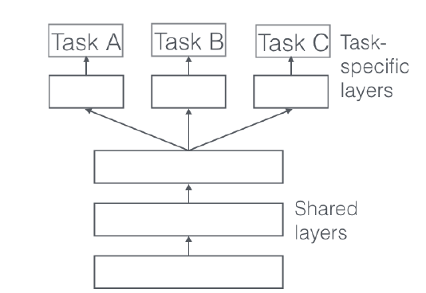
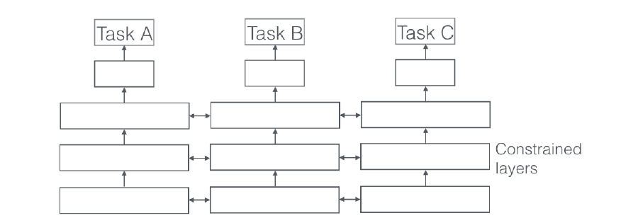

An Overview of Multi-Task Learning in Deep Neural Networks

# 深度神经网络中的多任务学习

**摘要**

多任务学习以及被成功的应用在许多机器学习任务中，如自然语言处理，语音识别，计算机视觉，药物发现。这篇文章的目的是为了给出多任务学习的一个总体概述，特别是在神经网络领域。介绍了深度学习中最常见的两种MTL方法，概述了相关文献，并讨论了最近的进展。特别地，它试图通过阐明MTL的工作原理和为选择适当的辅助任务提供指导方针来帮助ML从业者应用MTL。

## 1 介绍

在机器学习(ML)中，我们通常关心优化特定的度量标准，无论这是在某个基准上的分数还是一个业务KPI。为了做到这一点，我们通常训练单个模型或模型集合来执行我们想要的任务。然后我们对这些模型进行微调，直到它们的性能不再提高。虽然通过这种方式，我们通常可以获得可接受的表现，但通过专注于我们的单一任务，我们忽略了可能帮助我们在我们关心的指标上做得更好的信息。具体来说，这些信息来自于相关任务的训练信号。通过在相关任务之间共享表示，我们可以使模型更好地泛化原始任务。这种方法称为多任务学习(MTL)。

从自然语言处理[Collobert和Weston, 2008]和语音识别[Deng et al.， 2013]到计算机视觉[Girshick, 2015]和药物发现[Ramsundar et al.， 2015]，多任务学习已经成功地应用于机器学习的所有应用中。MTL有多种形式:联合学习、学习学习和辅助任务学习只是其中的一些名称。通常，一旦你发现自己优化了不止一个损失函数，你就可以有效地进行多任务学习(与单任务学习相比)。在这些场景中，考虑您正试图根据MTL明确地做什么，并从中获得洞见是有帮助的。

即使像典型的情况一样，你只优化了一个损失，也有可能有一个辅助任务帮助你改进你的主要任务。[Caruana, 1998]简洁地总结了MTL的目标:“MTL通过利用相关任务的训练信号中包含的领域特定信息来改进泛化”。

在本文中，我将尝试对多任务学习的当前状态给出一个总体概述，特别是涉及到深度神经网络的MTL时。在第2节中，我将首先从不同的角度激励MTL。然后，我将在第3节介绍深度学习中最常用的两种MTL方法。随后在第四节，我将描述共同说明MTL为什么在实践中起作用的机制。在研究更高级的基于神经网络的MTL方法之前，我将在第5节通过讨论MTL的文献提供一些背景。然后，我将在第6节中介绍一些最近提出的用于深度神经网络MTL的更强大的方法。最后，我将在第7节中讨论常用的辅助任务类型，并讨论什么是MTL好的辅助任务。

## 2 动机

我们可以用不同的方式激发多任务学习:从生物学角度来说，我们可以把多任务学习看作是由人类学习激发的。在学习新的任务时，我们经常运用所学到的相关任务知识。例如，婴儿首先学会识别人脸，然后可以运用这一知识来识别其他物体。

从教学的角度来看，我们通常首先学习任务，这些任务为我们掌握更复杂的技术提供了必要的技能。这对于学习武术(如柔道)的正确落体方式和学习编程都是正确的。

以流行文化为例，我们还可以考虑《空手道小子》(1984)2。在电影中，唤醒先生宫城县教空手道孩子似乎无关的任务，如打磨地板和打蜡汽车。然而，事后看来，这些知识为他提供了与空手道学习相关的宝贵技能。

最后，我们可以从机器学习的角度来激励多任务学习:我们可以把多任务学习看作是一种形式的归纳迁移。诱导转移可以通过引入诱导偏差来改进模型，诱导偏差使模型更倾向于某些假设。例如，归纳偏差的一种常见形式是' 1正则化，这导致了对稀疏解的偏好。在MTL的情况下，辅助任务提供了归纳偏差，导致模型倾向于使用能够解释多个任务的假设。我们将很快看到，这通常是这样的

## 3 对于深度学习的两种多任务学习方法

到目前为止，我们主要关注MTL的理论动机。为了使MTL的概念更加具体，我们现在来看看在深度神经网络中执行多任务学习的两种最常用的方法。在深度学习环境下，多任务学习通常是通过隐藏层的硬参数共享或软参数共享来完成的。

图1:深度神经网络多任务学习的硬参数共享

### 3.1 硬件参数共享

硬参数共享是神经网络中MTL最常用的方法，可以追溯到[Caruana, 1993]。它通常通过在所有任务之间共享隐藏层来应用，同时保留几个特定于任务的输出层，如图1所示。

硬参数共享大大降低了过拟合的风险。事实上，[Baxter, 1997]表明过拟合共享参数的风险为N阶，其中N为任务数，小于过拟合特定任务参数，即输出层。这直观上讲得通:我们同时学习的任务越多，我们的模型就越需要找到一个能涵盖所有任务的表示，我们过度拟合原始任务的机会就越少。

### 3.2 软件参数共享

而在软参数共享中，每个任务都有自己的模型，有自己的参数。然后将模型参数之间的距离进行正则化，以便使参数相似，如图2所示。例如[Duong et al.， 2015]使用L2 distance来进行正则化，而[Yang and Hospedales, 2017b]使用trace范数。

图2:深度神经网络多任务学习的软参数共享

深层神经网络中用于软参数共享的约束，在很大程度上受到MTL正则化技术的启发，这些技术已经被开发用于其他模型，我们将很快讨论。

## 4 为什么MTL可以工作?

尽管从直觉上看，通过多任务学习获得的归纳偏差似乎是合理的，但为了更好地理解MTL，我们需要研究其背后的机制。其中大多数是由[Caruana, 1998]首先提出的。对于所有的例子，我们假设我们有两个相关的任务A和B，它们依赖于一个公共的隐藏层表示F。

### 4.1 隐式数据扩充

MTL有效地增加了我们用来训练模型的样本容量。由于所有的任务都有一定的噪声，所以当在某个任务a上训练一个模型时，我们的目标是学习一个好的任务a的表示法，这个表示法可以理想地忽略依赖数据的噪声，并能很好地推广。由于不同的任务有不同的噪声模式，同时学习两个任务的模型能够学习更一般的表示。仅学习任务A就承担了任务A过拟合的风险，而学习A和B可以使模型通过平均噪声模式得到更好的表示F。

### 4.2 注意力集中

如果一项任务噪声很大，或者数据有限且高维，那么模型就很难区分相关和不相关的特征。MTL可以帮助模型将其注意力集中在那些实际上很重要的特性上，因为其他任务将为那些特性的相关性或不相关性提供额外的证据。

### 4.3 窃听

对于一些特征G可以很容易的从任务B中学到，而不容易从另一个任务A中学到。这可能是因为A以更复杂的方式与特征交互，或者是因为其他特征阻碍了模型学习G的能力。通过MTL，我们可以允许模型进行窃听，即通过task b学习G，最简单的方法是通过提示[Abu-Mostafa, 1990]，即直接训练模型来预测最重要的特征。

### 4.4表示的偏见

MTL使模型偏向于其他任务也喜欢的表现形式。这也将有助于该模型在未来推广到新任务，因为假设空间在足够多的训练任务中表现良好，在学习新任务时也表现良好，只要它们来自相同的环境[Baxter, 2000]。

### 4.5 正则化

最后，MTL通过引入归纳偏差作为一个调节器。因此，它降低了过度拟合的风险，也降低了模型的高度复杂性，即拟合随机噪声的能力