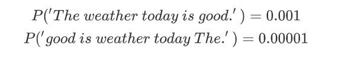

# 用于抽象句子概括的神经注意模型

## 摘要

基于文本提取的自动摘要是有其内在的局限性，但事实证明，生成的抽象方法构建起来很有挑战性。在这项工作中，我们提出了一个全数据驱动的方法来抽象句子摘要。我们的方法使用了一个基于局部注意的模型，该模型根据输入的句子生成摘要中的每个单词。虽然该模型在结构上很简单，但是可以很容易地进行端到端训练，并且可以扩展到大量的训练数据。与几个强基线相比，该模型在DUC -2004共享任务上显示了显著的性能提升。

## 介绍

自动文摘在自然语言理解上是个重要的挑战。目标是从原来的句子中生成能够捕获核心意思的精简的描述。大部分成功的自动文摘系统使用抽取方法，它裁剪并把文本的部分缝在一起，形成一个浓缩的版本。不同的是，抽象摘要尝试生成自底向上的摘要，摘要某些部分肯不会在原文中出现。

我们研究的重点式句子级别的自动摘要。在此任务上的许多工作都着眼于基于删除的句子压缩技术。对人类摘要的研究表明，在进行压缩时应用释义、概括和重新排序各种其他操作是很常见的。过去的工作已经使用受语言启发的约束对这个抽象的摘要问题建模或者使用输入文本的语法转换。

相反，我们探索一种完全由数据驱动的方法来生成抽象摘要。受最近神经机器翻译成功的启发，我们将神经语言模型与上下文输入编码器相结合。我们的编码器是模仿Bahdanau et al. (2014)基于注意力的编码器。在此过程中，它学习输入文本上潜在的软对齐，以帮助通知摘要。至关重要的是，编码器和生成模型都是在句子摘要任务上联合训练的。
$$
P(s)=\prod_{i} P\left(w_{i} | w_{1 : i-1}\right) \sim \prod_{i} P\left(w_{i} | c_{i}\right)
$$

$$
P('The\ weather\ today\ is\ good.') = 0.001 \\
P('good\ is\ weather\ today\ The.') = 0.00001
$$

