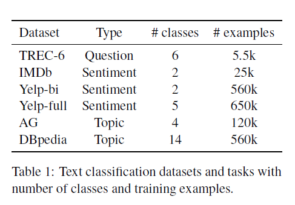

Universal Language Model Fine-tuning for Text Classification

# 用于文本分类的通用语言模型微调

## 摘要

归纳迁移学习对计算机视觉产生了很大的影响，但是NLP中的现有方法仍然需要从头开始进行特定于任务的修改和培训。提出了通用语言模型微调（ULMFiT），这是一种有效的迁移学习方法，可以应用于NLP中的任何任务，并介绍了微调语言模型的关键技术。我们的方法在六个数据集上显著提高了SOTA，在大部分数据集上减少了18-24%的错误率。此外，只有100个标记的示例，它就可以匹配在另外100倍个数据上从零开始的训练的性能。我们开源我们预先训练好的模型和代码http://nlp.fast.ai/ulmfit。

## 1 介绍

归纳迁移学习对计算机视觉（CV）有很大的影响。应用CV模型（包括目标监测，分类，和分割）很少从零开始训练，而是通过在ImageNet、MS-COCO和其他数据集上预先训练的模型进行微调(Sharif Razavian et al., 2014; Long et al.,2015a; He et al., 2016; Huang et al., 2017)。

文本分类是自然语言处理（NLP）任务其中一种，与现实世界的应用，如垃圾邮件，欺诈和机器人检测。(Jindal and Liu, 2007; Ngai et al., 2011; Chu et al.,2012),应急响应(Caragea et al., 2011),和商业文件分类，如法律发现(Roitblat et al., 2010).

虽然深度学习模型在许多NLP任务上已经达到了最先进的水平，但这些模型是从零开始训练的，需要大量的数据集，并且需要几天的时间来收敛。自然语言处理的研究主要集中在转导迁移方面(Blitzer et al.,2007).对于感应传输，微调预先训练的词嵌入(Mikolov et al., 2013),一种简单的传输技术只针对模型的第一层，在实践中产生了巨大的影响，并被用于最先进的模型。将来自其他任务的嵌入与不同层的输入连接起来的新方法(Peters et al., 2017; McCann et al., 2017;Peters et al., 2018)仍然从零开始训练主要任务模型，并将预先训练好的嵌入作为固定参数对待，从而限制了它们的有用性。

考虑到预训练的好处(Erhan et al., 2010),我们应该能够比随机初始化模型的其余参数做得更好。然而，通过微调的归纳迁移对NLP任务来说是不成功的。(Mou et al.,2016). Dai and Le (2015)第一次提出微调一个语言模型（LM）但是需要数百万个域内文档才能获得良好的性能，这严重限制了它的适用性。

我们表明，不是LM微调的想法，而是我们缺乏如何有效训练它们的知识，阻碍了更广泛的采用。当使用分类器进行微调时，LMs会过度适合小数据集，并遭受灾难性的遗忘。与CV相比，NLP模型通常较浅，因此需要不同的微调方法。

我们提出了一种新方法，通用语言模型微调（ULMFiT）可以解决这些问题，支持对任何NLP任务的鲁棒归纳转移学习。类似于微调ImageNet模型:相同的3层LSTM架构，使用相同的超参数，并且除了调优的dropout超参数之外没有添加任何东西。性能优于高度模型化的和迁移学习方法在关于六个广泛研究的文本分类任务。在IMDb上，具有100个标签的样本，ULMFiT将从零开始的训练性能与10倍个示例(给定50k未标记示例)和100倍多个数据进行匹配。

**贡献** 我们的贡献如下：1)提出了通用语言模型微调(ULMFiT)，一种方法，可以用来实现cvlike转移学习的任何任务的NLP。2)我们提出了有区别的微调，倾斜的三角形学习率，逐步解冻，新颖的技术，以保留以前的知识和避免灾难性遗忘在微调期间。3)我们在6个有代表性的文本分类数据集上的表现明显优于最先进水平，在大多数数据集上的错误率降低了18-24%4)我们证明我们的方法能够实现非常高效的样本转移学习，并进行广泛的消融分析。5)我们提供预培训的模型和我们的代码，以使更广泛的采用。

## 2 相关工作

**CV中迁移学习** CV中深度神经网络的特征被观察到从第一层过渡到最后一层(Yosinski et al., 2014).由于这个原因，CV中的大部分工作都集中于传输模型的第一层(Long et al., 2015b).Sharif Razavian et al. (2014)使用ImageNet模型的特性作为简单分类器的输入，实现SOTA的结果。在最近几年，这种方法已经被微调取代，不是最后一个(Donahue et al., 2014)或者是一个预训练模型的最后几层，剩下的几层都是冻结的(Long et al., 2015a)。

**Hypercolumns** 在NLP中，直到最近，人们才提出了超越传递词嵌入的方法。流行的方法是预先培训通过其他任务捕获额外上下文的嵌入。然后将不同级别的嵌入作为特性使用，并与单词Embeddings或中间层的输入连接起来。这种方法被称为hypercolumns(Hariharan et al., 2015)在CV中被Peters et al. (2017)使用Peters et al.(2018), Wieting and Gimpel (2017),Conneau et al（2017），和McCann et al. (2017)使用语言建模、释义、隐含和分别用于培训前的机器翻译(MT)。特别的，Peters等人(2018)要求工程定制架构，而我们在一系列任务中使用相同的基本架构展示了最先进的性能。在CV中，超列几乎完全被端到端调优所取代(Long et al., 2015a)。

**多任务学习** 一个相关的方向是多任务学习(MTL)(Caruana, 1993).这种方法被Rei (2017) 和Liu et al.(2018)采取，他们在与主任务模型联合训练的模型中加入语言建模目标。MTL要求每次都从头开始训练任务，这使得它的效率很低，并且常常需要仔细权衡特定于任务的目标函数(Chen et al., 2017).

**微调** 微调成功被应用在迁移两个相似的任务上。如，在QA中(Min et al., 2017),用于远距离监督情绪分析(Severyn and Moschitti, 2015),或者MT领域(Sennrich et al., 2015)但在不相关的测试中失败了(Mou et al.,2016)。Dai and Le (2015)还可以对语言模型进行微调，但是要想获得良好的性能，就需要使用大量带有10k标记的示例和数百万域内文档。相比之下，ULMFiT利用了通用域的预训练和新的细化技术，即使只有100个标记的示例，也可以防止过度拟合，并在小数据集上获得最新的结果。

## 3 通用语言模型微调

我们感兴趣的是NLP最一般的归纳转移学习设置(Pan and Yang,2010):给一个静态资源任务$\mathcal{T}_{S}$,和任何的目标任务$\mathcal{T}_{T}$,$\mathcal{T}_{S}\neq \mathcal{T}_{T}$.我们希望改进性能在$\mathcal{T}_{T}$上。语言建模可以被看作是NLP的理想源任务和ImageNet的副本:它捕获与下游任务相关的语言的许多方面，例如长期依赖关系(Linzen et al., 2016),层次关系(Gulordava et al., 2018),和情绪(Radford et al., 2017).与像MT这样的任务相比(McCann et al., 2017)和蕴涵(Conneau et al., 2017),它为大多数域和语言提供几乎无限数量的数据。此外，预训练的LM可以很容易地适应目标任务的特性，我们证明这能显著提高性能（见第五节)。此外，语言建模已经成为现有任务(如机器翻译和对话建模)的关键组成部分。正式的，语言模型包括一个超参数空间$\mathcal{H}$,能够被利用到很多其他的NLP任务中(Vapnik and Kotz, 1982; Baxter, 2000)。

我们提出通用语言模型微调（ULMFiT），它预训练一个语言模型在一个大型通用域语料库上，并使用新技术对其进行微调。该方法具有普遍性，因为它符合下列实际标准:1)适用于文档大小、数量和标签类型不同的任务;2)使用单一的架构和培训流程;3)不需要自定义特征工程或预处理;4)不需要额外的域内文档或标签。

在我们的实验中，我们使用SOTA语言模型(Merity et al.,2017a)，一个普通LSTM(没有注意机制，没有捷径连接，或其他复杂的附加)具有各种调优的dropout超参数。与CV类似，我们期望在未来通过使用更高性能的语言模型来提高下游性能。

ULMFiT包含以下步骤，如我们图1所示：a）通用领域语言模型预训练（$\S3.1$);b）目标任务语言模型微调（$\S3.2$）；和c）目标任务分类微调($\S3.3$)。我们会在下面章节讨论这些。

### 3.1 用领域语言模型预训练

一个像ImageNet一样的语言语料库应该很大，并且能够捕捉语言的一般属性。我们预训练语言模型在Wikitext-103(Merity et al., 2017b)上，包含28,595预处理过的Wikipedia文章和1.03亿个词。预训练对小数据集的任务最有利，即使有100个标记的示例，也能进行泛化。我们将探索更加多样化的预训练语料库留给未来的工作，但希望它们能够提高性能。虽然那个阶段是最昂贵的，它只需被执行一次，就能提高下游模型的性能和收敛性。

### 3.2 目标任务语言模型微调

无论用于预训练的通用预料库多么的不同，目标任务的数据很有可能来自一个不同的分布。我们因此在目标任务数据上微调语言模型。给予一个预训练通用语言模型，这个阶段收敛得更快，因为它只需要适应目标数据的特性，它允许我们训练一个强大的LM，即使是小的数据集。我们提出了有区别的微调和倾斜三角形学习率微调LM，我们介绍如下。

**区分微调** 因为不同的层捕获不同类型的信息(Yosinskiet al., 2014),它们应该在不同程度上进行微调。为了这个目的，我们提出一个新颖的方法，区分微调。

取代使用相同的学习速率对于所有的模型层，区分微调允许我们微调每个层，使用不同的学习率。对于文本，常规随机梯度下降（SGD）更新模型的参数$\theta$在时间步骤$t$如下所示(Ruder, 2016):
$$
\theta_t=\theta_{t-1}-\eta\cdot\bigtriangledown_\theta J(\theta) \tag1
$$
这里$\eta$是学习率，$\bigtriangledown_\theta J(\theta)$是关于模型目标函数的梯度。对于区分微调，我们分割参数$\theta$为$\{\theta^1,...\theta^L\}$,这$\theta^l$包含了模型中第$l$层的参数。同样，我们注意到$\{\eta^1,...,\eta^L\}$,这$\eta^l$是第$l$层的学习率。

区分微调使用SGD跟新如下：
$$
\theta_t^l=\theta_{t-1}^l-\eta^{l}\cdot\bigtriangledown_{\theta^l}J(\theta) \tag2
$$
我们根据经验发现，首先选择最后一层学习率$\eta^L$通过微调最后一层，使用$\eta^{l-1}=\eta^{l}/2.6$作为低层的学习率是有效的。

**倾斜的三角形学习率** 为了使其参数适应于特定任务的特征，我们希望模型在训练开始时快速收敛到一个合适的参数空间区域，然后细化其参数。在整个训练过程中，使用相同的学习率（LR）或一个退火的学习率并不是实现这种行为的最佳方法。相反，我们提出*倾斜的三角形学习率*(STLR), 首先线性增加学习率，然后线性递减，按照如下更新计划，如图2所示:
$$
\begin{aligned} c u t &=\left\lfloor T \cdot c u t_{-} f r a c\right\rfloor \\ p &=\left\{\begin{array}{ll}{t / c u t} & {if t < cut} \\ { 1-\frac{t-c u t}{c u t \cdot(1 / c u t-f r a c-1)},} & {\text { otherwise }}\end{array}\right.\\ \eta_{t} &=\eta_{\max } \cdot \frac{1+p \cdot(\text {ratio}-1)}{\text {ratio}} \end{aligned} \tag{3}
$$
这里T是学习的迭代次数，$cut\_frac$是是我们增加LR的迭代次数。$cut$是我们从增加切换到减少的迭代次数。$p$我们分别增加或减少的迭代次数的比例,$radio$特别指定最小的学习率比最大的小多少倍，$\eta_t$是迭代t次的学习率。我们一般上使用$\mbox{cut_frac}=0.1,ratio=32,\eta_{max}=0.01$。

STLR修改三角形的学习速率(Smith,2017)有短时间的增长和长时间的衰减。我们发现这是良好表现的关键。在第五节，我们比较了积极的余弦退火，一个类似的时间表，最近已被用来实现最先进的表现在CV(Loshchilov and Hutter, 2017)。

### 3.3 目标任务分类器微调

最后，对于微调分类器，我们用两个额外的线性块来扩充预训练语言模型。遵循CV分类器的实践标准，每个块使用batch normalization(Ioffe and Szegedy, 2015)和dropout，与中间层的ReLU激活和softmax激活，后者输出目标类在最后一层的概率分布。注意，这些特定于任务的分类器层中的参数是惟一从头开始学习的参数。第一个线性层作为输入池的最后一个隐藏层的状态。

**连接池化** 本分类任务中的信号通常包含在几个单词中，可能会出现在文档中的任何地方。由于输入文档可能由单词组成，因此如果仅考虑模型的最后一个隐身状态，则信息可能会丢失。由于这个原因，我们可以连接隐藏层状态在最后一个时间步骤$h_T$包含隐藏状态的最大池表示和均值池表示的文档,超过许多时间步适合在GPU内存$H={h_1,...,h_T}$:
$$
h_c=[h_T,\mbox{maxpool}(H),\mbox{meanpool}(H)] \tag{4}
$$
这里[]是连接操作。

微调目标分类器是是迁移学习方法中最关键的部分。过于激进的微调会造成灾难性的遗忘，消除通过语言建模获取信息的好处；太过于小心的微调会导致收敛缓慢（和过拟合）。除了判别微调和三角学习率外，我们还提出了逐步解冻的方法来微调分类器。

**逐步解冻** 相比于一次性微调所有的层，我们建议从最后一层开始逐步解冻模型，因为它包含的常识最少(Yosinski et al., 2014):我们第一次解冻最后一层，微调解冻的所有层在一次epoch中。然后，我们解冻下一个较低的冻结层，并重复，直到我们微调完所有层，直到收敛在最后的迭代。这类似于“链解冻”(Felbo et al.,2017) 。是我们一次在“解冻”层的集合中添加一层，而不是一次只训练一层。

虽然有区别的微调，倾斜三角形学习率，逐步解冻都是有益的。我们在第五节中展示，它们相互不足，使我们方法在不同的数据集表现的更好。

**BPTT对于文本分类（BPT3C）**语言模型通过时间反向传播(BPTT)进行训练，以支持大输入序列的梯度传播。为了实现大规模文本信息的微调。我们建议使用BPTT进行文本分类（BPT3C）：我们将文档划分为大小为b的定长批。在每批开始时，用前一批的最终状态初始化模型;我们跟踪均值和最大池的隐藏状态;梯度反向传播到那些隐藏状态有助于最终预测的批次。在实际中，我们使用可变长度的反向传播序列(Merity et al., 2017a)。

**双向语言模型** 与现有的工作相似(Peters et al., 2017, 2018),我们并不局限于对单向语言模型进行微调。在我们所有的实验中，我们都对前向和后向LM进行了预训练。我们使用BPT3C分别对每个LM的分类器进行微调，并对分类器的预测进行平均。

## 4 实验

虽然我们的方法同样适用于序列标记任务，但由于文本分类任务在现实世界中具有重要的应用，所以我们的工作重点是文本分类任务。

### 4.1 实验设置

**数据集和任务 ** 我们评估我们的模型在6个广泛研究的数据集上，文档数量和文档长度不同，采用最先进的文本分类和转移学习方法。(Johnson and Zhang, 2017;McCann et al., 2017)作为三个常见文本分类任务的实例:情绪分析，问题分类和话题分类。我们在表1中显示每个数据集和任务的统计信息。

**情绪分类** 对于情绪分类，我们评估我们的方法在二分类电影评论IMDb数据集(Maas et al., 2011)和二分类和五分类版本的Yelp评论数据集（Zhang et al. 2015.）上。

**问题分类 ** 我们使用六分类的小TREC数据集版本(Voorhees and Tice, 1999)开放领域的数据集，基于事实的问题分为广泛的语义类别。

**话题分类** 对于话题分类，我们在由Zhang et al. (2015)创建大规模AG新闻和DBpedia本体数据集上进行评估。

**预处理** 我们使用与早期工作(Johnson and Zhang, 2017; Mc-Cann et al., 2017).相同的预处理。此外，为了允许语言模型捕获可能与分类相关的方面，我们为大写单词、延伸和重复添加了特殊标记。

**超参数** 我们感兴趣的是一个能够在不同任务集上稳健执行的模型。为了这个目的，如果没有另外提到，我们在不同的数据集上使用相同的超参数设置。该设置在IMDb验证集上微调。我们使用AWD-LSTM语言模型(Merity et al.,2017a)嵌入尺寸为400，3层，每层1150个隐藏激活单元。BPTT的batch的大小为70，我们每一层的dropout为0.4，RNN层为0.3，输入词嵌入层为0.4。嵌入层为0.05。RNN隐藏到隐藏矩阵的权值差为0.5。分类器的隐藏层大小为50。我们使用Adam的$\beta_1=0.7$来取代默认的设置0.9。$\beta_2=0.99$,与(Dozat and Manning, 2017)相似。我们使用batch的大小为64，微调语言模型和分类器的基础学习速率是分别是0.004和0.01。并调整每个任务的验证集上的epoch数量。我们否则使用相似的实践(Merity et al., 2017a)。

**基线和比较模型** 对于每个任务，我们与当前的SOTA比较。对于IMDb和TREC-6数据集，我们和CoVe(McCann et al., 2017)比较，一个SOTA的迁移学习模型对于NLP。对于AG，Yelp和DBpedia，我们和SOTA文本分类模型Johnson and Zhang (2017)。

### 4.2 结果

为了一致性，我们将所有结果展示为错误率（越低越好）。我们展示了文本错误率在IMDb和TREC-6数据集，采用Cann et al. (2017) 在表2中。我们的方法比两个CoVe都好，CoVe是一种最先进的基于超列的转移学习方法，它在两个数据集上都是最先进的。在IMDb上，我们分别将CoVe和SOTA的误差降低了43.9%和22%。这是有希望的，因为现有的技术状态需要复杂的架构(Peters et al., 2018)、多种形式的注意力(McCann et al., 2017)和复杂的嵌入方案(Johnson and Zhang, 2016)，而我们的方法采用的是常规的LSTM，带有dropout。我们注意到语言模型微调方法Dai and Le (2015)在IMDb上的方法只能实现7.64，而我们的错误率是4.6，展示了受益于使用我们的微调技术从大型ImageNet-like语料库学到的迁移知识。IMDb特别反映了现实世界的数据集:其文档通常有几段长-类似于电子邮件（例如用于法律发现）和在线评论（例如用于社区管理）；情感分析类似于许多商业应用，如产品响应跟踪和支持电子邮件路由。

在TREC-6，我们的改进，于SOTA改进方向相似，没有统计学意义，由于500个样本的测试集很小。而，TREC-6上的竞争性能表明，我们的模型在不同的数据集大小上表现良好，可以处理从单个句子(以TREC-6为例)到IMDb的多个段落的示例。值得注意的是，尽管预培训的数据比700万对句子少了两个数量级McCann et al. (2017)，我们始终在两个数据集上都优于他们的方法。

我们在较大的AG，DBpedia，Yelp-bi和Yelp-full数据集上显示了测试错误率，如表三所示。我们的方法再一次显著地超过了SOTA方法。在AG上，我们注意到，与SOTA相比错误率减少了23.7%。在DBpedia，Yelp-bi和Yelp-full上，我们的错误率分别减少了4.8%，18.2%，2.0%。

## 5 分析

为了评估每个贡献的影响，我们进行了一系列的分析和消融。我们在三个语料库，IMDb, TREC-上进行了实验

代表不同的任务、类型和大小。对于所有的实验，我们划分了10%的训练集，并使用单向LMs报告此验证集的错误率。我们对分类器进行了50个轮次的微调，并对除了ULMFiT之外的所有方法进行了早期停止训练。

**Low-shot学习** 迁移学习一个最重要的好处是能够在一个小型的标注训练集上经行训练。我们用ULMFiT评估对不同数量的标记样例在两种设置:只有标记样例用于LM微调(“监督”);所有的任务数据都是可用的，可以用来微调LM(“半监督”)。我们将ULMFiT与从零开始的训练进行比较，这对于基于hypercolumn的方法是必要的。我们分离出训练数据的平衡部分，保持验证集不变，并使用与之前相同的超参数。结果如图3所示。

在IMDb和AG上，监督的ULMFiT仅仅使用了100个带标签的样本，匹配10倍和20倍更多的数据从零开始训练，清楚地展示了通用域LM预培训的好处。如果我们允许ULMFiT使用未标注的样本（50K个IMDb，和100K个AG样本），在100个标注样本中，性能表现分别匹配在AG和IMDb上50倍和100倍的样本。在TREC-6上，ULMFiT在从无到有的训练基础上显著提高;由于例子更短、更少，监督ULMFiT和半监督ULMFiT得到了相似的结果。

**预训练的影响 **我们将不使用预培训与在WikiText-103(Merity et al., 2017b)上进行预训练进行比较。预训练对中小型数据集最有用，它们在商业应用程序中最常见。然而，即使对于大型数据集，预训练也能提高性能。

**语言模型质量影响 **为了衡量选择合适LM的重要性，我们将具有相同超参数且没有任何缺失的vanilla LM与具有调整后的缺失参数的AWD-LSTM LM进行了比较，如表5所示。使用我们的微调技术，即使是常规LM，在大型数据集上也能达到惊人的良好性能。在较小的TREC-6数据集上，vanilla 语言模型如果没有dropout，就会有过度拟合的风险，从而降低性能。

**语言模型微调影响** 我们比较了没有微调和微调过的完整模型（Erhan et al., 2010）('Full'),只微调最后一层（‘Last’）(Donahue et al.,2014),'Chain-thaw'(Felbo et al.,2017),和逐渐解冻（’Freez‘）。我们进一步评估了区别微调（’Discr‘）和倾斜的三角形学习率（’Stlr‘）的重要性。我们将后者与一种替代的、积极的余弦退火计划（’Cos‘）(Loshchilov and Hutter, 2017)进行比较。我们使用学习率$\eta^L=0.01$对于’Discr‘，学习率使用0.001和0.0001分别对于最后一层和其他的层对于’Chain-thaw‘(Felbo et al.,2017)，否则学习率为0:001。结果如表7所示。

对分类器进行微调可以显著地改进从零开始的训练，特别是在小型TREC-6上。‘Last’,CV中的标准微调方法，严重不适应，永远不能降低训练误差为0。’Chain-thaw‘在较小的数据集上获得有竞争力的性能，但在大型数据集上有明显的超越。’Freez‘提供了与’Full‘相似的性能。’Discr‘不断提高“Full”和“Freez”的表现，除了那个large AG。余弦退火与大数据上的倾斜三角形学习率相比具有竞争力，但在较小的数据集上表现较差。最后，完整的ULMFiT分类器微调(底部一行)在IMDB和TREC-6和竞争绩效的AG。重要的是,ULMFiT是唯一在整个领域显示出优异性能的方法，因此也是唯一通用的方法。

**分类器微调行为** 虽然我们的结果表明，我们如何微调分类器作出了显着的差异，微调归纳转移目前在NLP研究不足，因为它大多被认为是没有帮助的(Mou et al., 2016)。为了更好地理解模型的微调行为，我们将微调后的分类器的验证误差与ULMFiT和图4中培训期间的“Full”。

在所有的数据集上，对整个模型进行微调，在训练的早期误差最小，例如：已经在IMDb的第一轮训练之后。然后，随着模型开始过度拟合和通过预培训获取的知识丢失，错误会增加。相反，ULMFiT更稳定，没有这种灾难性的遗忘;结果显示，这说明了学习率计划的积极作用。

**双向性的影响** 以训练第二个模型为代价，对前向和后向lm分类器的预测进行集成，将带来大约0.5-0.7的性能提升。在IMDb上，我们将双向模型的测试误差从单个模型的5.30降低到4.58。

## 6 讨论和未来的方向

虽然我们已经证明ULMFiT可以在广泛使用的文本分类任务中获得SOTA，我们相信，与现有的迁移学习方法相比，语言模型的微调在以下情况下会特别有用(Conneau et al., 2017; Mc-Cann et al., 2017; Peters et al., 2018):)非英语语言的NLP，用于监督前培训任务的培训数据稀缺;b)没有最先进的架构的新NLP任务;c)带有有限数量标记数据的任务(以及一些未标记的数据)。

考虑到转移学习，特别是对NLP的微调还有待探索，未来的许多方向是可能的。一个可能的方向是改进语言模型的预培训和微调，并使它们更具可伸缩性:对于ImageNet，预测更少的类只会导致一个小的性能下降(Huh et al., 2016),虽然最近的工作表明，源任务标签集和目标任务标签集之间的对齐非常重要(Mahajan et al., 2018)专注于预测一个子集的单词，比如最常见的单词，可能会在加快训练的同时保留大部分的表现。语言建模还可以通过多任务学习方式的附加任务来扩展(Caruana, 1993)，或者通过附加的监督来丰富，例如语法敏感的依赖关系(Linzen et al.， 2016)创建一个更通用或更适合某些下游任务的模型，理想情况下以弱监督的方式保留其通用属性。

另一个方向是将该方法应用于新的任务和模型。虽然对序列标记的扩展很简单，但是其他具有更复杂交互的任务，如entailment或问题回答，可能需要新的方法来进行预训练和调整。最后，虽然我们已经提供了一系列的分析和分析，但是需要更多的研究来更好地理解一个预先训练好的语言模型所捕获的知识，在微调过程中这些知识是如何变化的，以及不同的任务需要哪些信息。

## 7 结论

我们提出了ULMFiT，这是一种高效的、非常高效的转移学习方法，可以应用于任何NLP任务。我们还提出了几种新的微调技术，这些技术可以防止灾难性的遗忘，并在不同的任务范围内实现健壮的学习。在六个有代表性的文本分类任务上，我们的方法明显优于现有的迁移学习技术和最新技术。我们希望我们的研究结果能够促进NLP转移学习的新发展。

## 致谢

我们感谢匿名评论者提供的宝贵反馈。塞巴斯蒂安得到了爱尔兰人的支持，研究理事会资助号EBPPG/2014/30和科学基金会爱尔兰资助号SFI / 12 / RC / 2289。