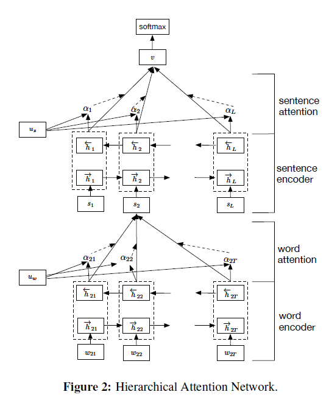

Hierarchical Attention Networks for Document Classification

# 用于文档分类的分层注意网络

## 摘要

我们提出了一个用于文档分类的分层注意力网络。 我们的模型具有两个鲜明的特征：（i）具有反映文档层次结构的层次结构； （ii）它在单词和句子级别上应用了两个级别的注意力机制，使它在构建文档表示形式时能够分别注意越来越重要的内容。 在六个大型文本分类任务上进行的实验表明，所提出的体系结构在很大程度上优于以前的方法。 注意层的可视化说明该模型选择了定性的信息单词和句子。

##  1 介绍 

文本分类使自然语言处理中一个基本的问题。 目标是为文本分配标签。  它有广泛的应用，包括主题标记(Wang and Manning, 2012)，情绪分类(Maas et al.， 2011; Pang and Lee,2008)，以及垃圾邮件检测(Sahami et al.， 1998)。传统的文本分类方法用稀疏的词汇特征表示文档，比如n-gram，然后使用线性模型或核方法来表示(Wang and Manning,2012; Joachims, 1998)。

最近的方法使用深度学习，例如卷积神经网络（Blunsom等人，2014）和基于长短期记忆（LSTM）的递归神经网络（Hochreiter and Schmidhuber，1997）来学习文本表示。

尽管神经网络的分类方法十分有效(Kim,2014; Zhang et al., 2015; Johnson and Zhang, 2014;Tang et al., 2015),在这篇论文中，我们验证了一个假设，即通过在模型架构中加入文档结构的知识可以获得更好的表示。我们的模型背后的直觉是，并非文档的所有部分都与回答查询同等相关，确定相关部分涉及到建模单词之间的交互，而不仅仅是它们的单独存在。 

我们的主要贡献是一个新的神经结构(§2)，分级注意网络(HAN)，旨在捕捉关于文档结构的两个基本观点。首先，由于文档具有层次结构(单词构成句子，句子构成文档)，我们同样通过首先构建句子的表示，然后将它们聚合成文档表示来构建文档表示。其次，可以观察到不同的单词和句子在文档中有不同的信息。此外，单词和句子的重要性在很大程度上取决于上下文，即，相同的单词或句子在不同的上下文中可能具有不同的重要性(§3.5)。为了包括对这一事实的敏感性，我们的模型包括两个层次的注意机制(Bahdanau et al.,2014; Xu et al., 2015)，一个在单词级别上，一个在句子级别上，这使得模型在构建文档表示时或多或少地关注单个单词和句子。  为了说明，考虑图1中的例子，这是一个简短的Yelp评论，其中的任务是在1 - 5的范围内预测评分。直观上，第一句和第三句有更强的信息辅助评级的预测;在这些句子中, 词delicious，a-m-a-z-i-n-g 在暗示这篇综述中所包含的积极态度方面贡献更大。  注意力有两个好处:它不仅通常会带来更好的性能，而且还能洞察哪些单词和句子有助于分类决策，这些分类决策在应用和分析中可能有价值(Shen et al., 2014; Gao etal., 2014). 

前面工作的关键区别在于，我们的系统使用上下文来发现一个字符序列何时是相关的，而不是简单地从上下文中过滤(一系列)字符。为了比较我们的模型与其他常见分类体系结构的性能，我们查看了六个数据集(§3)。我们的模型比以前的方法有显著的优势。 

##  2 层次注意网络 

t分层注意力网络（HAN）的总体架构如图2所示。它由几个部分组成：单词序列编码器，单词级别的注意力层，句子编码器和句子级别的注意力层。 我们将在以下各节中介绍不同组件的详细信息。

###  2.1基于GRU的序列编码器 

 GRU (Bahdanau et al.， 2014)使用一个门控机制来跟踪序列的状态，而不使用单独的记忆细胞。有两种类型的门:复位门$r_t$和跟新门$z_t$.它们一起控制数据的更新状态，在时间t， RU计算新的状态为：
$$
h_t=(1-z_t)\odot h_{t-1}+z_t\odot\widetilde{h}_t \tag{1}
$$
 这是以前的状态之间的线性插值$h_{t−1}$和当前新状态$\widetilde{h}_t$计算新的序列信息。 $z_t$门决定哪些过去的信息会被保留下来，哪些新的信息会被添加，$z_t$被跟新为：
$$
z_t = \sigma(W_zx_t+U_Zh_{t-1}+b_z) \tag{2}
$$
这里$x_t$时间t时刻的序列向量。候选状态$\widetilde{h}_t$ 的计算方法与传统的递归神经网络(RNN)相似: 
$$
\widetilde{h}_t=\tanh(W_hx_t+r_t\odot(u_hh_{-1})+b_h) \tag{3}
$$
这里$r_t$是复位门控制多少过去的状态决定候选状态。如果$r_t$是零，然后它忘记了之前的状态。复位门更新如下: 
$$
r_t=\sigma(W_rx_t+U_rh_{h-1}+b_r) \tag{4}
$$

### 2.2 层次注意力

在这项工作中我们关注文本级别的分类，假设每个文档包含L个句子$s_i$,每个句子包含$T_i$个词。$w_{it},t \in [1,T]$表示第i个句子中的词。该模型将原始文档投影为向量表示，并在此基础上构建分类器进行文档分类。接下来，我们将介绍如何使用层次结构逐步地从word向量构建文档级向量。

**词编码器** 给一个句子具有词$w_{it},t \in[0,T]$, 我们首先通过嵌入矩阵$W_e,x_{ij}=W_ew_{ij}$将单词嵌入到向量中。我们使用双向GRU (Bahdanau et al.， 2014)  通过对词语两个方向的信息进行汇总，从而得到词语的注释，从而在注释中加入上下文信息。 双向GRU包含前向GRU$\overrightarrow{f}$,它从$w_{i1}$到$w_{iT}$来度句子$s_i$,反向GRU$\overleftarrow{f}$来从$w_{iT}$到$w_{i1}$读句子。
$$
x_{it}=W_ew_{it},t \in[1,T], \\
\overrightarrow{h}_{it}=\overrightarrow{GRU}(x_{it}),t \in[1,T], \\
\overleftarrow{h}_{it}=\overleftarrow{GRU}(x_{it}),t \in[T,1],
$$
我们获得词$w_{it}$的注释通过连接前向隐藏状态$\overrightarrow{h}_{it}$和反向隐藏状态$\overleftarrow{h}_{it}$,即$h_{it}=[\overrightarrow{h}_{it},\overleftarrow{h}_{it}]$， 总结以$w_{it}$为中心的整个句子的信息。

我们直接使用词嵌入向量。对于一个更复杂的网络我们能够使用GRU直接从字符中得到词向量，与（Ling et al., 2015 ）相似。 为了简单起见，我们省略了这个。 

**词注意力** 不是每个词对句子意思的贡献都相等。因此，我们介绍注意力机制来抽取对句子意思更重要的词， 集合这些信息词的表示形式，形成一个句子向量。具体地说, 
$$
u_{it}=\tanh(W_wh_{it}+b_w) \tag{5}
$$

$$
\alpha_{it} =\frac{\exp(u_{it}^{\top}u_w)}{\sum_t\exp(u_{it}^{\top}u_w)} \tag{6}
$$

$$
s_i=\sum_t\alpha_{it}h_{it}. \tag{7}
$$

也就是说，我们首先提供单词注释$h_{it}$ 通过单层MLP获得$u_{it}$作为一个隐藏层$h_{it}$的表示, 然后我们用相似度$u_{it}$ 使用单词级上下文向量$u_w$来衡量这个词的重要性，并通过一个softmax函数得到其归一化的重要性权重$\alpha_{it}$。 然后，我们计算句子向量$s_i$ (我们滥用这里的符号)作为基于权重的单词注释的加权和。上下文向量$u_w$能够被视作一个高度表示的 一个固定的query “什么是信息性词汇”超过了在记忆网络中使用的词汇(Sukhbaatar et al., 2015; Kumar et al., 2015).上下文向量$u_w$是随机初始化的 并在训练过程中共同学习。 

**句子注意力**  为了奖励对文档进行正确分类的线索句子，我们再次使用注意机制并引入句子级上下文向量$u_s$,并且使用向量来估计句子的重要程度。即：
$$
u_{i}=\tanh(W_sh_{i}+b_s) \tag{8}
$$

$$
\alpha_{i} =\frac{\exp(u_{i}^{\top}u_s)}{\sum_i\exp(u_{i}^{\top}u_s)} \tag{9}
$$

$$
v=\sum_i\alpha_{i}h_{i}. \tag{10}
$$

这里$v$是是总结文档中所有句子信息的文档向量。同样，句子级上下文向量可以在训练过程中随机初始化，共同学习。

###  2.3 文档分类 

 文档向量v是文档的高级表示，可以用作文档分类的特征：
$$
p = \mbox{softmax}(W_cv+b_c) \tag{11}
$$
 我们使用正确标签的负对数可能性作为训练损失: 
$$
L = -\sum_d\log P_{dj} \tag{12}
$$
这里j是文档d的标签。

## 3 实验

### 3.1 数据集

我们评估我们的模型有效性在大规模文本分类数据集上。这些数据集能够被分类成两种类型的文本分类任务：情绪估计和主题分类。各数据集的统计汇总如表1所示。除非另有说明，我们将80%的数据用于培训，10%用于验证，其余10%用于测试。

**Yelp reviews** 从2013年，2014年和2015年的Yelp数据集挑战中获得（Tang等人，2015）。 评分分为5级（从1到5）（越高越好）。

**IMDB reviews** 从（Diao et al。，2014）获得。 评分范围是1到10。

**Yahoo answers** 从（Zhang et al。，2015）获得。这是一个主题分类任务有10类：社会与文化，科学与数学，健康，教育与参考，电脑与网络，体育，商业与金融，娱乐和音乐，家庭与人际关系与政治和政府。 我们使用的文档包括问题标题，问题上下文和最佳答案。 有140,000个训练样本和5000个测试样本。原始数据集不提供验证样本。 我们随机选择10％的训练样本作为验证。

**Amazon reviews** 从（Zhang et al。，2015）获得。 评分为1-5。3,000,000条评论用于培训，650,000条评论用于测试。 同样，我们使用10％的训练样本作为验证。

### 3.2 Baselines

我们将HAN与几种基线方法进行了比较，包括传统方法，例如线性方法，使用神经网络的SVM和段落嵌入，LSTM，基于单词的CNN，基于字符的CNN以及Conv-GRNN，LSTMGRNN。 这些基线方法和结果已在（Zhang等人，2015； Tang等人，2015）中进行了报道。

#### 3.2.1 Linear methods

线性方法（Zhang等，2015）使用构造的统计量作为特征。 基于多项式逻辑回归的线性分类器用于使用特征对文档进行分类。

**BOWand BOW+TFIDF** 从训练集中选择50,000个最常见的单词，然后使用每个单词的计数功能。 顾名思义，Bow + TFIDF使用计数的TFIDF作为特征。

**n-grams and n-grams+TFIDF** 使用最频繁的500,000 n-grams（最大5-grams）。

**Bag-of-means** 平均word2vec嵌入（Mikolov等人，2013）用作特征集。

####  3.2.2 支持向量机

在（Tang等人，2015）中报告了基于SVM的方法，包括**SVM + Unigram，Bigrams，Text Features，AverageSG，SSWE**。 详细来说，**Unigram**和**Bigrams**分别使用bag-of-ungrams和bag-of-bigrams作为特征。

**Text Features**  根据(Kiritchenko et al.， 2014)构建，包括单词和字符的n-gram，情感词汇特征等。 

**AverageSG**  使用word2vec构造200维单词向量，并使用每个文档的平均单词嵌入。 

**SSWE**  根据(Tang et al.， 2014)使用情感特定词嵌入。 

####  3.2.3 神经网络方法 

 基于神经网络的方法在(Tang et al.， 2015)和(Zhang et al.， 2015)中有说明。 

**CNN-word** 基于Word的CNN模型 (Kim, 2014)。

**CNN-char** 字符级CNN在（Zhang et al.,2015）中有说明。

**LSTM** 将整个文档视为单个序列，并将所有单词的隐藏状态的平均值用作分类的特征。

**Conv-GRNN and LSTM-GRNN** （Tang et al。，2015）提出。 他们还探索了层次结构：CNN或LSTM提供了句子向量，然后门控递归神经网络（GRNN）组合了来自文档级向量表示的句子向量以进行分类。

###  3.3 模型配置与训练 

我们将文档分为句子，并使用斯坦福大学的CoreNLP将每个句子标记化（Manning等，2014）。 在构建词汇表时，我们只会保留出现5次以上的单词，并用特殊的UNK令牌替换出现5次的单词。 我们通过在训练和验证拆分上训练无监督word2vec模型（Mikolov等人，2013）来获得词嵌入，然后使用词嵌入来初始化$W_e$。

在验证集上调整了模型的超级参数。 在我们的实验中，我们将单词嵌入维度设置为200，将GRU维度设置为50。在这种情况下，向前和向后GRU的组合为我们提供了100个单词/句子注释的维度。 单词/句子上下文向量的维度也为100，是随机初始化的。

为了进行培训，我们使用64的小批量，并且将长度相似（根据文档中句子的数量）的文档组织为一批。 我们发现，调整长度可以使训练速度提高三倍。 我们使用随机梯度下降法训练动量为0.9的所有模型。 我们使用验证集上的网格搜索来选择最佳学习率。

###  3.4 结果与分析 

 各数据集的实验结果如表2所示。我们称我们的模型为 **HN-{AVE,MAX,ATT}**.在这里，HN代表分层网络，AVE表示平均，MAX表示最大池，ATT表示我们提出的分层注意模型。 结果表明，HNATT在所有数据集中提供了最佳性能。

改进与数据大小无关。 对于Yelp 2013和IMDB等较小的数据集，我们的模型分别比以前的最佳基准方法好3.1％和4.1％。 这一发现在其他更大的数据集上是一致的。 在Yelp 2014，Yelp 2015，Yahoo Answers和Amazon Reviews上，我们的模型分别比以前的最佳模型高出3.2％，3.4％，4.6％和6.0％。 无论任务的类型如何，都会发生改进：情感分类，其中包括Yelp 2013-2014，IMDB，Amazon Reviews和Yahoo Answers的主题分类。

从表2中我们可以看到，基于神经网络的，不探索分层文档结构的方法（例如LSTM，CNN-word，CNNchar）与传统的大规模文本分类方法相比，优势不大。 例如。 SVM + TextFeatures分别为Yelp 2013、2014、2015和IMDB提供59.8、61.8、62.4、40.5的性能，而CNN单词分别具有59.7、61.0、61.5和37.6的精度。

仅像HN-AVE，HN-MAX中那样探索分层结构可以显着改善LSTM，CNN单词和CNN字符。 例如，在Yelp 2013、2014、2015和IMDB上，我们的HN-AVE分别比CNN单词高7.3％，8.8％，8.5％，10.2％。我们的模型HN-ATT进一步利用注意力机制与层次结构相结合，与以前的模型（LSTM-GRNN）相比分别提高了3.1％，3.4％，3.5％和4.1％。 更有趣的是，在实验中，HN-AVE等效于使用非信息性全局单词/句子上下文向量（例如，如果它们都是全零向量，则等式6和9中的注意力权重将变为统一权重）。 与HN-AVE相比，HN-ATT模型可提供全面的性能。 这清楚地证明了所提出的针对HAN的全局单词和句子重要性向量的有效性。

###  3.5 上下文相关的注意权重 

如果单词固有地重要或不重要，则没有注意机制的模型可能会很好地工作，因为该模型可以自动为无关单词分配低权重，反之亦然。 但是，单词的重要性在很大程度上取决于上下文。 例如，“good”一词可能会出现在评分最低的评论中，这可能是因为用户仅对部分产品/服务感到满意，或者因为用户否定使用了该产品/服务（例如not good）。 为了验证我们的模型可以捕获上下文相关的单词重要性，我们从Yelp 2013数据集的测试拆分中绘制了单词good与bad的注意力权重分布，如图3（a）和图4（a）所示。 我们可以看到，分布中的注意力权重分配给一个从0到1的单词。这表明我们的模型捕获了各种上下文，并为单词分配了上下文相关的权重。

为了进一步说明，我们以评论的评分为条件画出分布。子图 3（b）-（f）在图3和图4分别对应于评级1-5。特别的，图3（b）展示了good的权重集中在低端的评论与评级1。随着评分的增加， 重量分布也是如此。 这意味着词good在高分评论中扮演着重要作用。我们能够注意到图4中相反的趋势对于词bad。这确认我们的模型能够捕获到基于内容的词重要性。

### 3.6 注意力可视化

为了可视化我们的模型能够选择文本中有用的句子和词，我们可视化多层注意力层在图5和图6，从几篇文档到Yelp 2013 和 Yahoo Answers 数据集.

每一行都是一个句子（有时候句子会因为它们的长度溢出好几行）红色表示的句子权重和蓝色表示的词权重。因为多层结构，我们通过句子的权重来规范单词的权重，以确保只有重要句子中的重要单词才会被强调为了可视化的目的我们显示$\sqrt{p_s}p_w$。$\sqrt{p_s}$项显示了重要的词在不重要的句子中来保证它们它们是可见的。从图5可以看出，我们的模型可以选择像delicious,amazing,terrible这样带有强烈感情以及对应的句子。句子包含许多词像cockitails，pasta，entree是无视的。注意到我们的模型不仅能够选择具有强烈情感的词,它同样能够处理复杂的交叉句子上下文。例如，句子像 i don't even like scallops在图5显示的第一个文档中，如果仅仅看这一个句子，我们可能认为这是一个负面评论。然而，我们的模型能够查看它的上下文，识别出它是一个正面评论而选择忽视这个句子。

我们多层注意力机制同样在 Yahoo Answer数据集中的话题分类任务中工作的很好。例如，对于左边的文档在图6具有标签1，被标记为科学和数学，我们模型准确的识别出单词zebra,strips,camoufulage,predator和它们相应的句子.对于右边的文档具有标签4， 被标记为计算机和英特网，我们的模型注意到web,searches,browsers和它们相应的句子。注意到这发生在多分类数据集中，这是检测发生在选择主题之前。

## 4 相关工作

Kim（2014）使用神经网络来经行文本分类，它的结构是直接应用CNNs，如在计算机视觉中一样（LeCun et al., 1998）, 尽管是NLP的解释。Johnson and Zhang(2014) 探讨了直接使用高维热向量作为输入的情况。 他们发现这工作的很好，不想词级别的模型，Zhang et al.(2015)应用一个字符级别的CNN来经行文本分类来达到一个具有竞争力的结果。Socher et al. (2013)使用循环神经网络来经行文本分类。Tai et al.(2015）使用分层结构在情感分类任务中。他们第一次使用CNN或者LSTM来得到句子的向量然后一个双向循环神经网络门来构成句子向量从而得到文本向量。这里有一些其他的工作使用多层结构在序列生成中(Li et al., 2015)和语言建模(Lin et al., 2015). 注意机制是由(Bahdanau et al.， 2014)在机器翻译中提出的。 

注意机制是由（Bahdanau et al。，2014）在机器翻译中提出的。 在翻译之前，使用编码器解码器框架，并使用注意机制为外语单词选择原始语言的参考单词。 Xu et al. (2015)在图像标题生成中使用注意力机制在生成标题中的单词时选择相关的图像区域。 注意机制的其他用途包括解析（(Vinyals et al., 2014)，自然语言问答(Sukhbaatar et al., 2015; Kumar et al., 2015; Hermann et al., 2015),和图像问题解答(Yang et al., 2015).与这些作品不同，我们探索了一种分层注意机制（据我们所知，这是第一个这样的实例）。

## 5 结论	

在本文中，我们提出了用于文档分类的分层注意力网络（HAN）。 作为一个方便的副作用，我们使用文档的高信息量组件获得了更好的可视化效果。 我们的模型通过将重要的词聚合为句子向量，然后将重要的句子向量聚合为文档向量，从而逐步构建文档向量。 实验结果表明，我们的模型比以前的方法具有明显更好的性能。 这些注意层的可视化表明，我们的模型可以有效地挑选出重要的单词和句子。

Acknowledgments This work was supported by Microsoft Research.