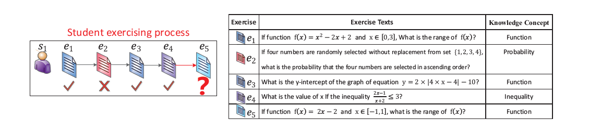
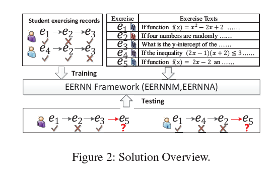
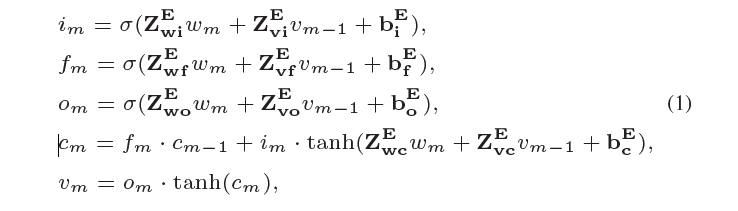
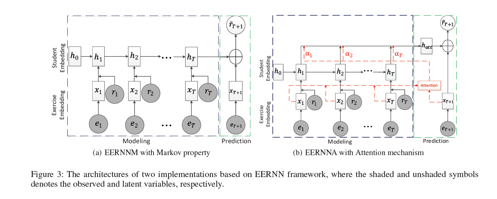
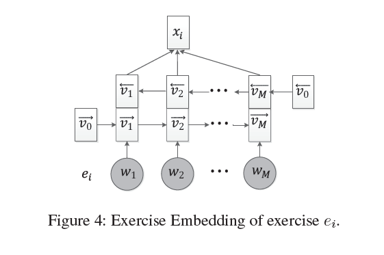
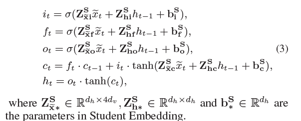

exercise-Enhanced Sequential Modeling for Student performance Prediction

# 练习增强的顺序建模学生的表现预测

## 摘要

在线教育系统中，学生提供积极主动的服务(例如，个性化的练习推荐)，一个关键的需求是预测学生在未来运动练习中的表现(例如，分数)。现有的预测方法主要利用学生的历史练习记录，其中每一项训练通常都用手工标注的知识概念来表示，而文本描述中包含的更丰富的信息还没有得到充分的挖掘。在这篇文章中我们提出一个新颖的练习增强循环神经网络框架，通过充分利用学生的练习记录和每次练习的文本来预测学生的成绩。具体来说，为了对学生的练习过程进行建模，我们首先设计了一个双向的LSTM，在没有任何专业知识和信息的情况下，从文本描述中学习每个练习表示。然后，我们提出了一种新的LSTM体系结构来跟踪学生的状态。（如知识状态）在其序列练习过程中与练习表示的结合。为了做出最终的预测，我们设置了两种策略EERNN及具有马尔可夫性质的EERNNM和具有注意力机制的EERNNA。对大规模真实数据的大量实验清楚地证明了EERNN框架的有效性。此外，EERNN结合了练习相关性，可以很好地从学生和练习的角度处理冷启动问题。

## 1.介绍

在线教育系统，大规模在线开放课程(MOOC)、智能辅导系统(ITS)等为学生提供了自主学习的开放途径。它们的普及和方便已经引起了教育者和普通公众的极大关注(Anderson et al. 2014)。

在这样的教育体系中，学生可以在练习的过程中得到适当的指导和个人知识的获得。图1显示了一个典型学生的这种过程。通常，一个训练推出，学生阅读它的内容运用知识去解决它，完整的，学生$s_1$做完了四个题目，为了给学生自我提高提供主动的建议。例如，学习补救建议和个性化练习推荐（Kuh et al. 2011），一个关键的需求是预测他们的表现(如得分)，即，预测学生是否能回答这个问题(例如，$e_5$)在未来是正确的(Baker and Yacef 2009)。在文献中，无论是教育心理学还是数据挖掘领域，都有很多关于预测学生成绩的努力，例如认知诊断(DiBello，Roussos, and Stout 2006),矩阵分解（Thai-Nghe et al.2010）和深度学习（Piech et al. 2015）.一般情况下，大多数方法都致力于对学生的练习记录进行建模以进行预测。然而，它们只是将每个练习表示为知识概念例如练习图1中的$e_1$代表概念“函数”，这些特定于知识的概念通常在实践中由专家标记（如老师），这可能是劳动密集型工作（Desmarais，Beheshti， and Naceur 2012）.于此同时，这些手工表示无法区分练习的个体特征(例如难度)，从而导致服务信息丢失(DiBello, Roussos, and Stout 2006)，例如练习$e_1，e_3$根据题目的不同（$e_3比e_1难$）虽然它们都有“函数”的标签。为此，本文认为，将学生的练习记录和每个练习的文本结合起来，有助于更准确地预测学生的成绩。

不幸的是，在这方面有许多技术和领域的挑战。首先，练习的表达形式多种多样，需要统一的方式从语义的角度自动理解和表示练习的特点。其次，学生未来的表现在很大程度上取决于他们长期的历史练习，尤其是他们重要的知识状态。如何跟踪学生的重点信息是非常具有挑战性的。最后，学生成绩预测任务存在“冷启动”问题。也就是说，我们通常需要预测新学生或者新练习（Wilson et al. 2016）。在这种情况下，有限的信息可能被利用，从而导致较差的预测结果。

*图1:Example:左框显示了一个学生的练习过程。右边表格显示了课文和习题的知识概念。*

为了解决这些问题，我们提出了一个新型训练强化的循环神经（EERNN）架构来通过充分利用学生的练习记录和课文练习预测学生的表现 。具体来说，对于学生的练习过程建模，受自然语言处理中的一些技术启发，我们首先设计了一个双向LSTM，利用文本自动描述每个练习语义。学习到的编码可以解释为特定于练习的嵌入，它捕获每个练习的单个特征，而不需要任何专业知识。然后，我们提出一个新的LSTM体系结构，通过结合练习表示来跟踪学生在连续练习过程中的状态。为了做出预测，利用学生状态和练习嵌入，我们在下面设计了两种策略EERNN框架。第一个是一个直接而有效的策略，即， EERNNM具有马尔可夫性质，其中学生未来的成绩只取决于当前的状态。相比之下，第二种方法更为复杂，即具有注意力机制的EERNNA ，它根据历史上类似的练习来跟踪学生的注意力状态。通过这种方式，EERNN可以根据她的练习记录自然地预测每个学生在未来练习中的表现。最后，我们在一个大规模的真实数据集上进行了大量的实验，这清楚地证明了EERNNM和EERNNA的有效性。此外，通过考虑运动相关性，EERNN框架可以有效地处理新生预测时的冷启动问题。据我们所知，这是第一次综合考虑练习记录和练习文本来预测学生的成绩。

## 2.相关工作

相关工作可以被分为以下几类，认知诊断、知识追踪、矩阵因子分解和深度学习研究。

**认知诊断**。在教育心里学领域，认知诊断是一种通过从学生的运动记录中发现学生状态来预测学生成绩的技术(DiBello, Roussos, and Stout 2006).传统的认知诊断模型可分为连续模型和离散模型两部分。其中，项目反应理论(IRT)作为一个典型的连续模型，用一个类似于逻辑函数的变量来表征每个学生(Embretson and Reise 2013)。相对而言，离散模型，例如确定的输入,噪声门模型(DINA)，将每个学生表示为一个二元向量，表示其是否掌握练习所需的知识概念(De La Torre 2009).为了提高预测结果，变种，如学习因素分析法（LFA）（Cen，Koedinger,and junker 2006）,表现因素分析法（PFA）（Pavlik jr，Cen， and Koedinger 2009）和模糊CDM（Wu et al. 2015）是综合其他因素提出的。

**知识追踪**.知识追踪是单独追踪每个学生的知识状态的一项必不可少的任务，这样我们就可以预测他们在未来锻炼活动中的表现，其中的想法类似于典型的顺序行为挖掘(shang et al，2017)。在这个任务中,贝叶斯知识追踪是一个流行的知识特定模型假设学生的知识状态为一组二元变量，其次是隐马尔可夫模型(Corbett和Anderson, 1994)。练习知识关系通常由专家来标记,许多扩展是考虑到其他因素而提出的,例如,练习难度(Pardos and Heffernan 2011),多个知识概念(Xu and Mostow 2010)和学生个性化(Yudelson, Koedinger, and Gordon 2013).更进一步,为了提高预测的结果,研究人员建议在传统的BKT中融入IRT或者PFA(Khajah et al.2014).

**矩阵因子分解**.最近,研究人员试图从数据挖掘的角度利用矩阵分解来预测学生的成绩,通常，这类研究的目的是预测未知的学生成绩尽可能准确给定一个学生的运动表现矩阵与一些已知的分数。例如，Thai等人(2015)提出了一种用于在线学习系统预测的多关系矩阵因子分解。为了捕捉学生锻炼过程的变化，Thai等人(2011)提出了一种增加额外时间因子的张量因子分解方法。Chen等人(2017)注意到了学习理论和艾宾浩斯遗忘曲线理论纳入统一的概率架。

**深度学习**.深度学习是一系列最先进的技术，它在很多应用上取得了很大的成功,例如,语言识别(Graves,Mohamed,and Hinton 2013),图像分类(Krizhevsky,Sutskever,and Hinton 2012),自然语言处理(Mikolov et al. 2013)和一些问题难度预测的教育问题(Huang et al. 2017). 受其卓越性能的启发，深度知识追踪(DKT)第一次使用循环神经网络(e.g., RNN and LSTM)来对学生的练习过程建模,来预测他们的表现(Piech et al. 2015).此外Zhang等人(2017)通过连接练习和知识概念之间的关系，提出了一种用于学生成绩预测的动态键值记忆网络模型。

我们的工作与之前的研究不同如下。首先，我们利用学生的练习记录和练习文本。其次，利用注意机制跟踪序列训练过程中的聚焦局部效应，有利于预测。最后，我们可以很好地处理冷启动问题，纳入运动的相关性，没有任何再培训。

## 3.EERNN架构

在本节中，我们首先正式介绍学生成绩预测问题，并给出解决方案概述。然后对EERNN框架进行了详细的描述。最后，给出了模型学习和测试阶段。

**问题和解决方案概述**

在线教育系统中,由$S$个学生和$E$道练习,学生独立的做题,我们记录学生做题的过程,$s_i=\{(e_1^i,r_1^i),(e_2^i,r_2^i),...,(e_T^i,r_T^i)\}$,$e_j^i$代表第i个学生做的第j道习题,$r_j^i$代表相应的分数.通常如果学生i回答问题j对了,$r_j^i=1$,否则等于0,除了学生练习过程的日志外，还给出了练习的文字描述。通常,每个练习$e_i$由一个词序列$e_i=\{w_1^i,w_2^i,..,w_M^i\}$组成.简单起见,我们使用$s=\{(e_1,r_1),(e_2,r_2),..,(e_T,r_T)\}$和$e=\{w_1,w_2,..,w_M\}$来分别表示每个学生过程$s_i$和习题内容$e_i$.

**定义1(学生表现预测问题)**.给出每个学生的练习日志和每个练习的文本描述从1到T,我们的目标是训练一个无监督模型$\mathcal{M}$,对于每个学生能够预测下一题$e_{T+1}$的分数$\widetilde{r}_{T+1}$.

图2显示了我们研究的解决方案概述。从图片上,在训练阶段,我们训练EERNN架构通过建模所有学生的用文本练习过程。之后，在测试阶段，EERNN可以根据她的个人连续锻炼记录预测每个学生在未来练习中的表现。

具体来说，EERNN是一个通用的框架，我们可以根据不同的策略来预测学生的表现。如图3所示，我们提出了EERNN下的两种实现，即， EERNNA具有马尔可夫性质，EERNNA具有注意机制。两种模型对学生运动记录的建模过程相同，但预测策略不同。

**EERNN建模过程**

EERNN建模的目标是建模每个学生的训练序列，通过输入s。通过图3，这个过程主要包括两个主要部分，及*训练嵌入和学生嵌入*

**训练嵌入**。由图3所展示的，给予一个学生的训练过程$s=\{(e_1,r_1),(e_2,r_2),...,(e_T,r_T)\}$,训练嵌入自动学习每个习题$x_i$的语义表示通过输入的文本$e_i$.

图4展示训练嵌入的技术细节，它是一个递归神经网络的实现，它的灵感来自于一个典型的长短期记忆神经网络
(LSTM) (Graves, Mohamed, Hinton2013年)，略有修改。具体来说，给定练习的文本描述M字序列$e_i={w_1,w_2,..,w_M}$,我们第一次采用Word2vec（Mikolow et al. 2013）来变化在练习$e_i$中的每一个词$w_i$至$d_0$维预训练词向量。初始化后，练习嵌入更新隐藏状态$v_m\in \mathbb{R}^{d_v}$每个单词$w_m$在第$m$个单词步长处，与之前的隐藏状态$v_{m - 1}$对应，递归式为:

$i_m,f_m,o_m$代表三个门，及输入门，遗忘门，输出门，$c_m$是细胞记忆向量。$\sigma(x)$是非线性sigmoid激活函数，$\cdot$表示向量之间的元素乘积。除了输入加权矩阵$\mathbf{Z_{w*}^E}\in \mathbb{R}^{d_v\times d_o}$,循环加权矩阵$\mathbf{Z_{V*}^E}\in \mathbb{R}^{d_v\times d_v}$和偏置加权向量$\mathbf{b_{*}^E}\in \mathbb{R}^{d_v}$为训练嵌入的所有网络参数。

传统的LSTM模型通过单一方向网络学习每个单词的表示，无法利用未来单词令牌中的上下文文本(Tan et al. 2015)。为了充分利用每个练习的上下文单词信息，我们构建了一个双向LSTM，分别将单词序列向前和向后移动。如图4所示，在每个单词步骤m处，前向层具有隐藏的单词状态$\overrightarrow{v}_m$是基于之前的隐藏状态$\overrightarrow{v}_{m-1}$和当前词$w_m$计算的;当向后层更新隐藏的单词状态$\overleftarrow{v}_m$时,基于之后的隐藏状态$\overleftarrow{v}_{m+1}$和当前词$w_m$计算的，所有每个单词的隐藏层表示$v_m$可以结合前馈状态和后馈状态连接而成$v_m=concatentate(\overrightarrow{v}_m,\overleftarrow{v}_m)$

然后，得到练习的整体语义表示$e_i$，我们我们利用最大池操作来合并M将单词上下文表示转换为全局嵌入$x_i \in\mathbb{R}^{2d_v}$由$x_i=max(v_1,v_2,...v_M)$得到。

值得一提的是，嵌入练习直接从文本描述中学习每个练习的语义表示，而不需要任何专家编码。它还可以自动捕获每个练习的特征(例如难度)，并区分它们的个体差异。

**学生嵌入.**通过训练嵌入得到每个问题$e_i$的表示$x_i$后,学生嵌入的目标是建模整个学生练习的过程和学习学生的隐藏表征，我们称之为*学生状态*,在不同的锻炼阶段结合历史上学生成绩的影响。如图3所示，EERNN框架依赖于两个基本假设:(1)学生的状态同时受到习题和相应分数的影响。(2)学生通常在长期的循序渐进的锻炼过程中学习和遗忘。

我们利用LSTM网络的一个变种，学生嵌入每个特定的学生练习过程的输入$s=\{(x_1,r_1),(x_2,r_2),...,(x_T,r_T)\}$。特别的，在练习的每个步骤t，输入网络是编码组合训练嵌入$x_t$和与之相配的分数$r_t$。由于练习成绩正确(1)和错误的分数(0），即在锻炼的过程中，我们需要找到一个合适的方法来区分这些不同的效果对一个特定的学生。

方法论方面，我们首先扩展得分值$r_t$到一个和训练向量$x_t$同样是$2d_v$特征向量$O=(0,0,...,0)$,然后学习组合输入向量$\widetilde{x}\in \mathbb{R}^{4d_v}$如下：
$$
|\widetilde{x}_t= \left\{ \begin{array}{crl} [x_t\bigoplus 0]&if&r_t=1, \\ [0\bigoplus x_t]&if &r_t=0,\end{array}\right. \ \ \ \ \ \ \ \ \    \  (2)
$$
$\bigoplus$操作符是连接两个向量

结合一个学生的训练序列$s=\{\widetilde{x}_1,\widetilde{x}_2,...,\widetilde{x}_T\}$，隐藏的学生状态$h_t \in \mathbb{R}^{d_h}$在他练习的第t步，被跟新基于当前组合的的输入$\widetilde{x}_t$,和先前的状态$h_{t-1}$以及方程(1)中的公式。

