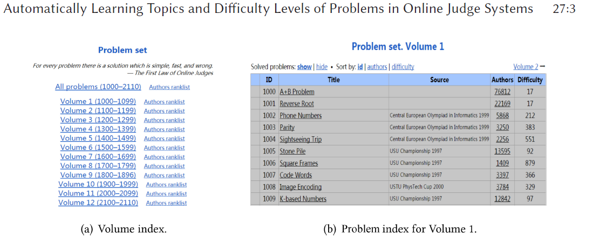
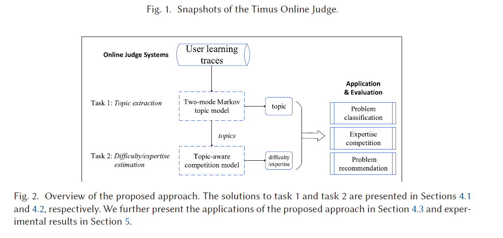

 Automatically Learning Topics and Difficulty Levels of Problems in Online Judge Systems 

#  自动学习在线评判系统中的主题和问题的难度 

在线评判系统已经被广泛的应用在各个方面， 包括编程，数学问题和面试。不像其它的在线学习系统，例如大规模开放在线课堂，大部分OJ系统被设计为 自主学习，不需要教师的干预。同样，在大部分OJ系统中，问题只是简单地以卷的形式列出，并没有按照主题或难度级别对它们进行清晰的组织。例如，同一卷的问题在主题或难度级别上是混合的。通过分析大规模用户的学习轨迹，我们发现有两种主要的学习模式(或模式)。用户要么从同一卷中按顺序练习问题，而不考虑他们的主题，要么尝试关于同一主题的问题，这些问题可能分散在多个卷中。 我们的观察与经典教育心理学的发现是一致的。基于我们的观察，我们提出了一种新的双模马尔可夫主题模型，通过联合表征两种学习模式来自动检测在线问题的主题。为了进一步预测在线问题的难度，我们提出了一个基于竞争的专家知识模型。在三个大型OJ数据集上的大量实验证明了我们的方法在三个不同任务上的有效性，包括技能主题提取、专家竞争预测和问题推荐。

CS概念:•信息系统→协同和社会计算系统和工具;协同过滤;社会的建议;•计算方法→主题建模;•应用计算→教育;

 其他关键字和短语:主题模型，专业知识学习，在线评判系统 

## 1 介绍

互联网技术的快速发展极大地促进了在线教育服务的发展，这使得教育资源的获取比以往更简单。在这些服务中，大规模开放在线课程（MOOC）平台（例如，COURSERA）是由专家和老师维护，它支持学生，教授和助教之间的交互。相反的，在线评判（OJ）系统设计用于自主学习，不需要老师的干预或与老师的互动。OJ系统通常拥有大量的提问或问题。提供用户提交的解决方案的实时自动评估。OJ系统可以作为一个开放和共享的测试平台，为自主学习提供越来越多的新资源[50].OJ系统的例子包括数学问题解决网站像ACT Math，像LeetCode这样的求职面试练习网站，还有像JKYDT这样的驾照网站。在OJ系统上，学习资源（i.e.,problems）通常是按卷收集的；固定数量的问题被选择并堆积成一个卷。 卷中的每个问题都被分配一个惟一的ID。这实际上形成了问题的两层索引结构:卷索引和问题ID。我们展示了**Timus在线评判系统**的快照在图1上，这是俄罗斯最大的编程问题档案库， 以卷来说明问题的组织。最新的，Timus包含1110个问题均匀的被分在12个卷中。登录系统后，用户可以选择这12个卷中的任何问题。使用卷组织，开发和更新对于偿还资源共享和练习评估的OJ系统的维护成本很低。

卷组织对于用户来说很难定位到需要的资源。例如，初学者只想练习简单的编程问题，但是在她的能力水平上，从大量的问题库中找出合适的问题需要相当多的时间。类似地，只希望关注动态规划编程的用户也会发现很难找到适当的问题，因为它们可能会分散在多个卷上。如前所述，课程设计应考虑两个非常重要的因素[6, 54, 57],换句话说，主题和难度等级。主题是指根据相关的知识组成、概念或技能对问题进行分类或分组; 难度等级是指问题的难度程度。**传统上，话题和难度等级是由领域专家或有经验的教师手工注释问题。这需要大量体力劳动。**然而正如过去所表现的那样[11,16]。用户的学习轨迹通常包含了推断主题信息和问题难度的重要证据。因此，在这篇文章中，我们聚焦于用户学习规矩来自动监测主题和难度等级在OJ系统中。

通过分析用户的轨迹，我们发现有两个主要的学习模型。用户可以从相同的卷中按顺序选择问题，而不必考虑其主题（面向卷的学习），或者专注于一个特定的主题，并从多个卷中选择关于同一主题的所有问题（面向主题的学习）。为了描述这两种学习方式，我们提出一种新颖的双模式马尔可夫主题模型：卷主题表示从卷中描述问题的生成概率，而技能主题表示从技能主题描述问题的生成概率。为用户配置了关于体积主题或技能主题的两个主题分布，并且她的偏好在联合模型中得以表征。

除了检测OJ系统中的问题外，我们也学习怎样来推断问题难度和使用用户学习轨迹的用户专业知识。不像传统的专家知识[13,33],通常描述难度或者专家知识等级使用单个的指标值，我们发现不同主题的问题可能有不同程度的困难。此外，一个用户在不同的领域上可能有不同的专家知识等级。这些发现显示难度或者专家知识等级应该在主题上定义。因此，我们进一步提出基于主题意识的竞争的专家模型。我们假设一个问题与特定主题的难度分数相关，而用户也与特定主题的专业分数相关联。如果将一个问题视为一个虚拟用户，那么在相同的表示空间中，难度或专业水平都可以用特定于主题的专业分数向量来表示。我们将问题解决过程建模为用户和问题之间的竞争。问题的主题信息是使用之前提出的双模马尔科夫主题模型获得的，并将其作为学习难度(或专业知识)级别的竞争环境。

如图2所示，我们主要关注两个任务，主题检测，它自动识别给定问题的主题，和难度/专家知识等级估计，这量化问题的难度。所导出的主题和难度/专长信息可随后用于下游OJ相关的应用程序，例如问题推荐或专家发现。 我们提出的方法已经在编程OJ系统上进行了评估，但它们也适用于任何其他OJ系统。 我们的贡献总结如下：

- 我们提出的第一个研究，自动学习的主题和问题的困难程度，在OJ系统中，问题是简单地由卷组织。 
- 定量分析了用户在OJ系统上的学习行为。我们已经确定了两种学习模式，即，以容量为导向和以主题为导向的学习。这一观察结果得到了教育心理学理论的进一步解释和支持。基于上述行为特征，我们提出了一种用于问题主题学习的双模隐马尔可夫主题模型。 
- 我们定量分析了不同题目的难度分布。我们发现不同主题的问题可能有不同程度的难度。
  基于这一发现，我们开发了一个特定于主题的专家模型来评估问题难度级别和用户专家评分。
-  在三个大型在线裁判数据集上的大量实验证明了我们的方法在三个不同任务上的有效性，包括技能主题提取、专业技能竞争预测和问题推荐。 

