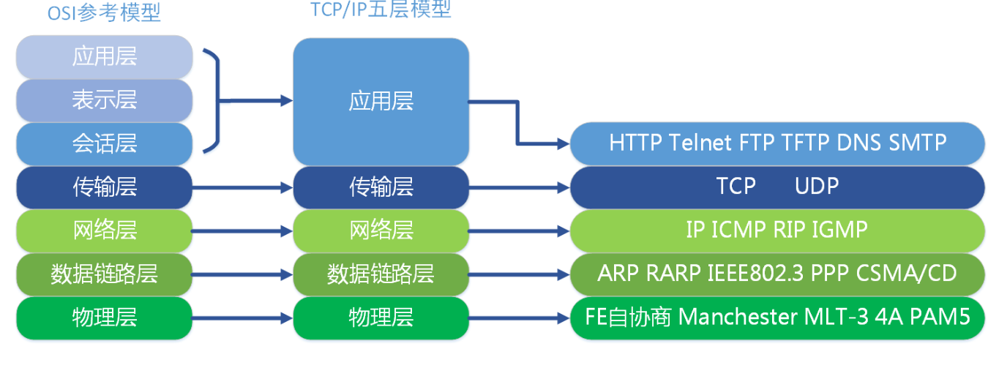

# 1.计算机网络面试核心

## OSI开发式互联参考模型

第1层 物理层：机械、电子、定时接口通信信道上的原始比特流传输

第2层 数据链路层： 物理寻址，同时将原始比特流转变成逻辑传输线路

第3层 网络层： 控制子网的进行，如逻辑编址、分组传输、路由选择。

第4层 传输层：接受上一层的数据，在必要的时候把数据进行分割，并将这些数据交给网络层，保证这些数据段有效到达对端。

第5层 会话层： 不同机器上的用户之间建立及管理会话。   

第6层 表示层： 信息的语法语义以及它们的关联，如加密解密、转换翻译、压缩解压缩。

第7层 应用层

## OSI的”实现“：TCP/IP

## TCP的三次握手

#### 传输控制协议TCP简介

- 面向连接的、可靠的、基于字节流的传输层通信协议
- 将应用层的数据流分割成报文段并发送给目标节点的TCP层
- 数据包都有序号，对方收到则发送ACK确认，未收到则重传
- 使用校验和来检验数据在传输过程中是否有误

